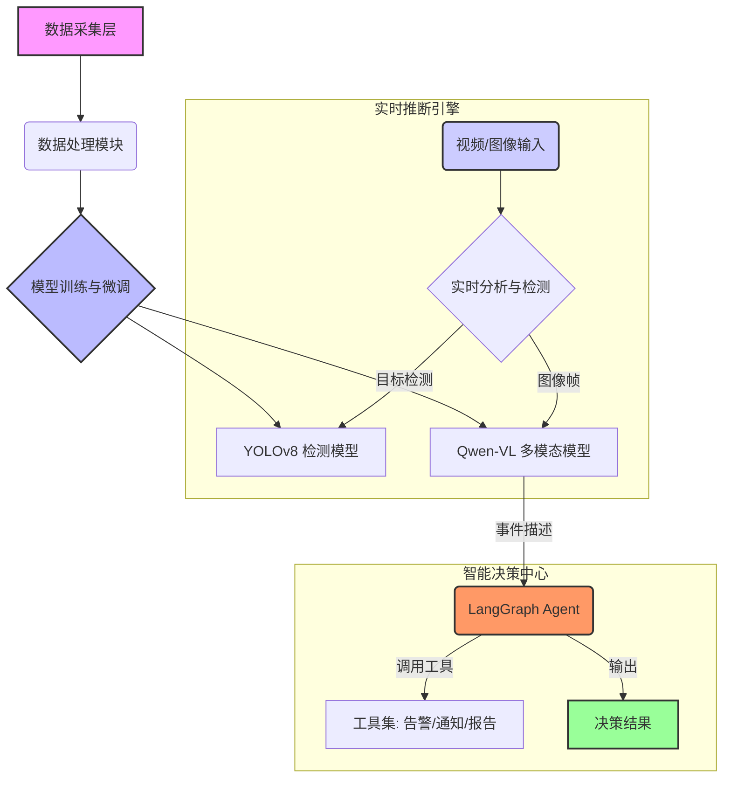

# 智慧城市视觉：基于多模态大模型的智能感知与决策系统 (Smart-City-Vision)

## 📖 项目简介

**智慧城市视觉 (Smart-City-Vision)** 是一个先进的开源项目，旨在利用尖端的人工智能技术，为现代城市打造一个智能、高效、安全的环境监测与事件响应系统。

本系统深度融合了 **YOLOv8** 目标检测模型和 **Qwen-VL** 多模态大语言模型，并创新性-地引入了 **LangGraph Agent** 作为智能决策核心。通过实时分析城市摄像头捕捉的视频流，系统不仅能精确识别各类异常事件（如交通事故、火灾、拥堵等），更能基于多模态信息进行深度理解和智能决策，最终形成一套完整的“感知-认知-决策”闭环，为城市管理者提供前所未有的洞察力和自动化处理能力。

我们致力于将这个项目打造成一个模块化、可扩展、易于部署的智慧城市解决方案，赋能开发者和城市管理者，共同迈向更智能的未来。

## ✨ 核心特性

- **🚀 高性能目标检测**: 基于微调后的 **YOLOv8** 模型，实现对城市环境中车辆、行人、交通标志等关键目标的实时、精准检测。
- **🧠 多模态事件理解**: 结合 **Qwen-VL** 大模型的强大视觉语言能力，对检测到的事件进行深层次的语义理解和描述，准确判断事件的性质和严重程度。
- **🤖 智能体决策引擎**: 独创性地使用 **LangGraph Agent** 构建智能体，模拟人类专家进行思考和决策，能够根据实时情况和预设规则，自主生成告警信息、提出处理建议，甚至联动其他城市管理系统。
- **⛓️ 端到端完整流程**: 提供了从数据清洗、模型微调、实时推断到智能决策的完整代码实现和详细教程，覆盖了项目全生命周期。
- **🔌 模块化与可扩展**: 系统采用高度模块化的架构设计，方便用户根据自身需求替换或扩展特定功能模块（如更换检测模型、增加新的决策工具等）。
- **边缘计算集成**: 包含边缘节点检测模块，可将计算任务下沉至边缘设备，降低延迟，提升系统响应速度。

## 🏛️ 项目架构

项目整体架构清晰，分为以下几个核心模块：

1. **数据处理模块 (`/src/data_processing`)**: 负责数据的接入、预处理和清洗，为模型训练准备高质量的“黄金”数据集。
2. **模型微调模块 (`/src/model_finetuning`)**: 提供对YOLOv8和Qwen-VL模型进行端到端微调的脚本和配置，以适应特定的城市场景。
3. **实时推断引擎 (`/src/inference_engine`)**: 系统的核心运行时组件，负责接收视频流，调用检测和多模态模型进行实时分析。
4. **LangGraph Agent 模块 (`/src/langgraph_agent`)**: 智能决策大脑，接收模型分析结果，通过内置的工具和逻辑链进行推理，并作出最终决策。
5. **边缘节点 (`/src/edge_node`)**: 负责在边缘设备上部署轻量级检测模型，实现初步的事件筛选和快速响应。
6. **服务与接口 (`/src/service`)**: 通过API服务器将系统的能力暴露出来，方便与其他应用或平台进行集成。

## 🚀 快速开始

**请注意：** 本项目目前正处于积极开发阶段，代码仓库尚在完善中。因此，我们暂时无法提供完整详细的环境搭建与一键运行指南。

当前，您可以查阅我们提供的Jupyter Notebook教程来了解项目的核心功能和模型微调方法：

1. **数据准备**:
   - 请参照 `数据清洗篇：从“脏”数据到“黄金”数据集的炼金术.md` 文档，准备和清洗您的数据集。
2. **模型微调**:
   - **YOLOv8**: 打开并运行 `YOLOv8_端到端微调与优化.ipynb` 来学习如何训练目标检测模型。
   - **Qwen-VL**: 打开并运行 `Qwen-VL 端到端微调与优化.ipynb` 来学习如何微调多模态视觉语言模型。

我们会在项目稳定后第一时间提供完整的安装和使用文档。

## 📚 文档与教程

- **数据清洗篇**: 详细介绍了如何处理原始数据，打造高质量的训练集。
  - [从“脏”数据到“黄金”数据集的炼金术.md](./数据清洗篇：从“脏”数据到“黄金”数据集的炼金术.md)
- **YOLOv8 微调教程**:
  - [YOLOv8_端到端微调与优化.ipynb](./YOLOv8_端到端微调与优化.ipynb)
- **Qwen-VL 微调教程**:
  - [Qwen-VL 端到端微调与优化.ipynb](./Qwen-VL%20端到端微调与优化.ipynb)
