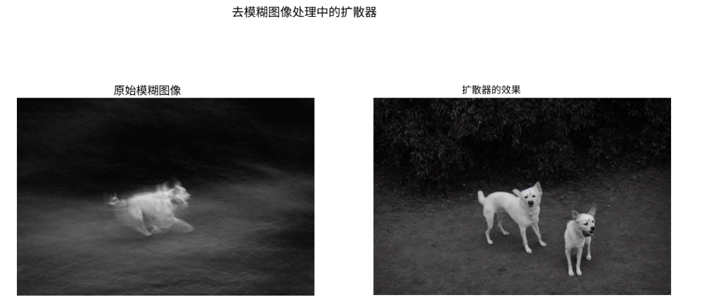
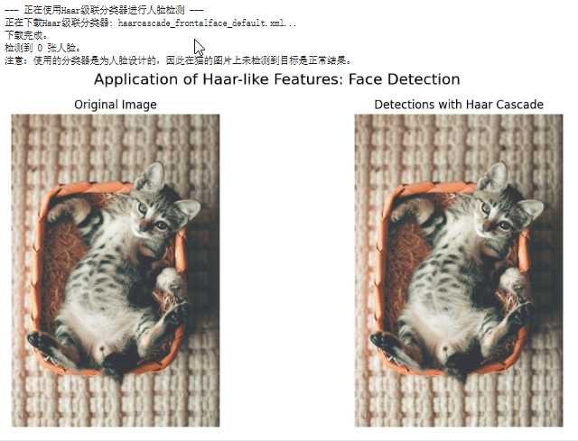
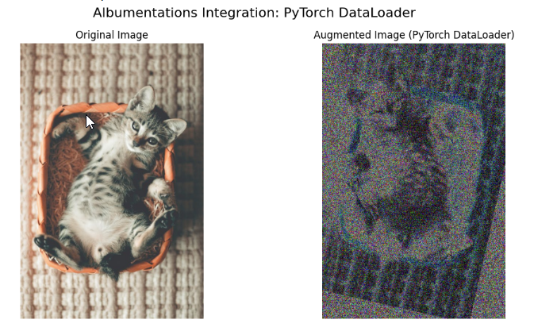

# 《数据清洗篇：从“脏”数据到“黄金”数据集的炼金术》

## 序章：当模型“失声”，问题出在哪？

### 核心困境：当先进模型（如YOLOv8）遭遇“垃圾数据”，为何会“水土不服”？

在人工智能的实践中，一个令人沮丧的场景正变得越来越普遍：一位工程师投入了数周时间，使用了业界最先进的模型（例如YOLOv8），在强大的GPU集群上消耗了可观的计算资源进行训练。然而，当最终进行推理测试时，屏幕上却是一片空白——模型什么也检测不出来，mAP（平均精度均值）指标趋近于零。

面对这种“模型失声”的窘境，我们的第一反应往往是陷入自我怀疑，并开始一系列常规操作：是学习率设置得不合理吗？是模型架构需要调整吗？还是超参数需要再优化一下？我们习惯性地将问题归咎于模型本身。

然而，正如一句古老的计算机谚语所言：“垃圾进，垃圾出”（Garbage In, Garbage Out）。在我们将目光投向复杂的模型算法之前，或许应该先审视一下我们提供给模型的“食粮”——数据。一个充满了视觉噪声、信息冗余、图像模糊、光照极端甚至与任务毫不相干样本的数据集，对于任何先进模型而言，都无异于一席难以下咽的盛宴。模型就像一个极其聪明的学生，但如果教材错误百出、内容混乱，他也无法学到真正的知识。

### 理念革新：从“模型为中心”到“以数据为中心”（Data-Centric AI）的思维转变

长期以来，AI研究的焦点主要集中在模型架构的创新上。但随着模型本身日趋成熟，一个新的共识正在形成，并由吴恩达（Andrew Ng）等行业领袖大力倡导，这就是“以数据为中心的人工智能”（Data-Centric AI）。

这个理念的核心思想非常清晰：**对于大多数应用而言，提升模型性能最有效的杠杆，不再是无尽地优化模型代码，而是系统化地提升数据质量。**

从“模型为中心”到“以数据为中心”的转变，标志着AI工程化的成熟。它要求我们像对待代码一样，用严谨的工程学方法来对待数据。我们不再将数据视为一个静态的、一成不变的集合，而是将其看作一个动态的、可以被持续迭代和优化的系统。在这个新范式下，数据质量不再是锦上添花，而是决定项目成败的基石。

### 本文目标

这篇教程并非一份简单的脚本代码清单，它的目标远不止于此。我们旨在为您构建一个**系统化、可复现的数据工程知识体系**。

我们将一同踏上一场“数据炼金术”之旅：从一个原始、混乱、充满问题的图像集合出发，通过一系列定义明确、逻辑严谨的清洗、筛选、修复与校验步骤，亲手将其“精炼”成一个高质量、高密度、高一致性的“黄金数据集”。

## 第一部分：思想武装与环境准备 (Mindset & Setup)

在开始任何技术操作之前，我们必须先统一思想、磨利工具。这个准备阶段将确保我们后续的所有努力都建立在坚实的基础之上。

### 1.1. 奠定基石：厘清“数据清洗”与“数据增强”的边界

在数据处理的领域中，“数据清洗”（Data Cleaning）和“数据增强”（Data Augmentation）是两个经常被提及但又极易混淆的概念。在我们的“炼金术”开始之前，必须清晰地划定它们的边界，因为这决定了我们工作的流程和哲学。

- **数据清洗：训练前的“提纯”，是根基**。

  数据清洗的目标是提升数据集本身的内在质量。它是一系列在模型训练之前进行的操作，专注于识别并处理数据中存在的问题。这包括剔除重复的、无关的样本，修复模糊、损坏的图像，纠正错误的标注等。清洗的本质是做“减法”和“修正”，旨在为模型提供一个干净、一致、高质量的学习起点。

- **数据增强：训练中的“扩展”，是杠杆**。

  数据增强则发生在模型训练之中。它的目标是从已经清洗过的高质量数据出发，通过应用一系列随机变换（如旋转、裁剪、色彩抖动等），在内存中动态地生成更多样化的训练样本。增强的本质是做“加法”，它并不会改变原始数据集的大小，而是通过“无中生有”来扩充送入模型的数据，从而提升模型的鲁棒性和泛化能力，防止过拟合。

> #### 黄金法则
>
> **先有高质量的清洗，再有高效率的增强**。
>
> 这是一个不可违背的原则。对一个充满噪声的“垃圾”数据集进行增强，你只会得到“增强后的垃圾”，这不仅无法提升模型性能，反而可能引入更多干扰，让模型学到错误的东西。我们的工作流必须严格遵循这一法则。

#### 1.1.1. 技术选型考量：传统方法与深度学习的权衡

在我们深入探讨以深度学习为核心的数据清洗技术之前，有一个重要的技术选型考量值得注意。我们应根据具体场景选择最合适的工具。虽然本教程聚焦于服务先进的深度学习模型，但在某些特定场景下，**传统的图像处理与机器学习方法依然具有不可替代的价值**。

- **小数据集场景**：当训练数据量有限时（例如，只有几百或几千张图片），复杂的深度学习模型很容易过拟合。此时，精心设计的传统特征提取算法（如我们将在后续章节讨论的SIFT、HOG）结合经典的机器学习分类器（如支持向量机SVM），往往能取得更稳定、泛化能力更强的效果。
- **强解释性需求**：在金融风控、医疗诊断等领域，模型决策的可解释性至关重要。传统方法的每一步（如滤波、边缘检测、特征提取）都有明确的数学或物理意义，易于理解和调试。

因此，一个全面的知识体系，应该既包含以数据为中心的深度学习工程方法，也理解传统算法的适用边界。这种认知上的广度，能帮助我们在面对不同问题时，做出最恰当的技术选型。

### 1.2. 利其器：配置我们的“数据炼金室”

工欲善其事，必先利其器。我们将选用一套结合了经典计算机视觉库与现代深度学习工具的技术栈，以应对不同层面的数据质量问题。

```cmd
conda create -n dataset python=3.12

conda activate dataset
```

打开您的终端或在Jupyter Notebook中，运行以下命令来安装所有必要的库：

```py
# 经典计算机视觉与图像处理库
!pip install opencv-python-headless scikit-image pillow matplotlib

# 用于句法去重（感知哈希）
!pip install imagehash

# 用于语义分析与处理（提供强大的CLIP模型）
!pip install sentence-transformers

# 用于数据增强
!pip install albumentations

# 其他辅助库
!pip install pandas tqdm requests
```

- **OpenCV, Scikit-image, Pillow**: 提供了丰富的图像读写、变换和处理功能，是我们的基本盘。
- **ImageHash**: 实现了多种感知哈希算法，是进行快速句法去重的利器。
- **Sentence-Transformers**: 极大地简化了CLIP等大型语言模型的使用，让我们能轻松地将图像和文本编码为语义向量。
- **Albumentations**: 一个速度极快、功能强大的图像增强库，被广泛应用于工业界和学术界。

### 1.3. 备其料：创建问题导向的“靶向样本集”

理论需要实践来检验。为了直观地展示各种清洗算法的效果，我们不能使用完美无瑕的“玩具”数据。相反，我们需要一个包含了各类典型问题的“靶向样本集”。

我们将从网络上下载一系列真实的、具有代表性问题的图片，它们将作为我们后续所有操作的“试金石”。

以下代码将自动创建一个名为 `demo_images` 的目录，并从网络下载图片。请确保您的网络连接正常。

```python
import os
import requests
from tqdm import tqdm
from PIL import Image
from io import BytesIO

# --- 定义图片信息 ---
# 我们从Pexels等提供免费使用图片的网站寻找了一些真实的照片样本
image_sources = [
    {
        "filename": "01_normal_quality.jpg",
        "url": "https://images.pexels.com/photos/1056252/pexels-photo-1056252.jpeg?auto=compress&cs=tinysrgb&w=1260&h=750&dpr=1",
        "description": "一张质量正常的猫的照片，作为我们的基准图片。"
    },
    {
        "filename": "02_exact_duplicate.jpg",
        "url": "https://images.pexels.com/photos/1056252/pexels-photo-1056252.jpeg?auto=compress&cs=tinysrgb&w=1260&h=750&dpr=1",
        "description": "与基准图片完全相同的副本，用于测试句法去重。"
    },
    {
        "filename": "03_semantic_duplicate.jpg",
        "url": "https://images.pexels.com/photos/1170986/pexels-photo-1170986.jpeg?auto=compress&cs=tinysrgb&w=1260&h=750&dpr=1",
        "description": "另一张不同姿势和背景的猫，用于测试语义去重。"
    },
    {
        "filename": "04_blurry.jpg",
        "url": "https://images.pexels.com/photos/12040556/pexels-photo-12040556.jpeg?auto=compress&cs=tinysrgb&w=1260&h=750&dpr=1",
        "description": "一张因运动而模糊的狗的照片，用于测试清晰度评估。"
    },
    {
        "filename": "05_low_light.jpg",
        "url": "https://images.pexels.com/photos/4069291/pexels-photo-4069291.jpeg?auto=compress&cs=tinysrgb&w=1260&h=750&dpr=1",
        "description": "一张光线昏暗的办公环境照片，用于测试低光照增强。"
    },
    {
        "filename": "06_overexposed.jpg",
        "url": "https://images.pexels.com/photos/33303041/pexels-photo-33303041.jpeg?auto=compress&cs=tinysrgb&w=1260&h=750&dpr=1",
        "description": "一张因阳光过强而过曝的雪山照片，用于测试光照评估。"
    },
    {
        "filename": "07_low_resolution.jpg",
        "url": "https://images.pexels.com/photos/33306577/pexels-photo-33306577.jpeg?auto=compress&cs=tinysrgb&w=126&h=75&dpr=1",
        "description": "一张低分辨率版本的基准图片，用于测试超分辨率。"
    },
    {
        "filename": "08_semantic_outlier.jpg",
        "url": "https://images.pexels.com/photos/3225517/pexels-photo-3225517.jpeg?auto=compress&cs=tinysrgb&w=1260&h=750&dpr=1",
        "description": "一张风景照，如果我们的任务是检测猫狗，它就是一个语义异常点。"
    }
]

# --- 创建目录并下载图片 ---
DEMO_IMAGES_DIR = "demo_images"
os.makedirs(DEMO_IMAGES_DIR, exist_ok=True)

print(f"开始下载演示图片到 '{DEMO_IMAGES_DIR}' 目录...")

for item in tqdm(image_sources, desc="下载进度"):
    try:
        response = requests.get(item["url"], stream=True)
        response.raise_for_status()  # 如果请求失败则抛出异常

        # 将图片保存到文件
        filepath = os.path.join(DEMO_IMAGES_DIR, item["filename"])
        with open(filepath, 'wb') as f:
            for chunk in response.iter_content(chunk_size=8192):
                f.write(chunk)

    except requests.exceptions.RequestException as e:
        print(f"\n下载失败: {item['filename']}，原因: {e}")
    except IOError as e:
        print(f"\n保存文件失败: {item['filename']}，原因: {e}")

print("\n所有图片下载完成！")
print(f"现在您可以在 '{DEMO_IMAGES_DIR}' 目录下找到以下图片:")
for item in image_sources:
    print(f"- {item['filename']}: {item['description']}")

```

## 第二部分：数据清洗核心技术详解 (Core Data Cleaning Techniques)

### 2.0. 基础预处理：特征归一化

在进行复杂的数据清洗之前，一个基础且关键的预处理步骤是**特征归一化 (Feature Normalization)**。

- **为什么需要归一化？** 神经网络本质上是在学习数据的分布。如果输入特征的尺度（量纲）差异很大（例如，一个特征范围是0-1，另一个是0-1000），会导致模型训练时梯度下降的路径变得曲折，收敛速度变慢。归一化将所有特征都统一到相似的数值范围内，可以**加速模型收敛**，并可能**提升模型精度**。
- **常用方法**：
  1. **Min-Max标准化 (离差标准化)**：将数据线性地映射到[0, 1]区间。公式为：$$X_{norm} = (X - X_{min} / (X_{max} - X_{min})$$。
  2. **Z-score标准化 (标准差标准化)**：将数据变换为均值为0，方差为1的标准正态分布。公式为：$$X_{norm} = (X - μ) / σ$$，其中μ是均值，σ是标准差。

对于图像数据，最常见的归一化方式是将像素值从[0, 255]的整数范围，转换到[0, 1]或[-1, 1]的浮点数范围。

### 2.1 冗余数据清理 (Redundant Data Cleaning)

**目标**：剔除重复信息，保证数据多样性，节省标注与计算成本。

冗余数据是数据集中最常见也最容易被忽视的问题。它不仅会严重扭曲数据的真实分布，导致模型过拟合于特定样本，还会极大地浪费宝贵的标注时间和计算资源。想象一下，如果一个数据集中有100张几乎完全一样的图片，标注员需要重复劳动100次，而模型在训练时也会反复“学习”同一个信息，这显然是低效且有害的。

因此，冗余数据清理是我们数据“炼金术”的第一步，其核心是“去伪存真”，确保数据集中的每一份子都贡献着独特而有价值的信息。我们将从两个层面来解决这个问题：视觉上的重复（句法冗余）和内容概念上的重复（语义冗余）。

#### 2.1.1. 句法去重：剔除视觉副本

**核心技术**：感知哈希（Perceptual Hashing）的各种变体。

**应用场景**：过滤因直接复制、缩放、格式转换、轻微亮度变化或添加水印而产生的视觉上高度雷同的图片。

**优势**：速度极快，计算开销小，对图像的微小变化具有鲁棒性，是大规模数据集预处理的理想第一道防线。

与逐像素比较这种“笨重”的方法不同，感知哈希算法会将一张图片通过一系列变换浓缩成一个极短的“视觉指纹”（通常是一个64位的二进制字符串）。我们无需比较庞大的图片本身，只需比较这些轻巧的“指纹”。通过计算两个指纹之间不同位的数量（即“汉明距离”），我们就能高效地判断出两张图片的视觉相似度。汉明距离越小，图片越相似。

我们将介绍几种主流的感知哈希算法，并提供代码示例。

##### 方法一：pHash (Perceptual Hash) - 感知哈希

- **工作原理**：pHash 利用离散余弦变换 (DCT) 来捕捉图像的频率信息。它将图像缩放、灰度化后进行 DCT，然后选取左上角低频部分的系数，并根据这些系数的平均值生成一个二进制哈希。
- **特点**：对图像内容的感知能力较强，对缩放、亮度调整和轻微压缩等变化具有较好的鲁棒性。
- **适用场景**：最常用的感知哈希算法，适用于大多数需要识别视觉上相似图片的情况。

```
import os
from PIL import Image
import imagehash
import matplotlib.pyplot as plt
from tqdm import tqdm

# --- 设置图片目录 ---
DEMO_IMAGES_DIR = "demo_images"

def find_visual_duplicates_phash(image_dir, threshold=5):
    """
    使用感知哈希（pHash）查找目录中的视觉重复图片。
    
    参数:
    image_dir (str): 图片所在的目录。
    threshold (int): 汉明距离阈值，低于此阈值的图片被认为是重复的。
                     0表示完全相同。
    
    返回:
    list: 一个包含重复图片对元组的列表。
    """
    hashes = {}
    duplicates = []
    
    image_files = [f for f in os.listdir(image_dir) if f.lower().endswith(('.png', '.jpg', '.jpeg'))]

    print("正在计算所有图片的 pHash 值...")
    for filename in tqdm(image_files, desc="处理进度"):
        filepath = os.path.join(image_dir, filename)
        try:
            with Image.open(filepath) as img:
                h = imagehash.phash(img) # 计算 pHash 值
                hashes[filename] = h
        except Exception as e:
            print(f"无法处理文件 {filename}: {e}")

    # 比较哈希值以查找重复项
    filenames = list(hashes.keys())
    for i in range(len(filenames)):
        for j in range(i + 1, len(filenames)):
            f1 = filenames[i]
            f2 = filenames[j]
            
            distance = hashes[f1] - hashes[f2] # 计算汉明距离
            
            if distance <= threshold:
                duplicates.append((f1, f2, distance))
                
    return duplicates

# --- 执行并可视化 ---
print("\n开始进行句法去重 (pHash)...")
visual_duplicates_phash = find_visual_duplicates_phash(DEMO_IMAGES_DIR, threshold=5)

if not visual_duplicates_phash:
    print("\n在给定的阈值下，未发现视觉重复的图片。")
else:
    print(f"\n发现 {len(visual_duplicates_phash)} 组视觉重复或高度相似的图片 (pHash)：")
    for f1, f2, dist in visual_duplicates_phash:
        print(f"- 文件 '{f1}' 与 '{f2}' 高度相似, 汉明距离: {dist}")

    # 可视化第一组发现的重复图片
    if visual_duplicates_phash:
        print("\n可视化其中一组 pHash 检测到的重复项：")
        f1, f2, _ = visual_duplicates_phash[0]
        img1_path = os.path.join(DEMO_IMAGES_DIR, f1)
        img2_path = os.path.join(DEMO_IMAGES_DIR, f2)

        fig, axes = plt.subplots(1, 2, figsize=(10, 5))
        axes[0].imshow(Image.open(img1_path))
        axes[0].set_title(f"Image A: {f1}") 
        axes[0].axis('off')

        axes[1].imshow(Image.open(img2_path))
        axes[1].set_title(f"Image B: {f2}") 
        axes[1].axis('off')
        
        plt.suptitle("Example of a Detected Visual Duplicate (pHash)") 
        plt.show()
```


##### 方法二：aHash (Average Hash) - 平均哈希

- **工作原理**：将图像缩放为小尺寸（如8x8），转换为灰度图，计算所有像素的平均值，然后将每个像素与平均值比较，生成一个二进制哈希。
- **特点**：最简单、计算速度最快。对图像缩放和颜色变化有一定鲁棒性。
- **局限性**：对裁剪、旋转和复杂的内容变化敏感。
- **适用场景**：对速度要求极高，且图像变化不大的场景。

```
import os
from PIL import Image
import imagehash
import matplotlib.pyplot as plt
from tqdm import tqdm

# --- 设置图片目录 ---
DEMO_IMAGES_DIR = "demo_images"

def find_visual_duplicates_ahash(image_dir, threshold=5):
    """
    使用平均哈希（aHash）查找目录中的视觉重复图片。
    
    参数:
    image_dir (str): 图片所在的目录。
    threshold (int): 汉明距离阈值。
    
    返回:
    list: 一个包含重复图片对元组的列表。
    """
    hashes = {}
    duplicates = []
    
    image_files = [f for f in os.listdir(image_dir) if f.lower().endswith(('.png', '.jpg', '.jpeg'))]

    print("正在计算所有图片的 aHash 值...")
    for filename in tqdm(image_files, desc="处理进度"):
        filepath = os.path.join(image_dir, filename)
        try:
            with Image.open(filepath) as img:
                h = imagehash.average_hash(img) # 计算 aHash 值
                hashes[filename] = h
        except Exception as e:
            print(f"无法处理文件 {filename}: {e}")

    # 比较哈希值以查找重复项
    filenames = list(hashes.keys())
    for i in range(len(filenames)):
        for j in range(i + 1, len(filenames)):
            f1 = filenames[i]
            f2 = filenames[j]
            
            distance = hashes[f1] - hashes[f2] # 计算汉明距离
            
            if distance <= threshold:
                duplicates.append((f1, f2, distance))
                
    return duplicates

# --- 执行并可视化 ---
print("\n开始进行句法去重 (aHash)...")
visual_duplicates_ahash = find_visual_duplicates_ahash(DEMO_IMAGES_DIR, threshold=5)

if not visual_duplicates_ahash:
    print("\n在给定的阈值下，未发现视觉重复的图片 (aHash)。")
else:
    print(f"\n发现 {len(visual_duplicates_ahash)} 组视觉重复或高度相似的图片 (aHash)：")
    for f1, f2, dist in visual_duplicates_ahash:
        print(f"- 文件 '{f1}' 与 '{f2}' 高度相似, 汉明距离: {dist}")

    # 可视化第一组发现的重复图片
    if visual_duplicates_ahash:
        print("\n可视化其中一组 aHash 检测到的重复项：")
        f1, f2, _ = visual_duplicates_ahash[0]
        img1_path = os.path.join(DEMO_IMAGES_DIR, f1)
        img2_path = os.path.join(DEMO_IMAGES_DIR, f2)

        fig, axes = plt.subplots(1, 2, figsize=(10, 5))
        axes[0].imshow(Image.open(img1_path))
        axes[0].set_title(f"Image A: {f1}") 
        axes[0].axis('off')

        axes[1].imshow(Image.open(img2_path))
        axes[1].set_title(f"Image B: {f2}") 
        axes[1].axis('off')
        
        plt.suptitle("Example of a Detected Visual Duplicate (aHash)") 
        plt.show()
```

##### 方法三：dHash (Difference Hash) - 差异哈希

- **工作原理**：将图像缩放为小尺寸（如9x8），转换为灰度图，然后比较相邻像素之间的亮度差异（水平或垂直方向），生成哈希。
- **特点**：对图像平移、裁剪和轻微旋转有较好的鲁棒性。
- **局限性**：对图像内容本身的复杂变化仍有限。
- **适用场景**：视频帧去重、截图去重等需要对轻微位移鲁棒的场景。

```
import os
from PIL import Image
import imagehash
import matplotlib.pyplot as plt
from tqdm import tqdm

# --- 设置图片目录 ---
DEMO_IMAGES_DIR = "demo_images"

def find_visual_duplicates_dhash(image_dir, threshold=5):
    """
    使用差异哈希（dHash）查找目录中的视觉重复图片。
    
    参数:
    image_dir (str): 图片所在的目录。
    threshold (int): 汉明距离阈值。
    
    返回:
    list: 一个包含重复图片对元组的列表。
    """
    hashes = {}
    duplicates = []
    
    image_files = [f for f f in os.listdir(image_dir) if f.lower().endswith(('.png', '.jpg', '.jpeg'))]

    print("正在计算所有图片的 dHash 值...")
    for filename in tqdm(image_files, desc="处理进度"):
        filepath = os.path.join(image_dir, filename)
        try:
            with Image.open(filepath) as img:
                h = imagehash.dhash(img) # 计算 dHash 值
                hashes[filename] = h
        except Exception as e:
            print(f"无法处理文件 {filename}: {e}")

    # 比较哈希值以查找重复项
    filenames = list(hashes.keys())
    for i in range(len(filenames)):
        for j in range(i + 1, len(filenames)):
            f1 = filenames[i]
            f2 = filenames[j]
            
            distance = hashes[f1] - hashes[f2] # 计算汉明距离
            
            if distance <= threshold:
                duplicates.append((f1, f2, distance))
                
    return duplicates

# --- 执行并可视化 ---
print("\n开始进行句法去重 (dHash)...")
visual_duplicates_dhash = find_visual_duplicates_dhash(DEMO_IMAGES_DIR, threshold=5)

if not visual_duplicates_dhash:
    print("\n在给定的阈值下，未发现视觉重复的图片 (dHash)。")
else:
    print(f"\n发现 {len(visual_duplicates_dhash)} 组视觉重复或高度相似的图片 (dHash)：")
    for f1, f2, dist in visual_duplicates_dhash:
        print(f"- 文件 '{f1}' 与 '{f2}' 高度相似, 汉明距离: {dist}")

    # 可视化第一组发现的重复图片
    if visual_duplicates_dhash:
        print("\n可视化其中一组 dHash 检测到的重复项：")
        f1, f2, _ = visual_duplicates_dhash[0]
        img1_path = os.path.join(DEMO_IMAGES_DIR, f1)
        img2_path = os.path.join(DEMO_IMAGES_DIR, f2)

        fig, axes = plt.subplots(1, 2, figsize=(10, 5))
        axes[0].imshow(Image.open(img1_path))
        axes[0].set_title(f"Image A: {f1}") 
        axes[0].axis('off')

        axes[1].imshow(Image.open(img2_path))
        axes[1].set_title(f"Image B: {f2}") 
        axes[1].axis('off')
        
        plt.suptitle("Example of a Detected Visual Duplicate (dHash)") 
        plt.show()
```

##### 方法四：wHash (Wavelet Hash) - 小波哈希

- **工作原理**：利用小波变换（如 Haar 小波）将图像分解为不同频率分量，然后对低频分量进行哈希。
- **特点**：能捕捉图像的频率信息，对缩放和旋转具有更好的鲁棒性。
- **局限性**：计算复杂度相对较高。
- **适用场景**：对鲁棒性要求更高，且对计算时间不那么敏感的场景。

```
import os
from PIL import Image
import imagehash
import matplotlib.pyplot as plt
from tqdm import tqdm

# --- 设置图片目录 ---
DEMO_IMAGES_DIR = "demo_images"

def find_visual_duplicates_whash(image_dir, threshold=5):
    """
    使用小波哈希（wHash）查找目录中的视觉重复图片。
    
    参数:
    image_dir (str): 图片所在的目录。
    threshold (int): 汉明距离阈值。
    
    返回:
    list: 一个包含重复图片对元组的列表。
    """
    hashes = {}
    duplicates = []
    
    image_files = [f for f in os.listdir(image_dir) if f.lower().endswith(('.png', '.jpg', '.jpeg'))]

    print("正在计算所有图片的 wHash 值...")
    for filename in tqdm(image_files, desc="处理进度"):
        filepath = os.path.join(image_dir, filename)
        try:
            with Image.open(filepath) as img:
                h = imagehash.whash(img) # 计算 wHash 值
                hashes[filename] = h
        except Exception as e:
            print(f"无法处理文件 {filename}: {e}")

    # 比较哈希值以查找重复项
    filenames = list(hashes.keys())
    for i in range(len(filenames)):
        for j in range(i + 1, len(filenames)):
            f1 = filenames[i]
            f2 = filenames[j]
            
            distance = hashes[f1] - hashes[f2] # 计算汉明距离
            
            if distance <= threshold:
                duplicates.append((f1, f2, distance))
                
    return duplicates

# --- 执行并可视化 ---
print("\n开始进行句法去重 (wHash)...")
visual_duplicates_whash = find_visual_duplicates_whash(DEMO_IMAGES_DIR, threshold=5)

if not visual_duplicates_whash:
    print("\n在给定的阈值下，未发现视觉重复的图片 (wHash)。")
else:
    print(f"\n发现 {len(visual_duplicates_whash)} 组视觉重复或高度相似的图片 (wHash)：")
    for f1, f2, dist in visual_duplicates_whash:
        print(f"- 文件 '{f1}' 与 '{f2}' 高度相似, 汉明距离: {dist}")

    # 可视化第一组发现的重复图片
    if visual_duplicates_whash:
        print("\n可视化其中一组 wHash 检测到的重复项：")
        f1, f2, _ = visual_duplicates_whash[0]
        img1_path = os.path.join(DEMO_IMAGES_DIR, f1)
        img2_path = os.path.join(DEMO_IMAGES_DIR, f2)

        fig, axes = plt.subplots(1, 2, figsize=(10, 5))
        axes[0].imshow(Image.open(img1_path))
        axes[0].set_title(f"Image A: {f1}") 
        axes[0].axis('off')

        axes[1].imshow(Image.open(img2_path))
        axes[1].set_title(f"Image B: {f2}") 
        axes[1].axis('off')
        
        plt.suptitle("Example of a Detected Visual Duplicate (wHash)") 
        plt.show()
```

#### 2.1.2. 语义去重：发掘概念副本

**核心技术**：CLIP模型 + 余弦相似度。

**应用场景**：处理内容、概念上高度相似，但因视角、光照、构图不同而无法被pHash识别的图片。例如，两张不同角度拍摄的同一只猫。

**优势**：能够深入理解图像的“意义”，保证数据集在概念层面的多样性，是构建顶级数据集、避免模型学到片面特征的关键一步。

pHash擅长处理“长得像”的图片，但面对“意思是”的图片则无能为力。这时，我们需要一个能理解图像内容和抽象概念的模型，而CLIP（Contrastive Language-Image Pre-Training）正是为此而生。

CLIP能将任何图片和任何文本都编码到同一个高维的“语义空间”中。在这个空间里，意义相近的图片和文本在向量表示上也会彼此靠近。因此，我们可以将数据集中的所有图片都用CLIP编码成语义向量，然后通过计算向量之间的“余弦相似度”（Cosine Similarity）来判断它们在内容上的接近程度。余弦相似度越接近1，代表两张图片在语义上越相似。**选择一个合适的相似度阈值是关键，它决定了去重的严格程度，需要根据具体任务和数据特性进行调整。**

**大规模语义去重的可扩展性考量**：

对于**大规模数据集**的语义去重，直接计算所有图片对的余弦相似度会带来 O(N2) 的计算复杂度，效率低下。为了解决这个问题，可以采用以下更高效的策略：

- **聚类算法**：在提取所有图片的 CLIP 嵌入向量后，可以采用**聚类算法**（如 **K-Means**、**DBSCAN** 或更适合高维数据的 **HDBSCAN**）对这些高维向量进行分组。每个聚类代表一组语义相似的图片。然后，从每个聚类中选择一个或几个代表性样本（例如，离聚类中心最近的样本）作为最终数据集的成员。这能将 O(N2) 的比较复杂度转化为更高效的聚类复杂度。
- **近似最近邻搜索 (Approximate Nearest Neighbor, ANN)**：对于超大规模数据集（例如，数亿甚至数十亿张图片），直接进行精确聚类也可能效率低下。此时，可以利用 **Faiss** (Facebook AI Similarity Search)、**Annoy** (Approximate Nearest Neighbors Oh Yeah) 或 **HNSW** (Hierarchical Navigable Small World) 等 ANN 库来加速相似向量的查找。这些库能在牺牲少量精度的情况下，将查找最相似图片的速度提高几个数量级。

接下来，我们将用CLIP来比较我们样本集中的两张猫的图片。

```python
import os
from PIL import Image
from sentence_transformers import SentenceTransformer, util
import torch
import matplotlib.pyplot as plt

# --- 全局设置 ---
# 确保模型可以被下载
os.environ['HF_HUB_OFFLINE'] = '0'
DEMO_IMAGES_DIR = "demo_images"


def find_semantic_duplicates(image_paths, threshold=0.95):
    """
    使用CLIP模型查找语义上重复的图片。

    参数:
    image_paths (list): 待比较的图片文件路径列表。
    threshold (float): 余弦相似度阈值，高于此值的图片被认为是语义重复的。

    返回:
    list: 一个包含语义重复图片对元组的列表。
    """
    print("正在加载CLIP模型... (首次运行可能需要一些时间)")
    # 'clip-ViT-B-32' 是一个性能和速度均衡的常用模型。
    model = SentenceTransformer('clip-ViT-B-32')
    
    print("正在将图片编码为语义向量...")
    images = [Image.open(fp) for fp in image_paths]
    
    embeddings = model.encode(images, batch_size=16, convert_to_tensor=True, show_progress_bar=True)
    
    # 计算所有图片对之间的余弦相似度
    cos_scores = util.pytorch_cos_sim(embeddings, embeddings)
    
    duplicates = []
    # 遍历相似度矩阵的上三角部分以查找重复项
    for i in range(len(cos_scores) - 1):
        for j in range(i + 1, len(cos_scores)):
            if cos_scores[i][j] >= threshold:
                duplicates.append((image_paths[i], image_paths[j], cos_scores[i][j].item()))
                
    return duplicates

# --- 准备待测图片 ---
# 我们选取一张基准猫图、另一张猫图以及一张风景照进行对比。
image_files_to_check = [
    "01_normal_quality.jpg",
    "03_semantic_duplicate.jpg",
    "08_semantic_outlier.jpg"
]
image_paths_to_check = [os.path.join(DEMO_IMAGES_DIR, f) for f in image_files_to_check]

# --- 执行并可视化 ---
# 针对这个特定的数据集，0.78左右的阈值可以有效地将相同主题（猫）的图片分组，同时排除其他图片。
# 这个值可能需要根据不同的数据集进行调整。
adjusted_threshold = 0.78 
print(f"正在使用阈值 {adjusted_threshold} 查找语义重复项...")
semantic_duplicates = find_semantic_duplicates(image_paths_to_check, threshold=adjusted_threshold)

if not semantic_duplicates:
    print(f"\n在阈值为 {adjusted_threshold} 的情况下，未发现语义重复的图片。")
else:
    print(f"\n发现 {len(semantic_duplicates)} 组语义相似的图片：")
    for f1, f2, score in semantic_duplicates:
        print(f"- '{os.path.basename(f1)}' 与 '{os.path.basename(f2)}' 语义相似。分数: {score:.4f}")

    # 可视化第一组检测到的重复项
    print("\n可视化其中一个示例：")
    
    f1, f2, _ = semantic_duplicates[0]
    
    fig, axes = plt.subplots(1, 2, figsize=(10, 5))
    axes[0].imshow(Image.open(f1))
    axes[0].set_title(f"Image A: {os.path.basename(f1)}")
    axes[0].axis('off')

    axes[1].imshow(Image.open(f2))
    axes[1].set_title(f"Image B: {os.path.basename(f2)}")
    axes[1].axis('off')
    
    plt.suptitle("Example of a Detected Semantic Duplicate")
    plt.show()
```


#### 2.1.3. 场景特例：动态与静态设备的去重策略

当数据来源于连续的图像序列或视频流时，简单的pHash或CLIP去重往往会失效。此时，我们必须根据数据采集设备的特性——是“静止”的还是“移动”的——来设计更为精妙的去重策略。

##### **场景一：静态设备（如监控、工业传送带）**

- 核心挑战：背景的“静”与前景的“动”

  对于固定摄像头而言，背景几乎是永恒不变的。如果直接使用pHash或CLIP，任意两帧图像（例如，一帧空无一人，一帧有人走过）都会因为共享同一个静态背景而计算出极高的相似度，导致包含关键前景信息的重要帧被错误地删除。

- 解决方案：关注“前景变化”的背景减除法

  我们的策略必须从关注“整图相似性”转变为关注“有效信息的变化”。背景减除（Background Subtraction）正是实现这一目标的关键技术。

  1. **建立背景模型**：首先，我们需要一个“纯净”的背景参考。在实际应用中，这通常通过对视频流开始时的若干帧（假设此时场景为空）进行平均或中值滤波来建立一个稳定的背景模型。
  2. **计算差值**：对于后续的每一帧，我们都将其与这个背景模型进行像素级的比较。
  3. **决策**：如果差值（即发生变化的像素）的总量低于一个设定的阈值，我们就认为这一帧没有发生有意义的事件，可以将其视为冗余帧并丢弃。反之，如果差值超过阈值，则说明有新的前景物体出现，必须保留这一帧。

  下面的代码将直观地演示这一过程。

  ```python
  import cv2
  import numpy as np
  import os
  import matplotlib.pyplot as plt
  
  def background_subtraction_demo(background_image_path):
      """
      演示用于固定摄像头的背景减除技术。
      """
      # --- 1. 加载并建立背景模型 ---
      # 在真实场景中，背景模型可能是通过对多帧求平均或中值得到的。
      # 这里为了演示，我们直接用一张图片作为稳定的背景。
      background = cv2.imread(background_image_path)
      if background is None:
          print(f"错误: 无法加载背景图片于 {background_image_path}")
          return
  
      # --- 2. 模拟一个带有前景物体的新帧 ---
      # 我们复制背景，并在上面画一个绿色的矩形来模拟一个新出现的物体。
      new_frame = background.copy()
      cv2.rectangle(new_frame, (500, 300), (650, 450), (0, 255, 0), -1)
      cv2.putText(new_frame, "New Object", (505, 290), cv2.FONT_HERSHEY_SIMPLEX, 1, (0, 255, 0), 2)
  
      # --- 3. 执行背景减除并提取前景掩码 ---
      # 计算两张图片的绝对差值。
      diff = cv2.absdiff(background, new_frame)
      # 将差值图转换为灰度图。
      gray_diff = cv2.cvtColor(diff, cv2.COLOR_BGR2GRAY)
      # 应用阈值处理，将非零差值的像素变为白色，得到前景的二值掩码。
      _, foreground_mask = cv2.threshold(gray_diff, 25, 255, cv2.THRESH_BINARY)
  
      # --- 4. 基于前景变化做决策 ---
      # 计算掩码中白色像素的数量。
      foreground_pixels = np.sum(foreground_mask > 0)
      print(f"检测到前景变化的像素数: {foreground_pixels}")
      
      # 设定一个阈值来决定是否为有效变化。
      if foreground_pixels > 100:
          print("结论: 检测到显著前景变化，应保留此帧。")
      else:
          print("结论: 无显著前景变化，可考虑丢弃此帧。")
  
      # --- 5. 可视化结果 ---
      fig, axes = plt.subplots(1, 3, figsize=(18, 6))
      
      # Matplotlib 显示的颜色通道顺序是 RGB, 而 OpenCV 是 BGR，需要转换。
      axes[0].imshow(cv2.cvtColor(background, cv2.COLOR_BGR2RGB))
      axes[0].set_title("Stable Background (Frame t-1)")
      axes[0].axis('off')
  
      axes[1].imshow(cv2.cvtColor(new_frame, cv2.COLOR_BGR2RGB))
      axes[1].set_title("New Frame with Object (Frame t)")
      axes[1].axis('off')
  
      # 掩码是灰度图，使用 'gray' colormap。
      axes[2].imshow(foreground_mask, cmap='gray')
      axes[2].set_title("Detected Foreground Mask")
      axes[2].axis('off')
      
      plt.suptitle("Background Subtraction for Fixed Cameras")
      plt.show()
  
  
  # --- 执行演示 ---
  DEMO_IMAGES_DIR = "demo_images"
  # 使用我们的基准图片作为背景。
  base_image_path = os.path.join(DEMO_IMAGES_DIR, "01_normal_quality.jpg")
  background_subtraction_demo(base_image_path)
  
  ```

  

##### 场景二：移动设备（如无人机、手持相机）

- 核心挑战：相机自身的“动”

  对于移动设备，背景时刻在变化，背景减除法完全失效。这里的冗余主要来源于相机“原地徘徊”或“移动过慢”，导致在短时间内采集了大量视角几乎没有变化的图片。此时，我们的目标是判断连续的两帧之间，场景本身是否有足够的变化。这里我们介绍两种主流的解决方案。

###### 解决方案 1：衡量“场景变化”的特征匹配法

此方法的核心是寻找两张图片中稳定对应的特征点，通过匹配点的数量来判断场景变化的程度。

1. **提取特征点**：使用像ORB（Oriented FAST and Rotated BRIEF）这样高效的算法，在两张图片中分别寻找数百个最显著的“关键点”（如角点、斑点）。
2. **计算并匹配描述子**：为每个关键点生成一个独特的“描述子”（代表其周围局部模式的向量），然后比较两图中所有描述子，找出最相似的成对匹配。
3. **决策**：如果两张图之间能找到大量的、高质量的匹配点对，这强烈地说明这两张图其实是在拍摄同一个场景，只是有微小的位移或旋转。我们可以设定一个匹配点数的阈值，若超过该阈值，则认为后一帧是冗余的。

**代码示例：**

```python
import cv2
import numpy as np
import os
import matplotlib.pyplot as plt

def feature_matching_demo(image_path):
    """
    演示用于移动设备的特征匹配去重技术。
    """
    # --- 1. 加载原始图像 ---
    img1 = cv2.imread(image_path, cv2.IMREAD_GRAYSCALE) # 使用灰度图以简化处理
    if img1 is None:
        print(f"错误: 无法加载图片于 {image_path}")
        return

    # --- 2. 模拟一个视角变化极小的“下一帧” ---
    # 我们对原图进行轻微的旋转和缩放，以模拟无人机缓慢平移或悬停。
    rows, cols = img1.shape
    # 定义一个仿射变换矩阵：旋转1度，缩放1.02倍
    M = cv2.getRotationMatrix2D((cols / 2, rows / 2), 1, 1.02)
    img2 = cv2.warpAffine(img1, M, (cols, rows))

    # --- 3. 使用ORB算法进行特征检测和匹配 ---
    # 初始化ORB检测器，设定最多检测1000个特征点。
    orb = cv2.ORB_create(nfeatures=1000)

    # 分别在两张图中寻找关键点和描述子。
    kp1, des1 = orb.detectAndCompute(img1, None)
    kp2, des2 = orb.detectAndCompute(img2, None)

    # 创建BFMatcher（Brute-Force Matcher）对象。
    # NORM_HAMMING适用于ORB描述子，crossCheck=True表示双向匹配，可以得到更可靠的匹配结果。
    bf = cv2.BFMatcher(cv2.NORM_HAMMING, crossCheck=True)
    
    # 对两组描述子进行匹配。
    matches = bf.match(des1, des2)

    # --- 4. 基于匹配结果做决策 ---
    # 按匹配距离排序，距离越小，匹配质量越高。
    matches = sorted(matches, key=lambda x: x.distance)
    
    # 我们认为，如果高质量的匹配点超过一个阈值（例如200个），就说明两帧高度相似。
    good_match_threshold = 200
    print(f"特征匹配法 - 检测到的匹配点数量: {len(matches)}")
    if len(matches) > good_match_threshold:
        print(f"结论: 匹配点数量超过阈值({good_match_threshold})，可以认为后一帧是冗余的。")
    else:
        print("结论: 场景变化显著，应保留此帧。")

    # --- 5. 可视化匹配结果 ---
    # 绘制前50个最佳匹配点。
    img_matches = cv2.drawMatches(img1, kp1, img2, kp2, matches[:50], None, flags=cv2.DrawMatchesFlags_NOT_DRAW_SINGLE_POINTS)

    plt.figure(figsize=(20, 10))
    plt.imshow(img_matches)
    plt.title("Feature Matching between Two Similar Frames")
    plt.axis('off')
    plt.show()

# --- 执行演示 ---
DEMO_IMAGES_DIR = "demo_images"
base_image_path = os.path.join(DEMO_IMAGES_DIR, "01_normal_quality.jpg")
feature_matching_demo(base_image_path)
```


###### 解决方案 2：感知“全局运动”的光流法

光流法（Optical Flow）提供了另一种视角。它不去寻找孤立的特征点，而是尝试估计画面中每一个像素在下一帧的运动矢量（方向和速度），通过衡量全局运动的幅度来判断场景是否静止。

1. **计算光流场**：使用如Farneback等算法，计算出从第一帧到第二帧的密集光流场。这个光流场描述了整个画面的运动情况。
2. **量化运动幅度**：通过计算所有运动矢量的平均大小（magnitude），我们可以得到一个代表全局运动强度的单一数值。
3. **校准与决策**：这是最关键的一步。我们需要设定一个**运动阈值**来区分无意义的“相机抖动”和有意义的“场景变化”。如果计算出的平均运动幅度低于该阈值，则意味着整个画面几乎没有移动，相机处于悬停或极缓慢移动状态，后一帧可被视为冗余。

**代码示例：**

为了清晰地展示这个过程，我们将代码分为两个部分：首先，我们通过对比“无变化”和“微小变化”来校准我们的感知；然后，我们应用校准后的阈值进行决策。

```python
import cv2
import numpy as np
import os
import matplotlib.pyplot as plt

def calculate_mean_flow_magnitude(frame1_gray, frame2_gray):
    """一个辅助函数，用于计算两帧之间的平均光流幅度。"""
    flow = cv2.calcOpticalFlowFarneback(frame1_gray, frame2_gray, None, 0.5, 3, 15, 3, 5, 1.2, 0)
    magnitude, _ = cv2.cartToPolar(flow[..., 0], flow[..., 1])
    return np.mean(magnitude)

def optical_flow_calibration_and_demo(image_path):
    """
    演示光流法的校准与决策过程。
    """
    # --- 1. 加载原始图像 ---
    img1_color = cv2.imread(image_path)
    if img1_color is None:
        print(f"错误: 无法加载图片于 {image_path}")
        return
    img1_gray = cv2.cvtColor(img1_color, cv2.COLOR_BGR2GRAY)

    # --- 2. 模拟不同程度变化的“下一帧” ---
    # 场景A: 完全没有变化 (与自身比较)
    img_no_change_gray = img1_gray.copy()
    
    # 场景B: 微小的平移 (模拟相机抖动)
    M_slight_shift = np.float32([[1, 0, 2], [0, 1, 1]]) # 向右平移2像素，向下平移1像素
    img_slight_shift_gray = cv2.warpAffine(img1_gray, M_slight_shift, (img1_gray.shape[1], img1_gray.shape[0]))
    
    # 场景C: 较大的平移 (模拟真实运动)
    M_large_shift = np.float32([[1, 0, 20], [0, 1, 10]]) # 向右平移20像素，向下平移10像素
    img_large_shift_color = cv2.warpAffine(img1_color, M_large_shift, (img1_color.shape[1], img1_color.shape[0]))
    img_large_shift_gray = cv2.cvtColor(img_large_shift_color, cv2.COLOR_BGR2GRAY)

    # --- 3. 校准：计算并观察不同场景下的运动幅度 ---
    print("--- 校准步骤：观察运动幅度 ---")
    mag_no_change = calculate_mean_flow_magnitude(img1_gray, img_no_change_gray)
    print(f"场景 A (无变化) 的平均运动幅度: {mag_no_change:.4f}")
    
    mag_slight_change = calculate_mean_flow_magnitude(img1_gray, img_slight_shift_gray)
    print(f"场景 B (微小抖动) 的平均运动幅度: {mag_slight_change:.4f}")
    
    mag_large_change = calculate_mean_flow_magnitude(img1_gray, img_large_shift_gray)
    print(f"场景 C (较大运动) 的平均运动幅度: {mag_large_change:.4f}")
    
    # --- 4. 决策：应用阈值 ---
    # 基于上面的观察，我们可以设定一个阈值，比如 3.0。
    # 这个阈值应该大于无意义的抖动，但小于有意义的运动。
    motion_threshold = 3.0
    print(f"\n--- 决策步骤 (使用阈值: {motion_threshold}) ---")

    # 测试场景B
    if mag_slight_change < motion_threshold:
        print(f"测试场景 B (微小抖动): 幅度为 {mag_slight_change:.4f}，低于阈值，判定为【冗余】。")
    else:
        print(f"测试场景 B (微小抖动): 幅度为 {mag_slight_change:.4f}，高于阈值，判定为【保留】。")

    # 测试场景C
    if mag_large_change < motion_threshold:
        print(f"测试场景 C (较大运动): 幅度为 {mag_large_change:.4f}，低于阈值，判定为【冗余】。")
    else:
        print(f"测试场景 C (较大运动): 幅度为 {mag_large_change:.4f}，高于阈值，判定为【保留】。")

    # --- 5. 可视化较大运动的光流场 ---
    flow = cv2.calcOpticalFlowFarneback(img1_gray, img_large_shift_gray, None, 0.5, 3, 15, 3, 5, 1.2, 0)
    magnitude, angle = cv2.cartToPolar(flow[..., 0], flow[..., 1])
    hsv = np.zeros_like(img1_color)
    hsv[..., 1] = 255
    hsv[..., 0] = angle * 180 / np.pi / 2
    hsv[..., 2] = cv2.normalize(magnitude, None, 0, 255, cv2.NORM_MINMAX)
    bgr_flow = cv2.cvtColor(hsv, cv2.COLOR_HSV2BGR)

    fig, axes = plt.subplots(1, 3, figsize=(18, 6))
    axes[0].imshow(cv2.cvtColor(img1_color, cv2.COLOR_BGR2RGB))
    axes[0].set_title("Original Frame (t-1)")
    axes[0].axis('off')
    axes[1].imshow(cv2.cvtColor(img_large_shift_color, cv2.COLOR_BGR2RGB))
    axes[1].set_title("Frame with Large Motion (t)")
    axes[1].axis('off')
    axes[2].imshow(bgr_flow)
    axes[2].set_title("Optical Flow Visualization")
    axes[2].axis('off')
    plt.suptitle("Optical Flow Demo: Calibration and Decision")
    plt.show()

# --- 执行演示 ---
DEMO_IMAGES_DIR = "demo_images"
base_image_path = os.path.join(DEMO_IMAGES_DIR, "01_normal_quality.jpg")
optical_flow_calibration_and_demo(base_image_path)
```


###### 对比与总结

这两种方法各有千秋：**特征匹配**对旋转和缩放更鲁棒，更适合判断场景内容是否一致；而**光流法**对细微的、全局性的平移运动更敏感，更适合判断相机是否处于“静止”状态。在实际工程中，选择哪种方法或是否将两者结合，取决于具体的应用场景和对“冗余”的定义。

#### 2.1.4. 实践考量与最佳实践

在实际的数据清洗流程中，冗余数据清理并非一蹴而就，需要结合具体任务进行灵活调整和迭代。以下是一些重要的实践考量：

- **阈值选择的艺术**：无论是感知哈希的汉明距离，还是语义相似度的余弦相似度，**阈值的选择至关重要且通常是经验性的**。过低的阈值可能导致删除不足，留下大量近重复；过高的阈值则可能误删有价值的独特样本。最佳阈值往往需要通过**小规模实验、人工抽样检查**去重结果（例如，随机查看被标记为重复的图片，确认是否确实是重复），并结合**模型在验证集上的表现**进行迭代调整。这种迭代过程是数据工程中的核心实践。
- **计算效率与可扩展性**：对于数百万甚至上亿张图片的大规模数据集，直接进行两两比较（O(N2) 复杂度）是不可行的。
  - **句法去重**：感知哈希算法的计算速度很快，适合作为大规模数据集的第一层过滤。
  - **语义去重**：在提取 CLIP 嵌入后，可以采用 **近似最近邻搜索 (Approximate Nearest Neighbor, ANN)** 算法（如 Faiss、Annoy）来高效查找相似向量，或者对嵌入进行**聚类**，然后从每个聚类中采样，以降低计算复杂度。这些技术是处理海量数据时的必备工具。
- **数据泄露的风险与防范**：这是一个在数据清洗中非常容易被忽视但后果严重的问题。
  - **定义**：如果不对整个原始数据集进行去重，而只对训练集去重，那么验证集和测试集中可能仍然存在与训练集高度相似的重复样本。
  - **影响**：这会导致模型在验证集/测试集上的性能指标（如准确率、mAP）虚高，给人一种模型泛化能力很强的假象，但实际部署时性能会大打折扣。这是因为模型实际上是在“作弊”，它在测试时遇到了在训练时已经“见过”的样本。
  - **最佳实践**：**去重操作必须在数据集划分（训练集、验证集、测试集）之前进行**。确保所有数据集都是从一个完全去重后的“干净”数据池中独立抽样出来的，这是保证模型评估结果真实性和泛化能力的关键。
- **去重顺序**：通常，我们会先进行**句法去重**（快速剔除完全相同或高度相似的副本），再进行**语义去重**（处理更抽象的概念重复），最后再考虑**场景特例**。这种分层策略可以提高效率并确保去重效果。

### 2.2 图像质量评估与筛选 (Image Quality Assessment & Filtering)

**目标**：建立量化标准，自动识别并筛选出不符合质量要求的图像。

在清除了重复数据后，我们的数据集在“多样性”上得到了保证。但“多样”不等于“优质”。一个数据集中可能依然混杂着大量因设备、环境或操作不当导致的低质量图像，例如模糊、过曝、欠曝或分辨率过低。这些图像不仅无法为模型提供有效信息，甚至可能误导模型的学习方向。

因此，本节的目标是建立一套自动化的“质检”流程，通过量化指标来筛选出那些有“硬伤”的图片。

> **PSNR (峰值信噪比)** 和 **SSIM (结构相似性指数)** 这类**有参考图像质量评估**指标，虽然它们主要用于图像复原效果的评价而非去模糊前的筛选，但它们是图像质量评估领域非常基础且重要的概念。

#### 2.2.1. 清晰度检测：告别模糊

在数据质检流程中，筛选掉模糊的图片是至关重要的一步。模糊的图像缺乏有效的边缘和纹理信息，会严重干扰模型的特征学习，导致性能下降。本节将深入探讨几种主流的清晰度检测技术，帮助您根据不同场景选择最合适的工具。

##### **方法一：拉普拉斯方差** (Laplacian Variance)

这是最经典、最高效的基准方法，适用于绝大多数场景。

- **核心技术**：拉普拉斯方差（Laplacian Variance）。
- **应用场景**：自动筛选因相机抖动、失焦、物体高速运动等原因造成的模糊图像。
- **工作原理**：
  1. **边缘检测**：拉普拉斯算子本质上是一个二阶导数算子。在图像中，灰度值变化剧烈的地方（即边缘），其二阶导数的绝对值会很大。因此，拉普拉斯算子能非常有效地突出图像中的边缘轮廓。
  2. **方差量化**：对于一张清晰的图像，它拥有大量锐利的边缘，经过拉普拉斯算子处理后，得到的图像像素值会有很大的波动，因此其**方差**会很高。相反，一张模糊的图像，其边缘信息大量丢失，像素过渡平缓，拉普拉斯算子处理后的图像像素值波动很小，其**方差**自然就很低。
  3. **阈值决策**：基于以上原理，我们就可以设定一个方差阈值。当一张图片的拉普拉斯方差低于这个阈值时，我们就可以自信地将其判定为“模糊图片”。

**代码示例**

```python
import cv2
import os
import matplotlib.pyplot as plt

def analyze_blurriness_laplacian(image_path):
    """
    使用拉普拉斯方差分析图像的模糊度。

    返回:
    - variance (float): 计算出的方差值。
    """
    image = cv2.imread(image_path)
    if image is None:
        print(f"警告：无法读取图片 {image_path}")
        return 0.0
    
    gray = cv2.cvtColor(image, cv2.COLOR_BGR2GRAY)
    variance = cv2.Laplacian(gray, cv2.CV_64F).var()
    return variance

# --- 准备待测图片 ---
DEMO_IMAGES_DIR = "demo_images"
clear_image_path = os.path.join(DEMO_IMAGES_DIR, "01_normal_quality.jpg")
blurry_image_path = os.path.join(DEMO_IMAGES_DIR, "04_blurry.jpg")

# --- 分析并输出结果 ---
var_clear = analyze_blurriness_laplacian(clear_image_path)
var_blurry = analyze_blurriness_laplacian(blurry_image_path)

print(f"清晰图片的拉普拉斯方差: {var_clear:.2f}")
print(f"模糊图片的拉普拉斯方差: {var_blurry:.2f}")

# --- 阈值决策 ---
clarity_threshold = 100.0
print(f"\n使用阈值: {clarity_threshold}")
print(f"结论: '{os.path.basename(clear_image_path)}' 被判定为 {'清晰' if var_clear >= clarity_threshold else '模糊'}。")
print(f"结论: '{os.path.basename(blurry_image_path)}' 被判定为 {'清晰' if var_blurry >= clarity_threshold else '模糊'}。")

# --- 可视化对比 ---
fig, axes = plt.subplots(1, 2, figsize=(12, 6))
axes[0].imshow(cv2.cvtColor(cv2.imread(clear_image_path), cv2.COLOR_BGR2RGB))
axes[0].set_title(f"Clear Image (Variance: {var_clear:.2f})")
axes[0].axis('off')
axes[1].imshow(cv2.cvtColor(cv2.imread(blurry_image_path), cv2.COLOR_BGR2RGB))
axes[1].set_title(f"Blurry Image (Variance: {var_blurry:.2f})")
axes[1].axis('off')
plt.suptitle("Blurriness Detection using Laplacian Variance")
plt.show()
```

##### 方法二：频域分析 (Frequency Domain Analysis)

- **核心技术**：快速傅里叶变换 (FFT)。
- **工作原理**：任何图像都可以被看作是不同频率正弦波的叠加。图像的边缘、纹理等细节对应着高频信号，而平滑的区域对应着低频信号。模糊的过程，本质上就是对图像应用了一个低通滤波器，削弱了高频信号。因此，我们可以：
  1. 对图像进行FFT，将其从空间域转换到频域。
  2. 分析其频谱图。清晰图像的频谱图中，高频区域（离中心较远的区域）会有更多的亮点和能量。
  3. 通过计算高频区域能量占总能量的比例，来量化图像的清晰度。比例越高，图像越清晰。

**代码示例**

```python
def calculate_spectrum_entropy(spectrum):
    # 计算频谱熵
    norm_spectrum = np.abs(spectrum)
    norm_spectrum = norm_spectrum / np.sum(norm_spectrum)  # 归一化
    entropy = -np.sum(norm_spectrum * np.log(norm_spectrum + 1e-10))  # 加1e-10防止log(0)
    return entropy

def analyze_blurriness_with_entropy(image_path, low_freq_ratio=0.1):
    """
    使用频域分析和频谱熵来评估图像的模糊度。
    """
    image = cv2.imread(image_path, cv2.IMREAD_GRAYSCALE)
    if image is None:
        return 0.0, None, 0.0

    # 执行FFT并移位
    f = np.fft.fft2(image)
    fshift = np.fft.fftshift(f)
    
    # 计算幅度谱
    magnitude_spectrum = 20 * np.log(np.abs(fshift) + 1)  # 防止log(0)

    # 计算高频能量占比
    rows, cols = image.shape
    crow, ccol = rows // 2, cols // 2
    cutoff_h = int(rows * low_freq_ratio / 2)
    cutoff_w = int(cols * low_freq_ratio / 2)
    
    mask = np.ones((rows, cols), np.uint8)
    mask[crow - cutoff_h:crow + cutoff_h, ccol - cutoff_w:ccol + cutoff_w] = 0

    total_energy = np.sum(np.abs(fshift)**2)
    high_freq_energy = np.sum(np.abs(fshift * mask)**2)
    
    if total_energy == 0:
        return 0.0, magnitude_spectrum, 0.0

    # 计算高频能量占比
    high_freq_energy_ratio = (high_freq_energy / total_energy) * 100

    # 计算频谱熵
    spectrum_entropy = calculate_spectrum_entropy(fshift)
    
    return high_freq_energy_ratio, magnitude_spectrum, spectrum_entropy

# --- 分析并可视化 ---
ratio_clear, spec_clear, entropy_clear = analyze_blurriness_with_entropy(clear_image_path)
ratio_blurry, spec_blurry, entropy_blurry = analyze_blurriness_with_entropy(blurry_image_path)

print(f"\n清晰图片的高频能量占比: {ratio_clear:.2f}%")
print(f"模糊图片的高频能量占比: {ratio_blurry:.2f}%")
print(f"清晰图片的频谱熵: {entropy_clear:.2f}")
print(f"模糊图片的频谱熵: {entropy_blurry:.2f}")

# --- 可视化对比 ---
fig, axes = plt.subplots(2, 2, figsize=(12, 12))
axes[0, 0].imshow(cv2.cvtColor(cv2.imread(clear_image_path), cv2.COLOR_BGR2RGB))
axes[0, 0].set_title(f"Clear Image")
axes[0, 0].axis('off')
axes[0, 1].imshow(spec_clear, cmap='gray')
axes[0, 1].set_title(f"Its Spectrum (High Freq Ratio: {ratio_clear:.2f}%)")
axes[0, 1].axis('off')

axes[1, 0].imshow(cv2.cvtColor(cv2.imread(blurry_image_path), cv2.COLOR_BGR2RGB))
axes[1, 0].set_title(f"Blurry Image")
axes[1, 0].axis('off')
axes[1, 1].imshow(spec_blurry, cmap='gray')
axes[1, 1].set_title(f"Its Spectrum (High Freq Ratio: {ratio_blurry:.2f}%)")
axes[1, 1].axis('off')

plt.suptitle("Blurriness Detection using Optimized FFT + Entropy")
plt.show()
```

##### 方法三：梯度方差 (Variance of Gradients)

- **核心技术**：Sobel算子 + 方差计算。
- **工作原理**：此方法与拉普拉斯方差非常相似，但使用的是一阶导数（梯度）而非二阶导数。
  1. 使用Sobel算子分别计算图像在x和y方向上的梯度。
  2. 计算每个像素点的梯度幅值（magnitude）。梯度幅值同样反映了边缘的强度。
  3. 计算所有梯度幅值的方差。清晰图像的边缘梯度更强、变化更大，因此方差也更高。
- **优势**：由于只使用一阶导数，它通常对噪声的敏感度比拉普拉斯算子稍低。

**代码示例**

```
import cv2
import numpy as np
import os

def analyze_blurriness_sobel(image_path):
    """
    使用梯度方差（Sobel）分析图像的模糊度。
    """
    image = cv2.imread(image_path, cv2.IMREAD_GRAYSCALE)
    if image is None:
        return 0.0
    
    # 计算x和y方向的梯度
    sobelx = cv2.Sobel(image, cv2.CV_64F, 1, 0, ksize=3)
    sobely = cv2.Sobel(image, cv2.CV_64F, 0, 1, ksize=3)
    
    # 计算梯度幅值
    gradient_magnitude = np.sqrt(sobelx**2 + sobely**2)
    
    # 计算梯度幅值的方差
    variance = np.var(gradient_magnitude)
    return variance

# --- 分析并输出结果 ---
var_clear_sobel = analyze_blurriness_sobel(clear_image_path)
var_blurry_sobel = analyze_blurriness_sobel(blurry_image_path)

print(f"清晰图片的梯度方差: {var_clear_sobel:.2f}")
print(f"模糊图片的梯度方差: {var_blurry_sobel:.2f}")
```

##### 方法四：深度学习方法 (Deep Learning Approach)

- **核心技术**：无参考图像质量评估（No-Reference Image Quality Assessment, NR-IQA）模型。
- **工作原理**：与依赖单一手工特征（如方差、能量比）的传统方法不同，深度学习方法通过一个神经网络，从大量数据中自动学习如何区分清晰与模糊。
  - **简单实现**：可以构建一个简单的卷积神经网络（CNN），将其作为一个二分类器来训练。给它成千上万张已标记为“清晰”或“模糊”的图片，让它自己学会提取最有效的区分特征。
  - **专业模型**：可以使用预训练的、更通用的IQA模型（如BRISQUE, NIQE, NIMA等），这些模型不仅能判断模糊，还能评估噪声、压缩失真等多种质量维度，并给出一个更符合人类主观感受的质量分数。
- **优缺点**：
  - **优点**：通常能达到最高的准确率，对复杂场景（如内容本身就平滑的图像）的判断更鲁棒。
  - **缺点**：计算成本高，速度慢，需要大量的标注数据进行训练（或依赖大型预训练模型），且模型本身像一个“黑箱”，可解释性较差。

由于深度学习方法需要复杂的模型训练和部署流程，此处我们主要理解其思想，暂不提供完整的训练代码。

##### 方法五：使用现代IQA库 (pyiqa) - 推荐方案

这是目前业界公认的、衡量图像质量的“最佳实践”之一。采用更现代、更强大的`pyiqa`库。

- **核心技术**：`pyiqa`是一个基于PyTorch的图像质量评估工具箱，它集成了包括BRISQUE在内的数十种SOTA（State-of-the-art）模型。
- **工作原理**：以BRISQUE为例，它不依赖于边缘或频率这些单一特征。它通过分析图像的像素统计特性，并将其送入一个预训练好的机器学习模型来预测最终的质量分数。这个分数经过大量数据训练，能够很好地模拟人类对图像质量的主观感受。
- **优势**：
  - **维护活跃**：`pyiqa`库正在被积极开发和维护，避免了版本兼容性问题。
  - **模型丰富**：除了BRISQUE，还支持NIMA, NRQM, MUSIQ等多种先进模型。
  - **准确全面**：不仅对模糊敏感，还能评估噪声、压缩失真等多种质量问题。
- **分数解读**：BRISQUE的分数越**低**，代表图像质量越**高**。通常，分数在0-30之间被认为是高质量，超过40-50则质量较差。

**安装第三方库**

```
!pip install pyiqa torch torchvision
```

**代码示例**

```
import pyiqa
import torch
from torchvision.transforms import ToTensor
import PIL.Image
import os
import matplotlib.pyplot as plt

# 创建一个IQA模型实例。对于BRISQUE这类传统模型，使用CPU即可。
# test_patch_size可以设为较大值以评估整图
iqa_metric = pyiqa.create_metric('brisque', device=torch.device('cpu'))

def analyze_quality_pyiqa(image_path):
    """使用pyiqa库中的BRISQUE算法评估图像的整体质量。"""
    try:
        # 确保图像为RGB格式
        img_pil = PIL.Image.open(image_path).convert("RGB")
        
        # 将PIL图像转换为PyTorch张量
        img_tensor = ToTensor()(img_pil).unsqueeze(0)
        
        # 计算分数
        score = iqa_metric(img_tensor)
        return score.item()
    except Exception as e:
        print(f"使用pyiqa评估失败: {e}")
        return -1.0


# --- 准备待测图片 ---
DEMO_IMAGES_DIR = "demo_images"
clear_image_path = os.path.join(DEMO_IMAGES_DIR, "01_normal_quality.jpg")
blurry_image_path = os.path.join(DEMO_IMAGES_DIR, "04_blurry.jpg")

# --- 分析并输出结果 ---
print("\n--- 使用pyiqa进行专业质量评估 ---")
score_clear = analyze_quality_pyiqa(clear_image_path)
score_blurry = analyze_quality_pyiqa(blurry_image_path)

print(f"清晰图片的BRISQUE分数: {score_clear:.2f} (分数越低，质量越高)")
print(f"模糊图片的BRISQUE分数: {score_blurry:.2f} (分数越低，质量越高)")

# --- 阈值决策 ---
quality_threshold = 40.0 
print(f"\n使用阈值: {quality_threshold}")
print(f"结论: '{os.path.basename(clear_image_path)}' 被判定为 {'高质量' if score_clear != -1 and score_clear <= quality_threshold else '低质量'}。")
print(f"结论: '{os.path.basename(blurry_image_path)}' 被判定为 {'高质量' if score_blurry != -1 and score_blurry <= quality_threshold else '低质量'}。")

# --- 可视化对比 ---
fig, axes = plt.subplots(1, 2, figsize=(12, 6))
axes[0].imshow(PIL.Image.open(clear_image_path))
axes[0].set_title(f"Clear Image (BRISQUE Score: {score_clear:.2f})")
axes[0].axis('off')

axes[1].imshow(PIL.Image.open(blurry_image_path))
axes[1].set_title(f"Blurry Image (BRISQUE Score: {score_blurry:.2f})")
axes[1].axis('off')
plt.suptitle("Image Quality Assessment using pyiqa (BRISQUE)")
plt.show()
```

#### **方法六：经典边缘检测算子概览 (拓展知识)**

前面的方法，无论是拉普拉斯方差、梯度方差还是频域分析，其核心都在于**量化图像中的高频信息**。在传统图像处理中，这一任务通常由**边缘检测算子**来完成。了解这些经典算子，不仅能加深我们对清晰度评估原理的理解，也是计算机视觉领域的基础知识。

##### **一阶导数算子 (First-Order Derivative Operators)**

这类算子通过计算图像在某个方向上的梯度（灰度变化率）来检测边缘。梯度幅值越大，说明灰度变化越剧烈，越有可能是边缘。

- **Roberts算子**: 最简单的算子，使用一个2x2的模板，计算对角线方向像素的差值。对噪声非常敏感，定位精度高但效果较粗糙。
- **Prewitt算子**: 使用3x3模板，考虑了中心像素周围的8个邻域点，对水平和垂直边缘有较好的检测效果，对噪声有一定平滑作用。
- **Sobel算子**: Prewitt算子的改进版。它同样使用3x3模板，但对距离中心更近的像素赋予了更大的权重，因此边缘检测结果更准确，对噪声的抑制效果也更好。我们之前在“梯度方差”方法中已经使用过它。

**代码示例：Sobel, Roberts, Prewitt 算子对比**

```
def compare_edge_operators(image_path):
    image = cv2.imread(image_path, cv2.IMREAD_GRAYSCALE)
    if image is None:
        return

    # Roberts 算子
    roberts_x = np.array([[1, 0], [0, -1]], dtype=np.float32)
    roberts_y = np.array([[0, 1], [-1, 0]], dtype=np.float32)
    img_roberts_x = cv2.filter2D(image, cv2.CV_64F, roberts_x)
    img_roberts_y = cv2.filter2D(image, cv2.CV_64F, roberts_y)
    img_roberts = cv2.convertScaleAbs(np.sqrt(img_roberts_x**2 + img_roberts_y**2))

    # Prewitt 算子
    prewitt_x = np.array([[-1, 0, 1], [-1, 0, 1], [-1, 0, 1]], dtype=np.float32)
    prewitt_y = np.array([[-1, -1, -1], [0, 0, 0], [1, 1, 1]], dtype=np.float32)
    img_prewitt_x = cv2.filter2D(image, cv2.CV_64F, prewitt_x)
    img_prewitt_y = cv2.filter2D(image, cv2.CV_64F, prewitt_y)
    img_prewitt = cv2.convertScaleAbs(np.sqrt(img_prewitt_x**2 + img_prewitt_y**2))

    # Sobel 算子
    img_sobel_x = cv2.Sobel(image, cv2.CV_64F, 1, 0, ksize=3)
    img_sobel_y = cv2.Sobel(image, cv2.CV_64F, 0, 1, ksize=3)
    img_sobel = cv2.convertScaleAbs(np.sqrt(img_sobel_x**2 + img_sobel_y**2))

    # 可视化
    plt.figure(figsize=(20, 5))
    plt.subplot(1, 4, 1), plt.imshow(image, cmap='gray'), plt.title('Original'), plt.axis('off')
    plt.subplot(1, 4, 2), plt.imshow(img_roberts, cmap='gray'), plt.title('Roberts'), plt.axis('off')
    plt.subplot(1, 4, 3), plt.imshow(img_prewitt, cmap='gray'), plt.title('Prewitt'), plt.axis('off')
    plt.subplot(1, 4, 4), plt.imshow(img_sobel, cmap='gray'), plt.title('Sobel'), plt.axis('off')
    plt.suptitle("Comparison of First-Order Edge Operators")
    plt.show()

compare_edge_operators(clear_image_path)
```

##### **二阶导数算子 (Second-Order Derivative Operators)**

- **Laplacian算子**: 它通过计算二阶导数来寻找边缘，对图像中的“过零点”（即灰度从亮到暗或从暗到亮变化最快的点）响应强烈。与一阶导数算子相比，它对边缘的定位更精确，但对噪声也更敏感。因此，使用Laplacian算子前通常需要先对图像进行高斯平滑。我们之前在“拉普拉斯方差”方法中已经使用了它。

##### **高级算子：Canny边缘检测**

Canny算子是目前公认的效果最优越的边缘检测算法之一，它不是单一的算子，而是一个多阶段的算法流程。

1. **高斯滤波 (Gaussian Filtering)**: 首先使用高斯滤波器平滑图像，以去除噪声。
2. **计算梯度 (Gradient Calculation)**: 使用Sobel等算子计算图像的梯度幅值和方向。
3. **非极大值抑制 (Non-Maximum Suppression)**: 这是一个关键步骤。它会沿着梯度方向，检查当前像素的梯度幅值是否是其邻域内的局部最大值。如果不是，就将其抑制（置为0）。这一步能将模糊的“胖边缘”细化为单像素宽的“瘦边缘”。
4. **双阈值连接 (Hysteresis Thresholding)**: 使用两个阈值（高阈值和低阈值）来最终确定边缘。
   - 梯度幅值高于**高阈值**的像素，被确定为“强边缘点”。
   - 梯度幅值低于**低阈值**的像素，被直接剔除。
   - 梯度幅值介于两者之间的像素，被标记为“弱边缘点”。只有当一个弱边缘点与一个强边缘点相连时，它才会被保留为边缘。这一步能有效连接断续的边缘，同时去除由噪声引起的伪边缘。

**代码示例：Canny 边缘检测**

```
def canny_edge_detection(image_path, low_threshold=50, high_threshold=150):
    image = cv2.imread(image_path, cv2.IMREAD_GRAYSCALE)
    if image is None:
        return
    
    # 应用Canny算法
    edges = cv2.Canny(image, low_threshold, high_threshold)

    # 可视化
    plt.figure(figsize=(12, 6))
    plt.subplot(1, 2, 1), plt.imshow(image, cmap='gray'), plt.title('Original'), plt.axis('off')
    plt.subplot(1, 2, 2), plt.imshow(edges, cmap='gray'), plt.title('Canny Edges'), plt.axis('off')
    plt.suptitle("Canny Edge Detection")
    plt.show()

canny_edge_detection(clear_image_path)
```

##### 总结与权衡

| **方法**               | **优点**                                             | **缺点**                                       | **适用场景**                                                 |
| ---------------------- | ---------------------------------------------------- | ---------------------------------------------- | ------------------------------------------------------------ |
| **拉普拉斯方差**       | - 速度极快，易实现，效果直观                         | - 对噪声敏感，依赖图像内容，较易受图像特征影响 | - 用于通用、快速的批量初筛，特别是对实时性要求高的任务       |
| **频域分析 (FFT)**     | - 提供不同的物理视角，对某些噪声（如高频噪声）不敏感 | - 计算稍慢，阈值不易确定，难以直观理解         | - 适用于需要从另一个维度验证图像质量或对特定频段噪声鲁棒的场景 |
| **梯度方差**           | - 相比拉普拉斯，噪声的鲁棒性稍强                     | - 同样依赖内容，效果类似于拉普拉斯             | - 作为拉普拉斯方差的一个微小改进或替代方案，适合简化实现     |
| **深度学习**           | - 准确率高，最符合人类感知                           | - 速度慢，依赖大量数据与训练，模型实现复杂     | - 对质量要求极高、不计成本的精准评估任务（例如医学影像分析、自动驾驶等） |
| **pyiqa (BRISQUE)**    | - 精准、全面，拥有丰富的模型，且社区活跃             | - 速度稍慢，依赖如PyTorch等深度学习框架        | - 需要精准、可靠质量分数的生产环境或长期监控任务             |
| **经典算子 (Canny等)** | - 原理清晰，基础知识点，可以提供精细的边缘提取能力   | - 结果不如深度方法，参数调节困难，适应性差     | - 用于理解清晰度评估的底层原理，或在特定传统计算机视觉任务中应用 |

掌握拉普拉斯方差是基础，了解其局限性并知晓其他替代方案，则能体现出您作为一名工程师解决问题的深度和广度。

#### 2.2.2. 光照评估：拒绝过曝与欠曝

在解决了图像的清晰度问题后，我们数据质检的下一个重点是光照。曝光极端（过曝或欠曝）的图像会丢失大量的纹理和颜色细节，使得模型难以学习到有效特征。例如，在过曝的图像中，不同物体可能都呈现为一片纯白；在欠曝的图像中，所有暗部细节都会丢失在一片漆黑里。本节将探讨如何自动识别并剔除这些有问题的图像。

##### 方法一：直方图分析 (Histogram Analysis) - 最经典方法

这是评估图像曝光最常用、最直观的方法。

- **核心技术**：灰度直方图分析。
- **工作原理**：
  1. **什么是直方图**：图像的灰度直方图是一个图表，它展示了图像中每个灰度级别（从0代表纯黑，到255代表纯白）的像素数量。
  2. **判断曝光**：通过观察直方图的分布形态，我们可以清晰地判断曝光情况：
     - **欠曝 (Underexposed)**：图像整体偏暗，直方图的绝大部分像素将“堆积”在左侧（低灰度值区域）。
     - **过曝 (Overexposed)**：图像整体偏白，直方图的绝大部分像素将“堆积”在右侧（高灰度值区域）。
     - **曝光良好**：直方图的像素分布相对均匀，覆盖了从暗到亮的大部分灰度范围。
  3. **量化决策**：我们可以通过检查直方图在最左端（如0-10）和最右端（如245-255）的像素数量占总像素的比例，来自动地、量化地判断图像是否存在严重的曝光问题。

**代码示例**

下面的代码将分别绘制正常、欠曝和过曝图像的直方图，并提供一个函数来自动进行判断。

```
import cv2
import os
import numpy as np
import matplotlib.pyplot as plt

def analyze_exposure_histogram(image_path, dark_thresh_ratio=0.1, bright_thresh_ratio=0.1):
    """
    通过分析直方图来评估图像的曝光情况。

    参数:
    - dark_thresh_ratio (float): 暗部像素占比阈值，超过则认为可能欠曝。
    - bright_thresh_ratio (float): 亮部像素占比阈值，超过则认为可能过曝。
    
    返回:
    - status (str): "正常", "可能欠曝", "可能过曝"。
    - hist (numpy.ndarray): 计算出的直方图。
    """
    image = cv2.imread(image_path)
    if image is None:
        return "无法读取", None
    
    # 转换为灰度图
    gray = cv2.cvtColor(image, cv2.COLOR_BGR2GRAY)
    
    # 计算直方图
    hist = cv2.calcHist([gray], [0], None, [256], [0, 256])
    
    # 计算总像素数
    total_pixels = gray.shape[0] * gray.shape[1]
    
    # 定义极暗和极亮区域的像素数量
    dark_pixels = np.sum(hist[:10])
    bright_pixels = np.sum(hist[246:]) # 255是包含的，所以是246:
    
    # 计算占比
    dark_percentage = dark_pixels / total_pixels
    bright_percentage = bright_pixels / total_pixels
    
    # 判断状态
    if dark_percentage > dark_thresh_ratio:
        status = f"Potentially Underexposed ({dark_percentage:.1%})"
    elif bright_percentage > bright_thresh_ratio:
        status = f"Potentially Overexposed ({bright_percentage:.1%})"
    else:
        status = "Normal Exposure"
        
    return status, hist

# --- 准备待测图片 ---
DEMO_IMAGES_DIR = "demo_images"
normal_img_path = os.path.join(DEMO_IMAGES_DIR, "01_normal_quality.jpg")
low_light_img_path = os.path.join(DEMO_IMAGES_DIR, "05_low_light.jpg")
overexposed_img_path = os.path.join(DEMO_IMAGES_DIR, "06_overexposed.jpg")

image_paths = {
    "Normal": normal_img_path,
    "Low Light": low_light_img_path,
    "Overexposed": overexposed_img_path
}

# --- 分析并绘制直方图 ---
print("--- 光照评估 (直方图分析法) ---")
fig, axes = plt.subplots(len(image_paths), 2, figsize=(12, 10))
fig.tight_layout(pad=4.0)

for i, (name, path) in enumerate(image_paths.items()):
    # 分析
    status, hist = analyze_exposure_histogram(path)
    print(f"文件 '{os.path.basename(path)}' 的状态: {status}")
    
    # 绘图
    image = cv2.imread(path)
    
    # 显示图片
    axes[i, 0].imshow(cv2.cvtColor(image, cv2.COLOR_BGR2RGB))
    axes[i, 0].set_title(f"Image: {name}")
    axes[i, 0].axis('off')
    
    # 显示直方图
    axes[i, 1].plot(hist)
    axes[i, 1].set_title(f"Histogram - Status: {status}")
    axes[i, 1].set_xlabel("Pixel Intensity")
    axes[i, 1].set_ylabel("Pixel Count")
    axes[i, 1].set_xlim([0, 256])

plt.suptitle("Exposure Assessment using Histograms", fontsize=16)
plt.show()
```


##### 方法二：平均像素强度 (Mean Pixel Intensity) - 更快但更粗略

- **核心技术**：计算整张图的平均灰度值。
- **工作原理**：这是一个更简单粗暴的方法。将图像转换为灰度图后，直接计算所有像素的平均值。
  - **欠曝**：平均值会非常低（例如，低于50）。
  - **过曝**：平均值会非常高（例如，高于200）。
- **优缺点**：
  - **优点**：计算速度比生成直方图更快。
  - **缺点**：非常粗略，容易被误导。例如，一张同时包含大面积纯黑和大面积纯白区域的“高对比度”图片，其平均灰度值可能恰好在正常范围，但它实际上可能是一张质量很差的图片。

**代码示例**

```
import cv2
import os

def analyze_exposure_mean(image_path):
    """通过计算平均像素强度来评估曝光。"""
    image = cv2.imread(image_path, cv2.IMREAD_GRAYSCALE)
    if image is None:
        return -1
    return image.mean()

print("\n--- 光照评估 (平均强度法) ---")
mean_normal = analyze_exposure_mean(normal_img_path)
mean_low_light = analyze_exposure_mean(low_light_img_path)
mean_overexposed = analyze_exposure_mean(overexposed_img_path)

print(f"正常曝光图片的平均强度: {mean_normal:.2f}")
print(f"欠曝图片的平均强度: {mean_low_light:.2f}")
print(f"过曝图片的平均强度: {mean_overexposed:.2f}")
```


##### 方法三：使用专业IQA库 - 更全面、更可靠

- **核心技术**：利用`pyiqa`等库中的专业IQA模型。
- **工作原理**：像BRISQUE这样的专业模型，在评估整体质量时，其内部特征就包含了对图像像素统计分布的分析。一个曝光极端的图像，其像素分布会严重偏离“自然图像”的统计规律，因此会被这些模型给予一个较差的质量分数（对于BRISQUE来说是较高的分数）。
- **优势**：无需我们自己设计复杂的规则，模型能够从一个更综合、更贴近人类感知的角度来判断图像质量，曝光问题只是其考量的一个方面。

**代码示例**

我们可以复用上一节的代码，来观察BRISQUE对这三张曝光不同的图片打出的分数。

```
import pyiqa
import torch
from torchvision.transforms import ToTensor
import PIL.Image
import os

# 初始化模型
iqa_metric = pyiqa.create_metric('brisque', device=torch.device('cpu'))

def analyze_quality_pyiqa(image_path):
    """使用pyiqa(BRISQUE)评估图像质量。"""
    try:
        img_pil = PIL.Image.open(image_path).convert("RGB")
        img_tensor = ToTensor()(img_pil).unsqueeze(0)
        score = iqa_metric(img_tensor)
        return score.item()
    except Exception as e:
        return -1.0

print("\n--- 光照评估 (专业IQA库法) ---")
score_normal = analyze_quality_pyiqa(normal_img_path)
score_low_light = analyze_quality_pyiqa(low_light_img_path)
score_overexposed = analyze_quality_pyiqa(overexposed_img_path)

print(f"正常曝光图片的BRISQUE分数: {score_normal:.2f} (分数越低，质量越高)")
print(f"欠曝图片的BRISQUE分数: {score_low_light:.2f}")
print(f"过曝图片的BRISQUE分数: {score_overexposed:.2f}")
```


##### 方法四：初步修复 - 全局直方图均衡化 (拓展知识)

在识别出欠曝图像后，一个自然的想法是：我们能否修复它？**全局直方图均衡化 (Global Histogram Equalization)** 是最经典的图像增强技术之一，旨在提高图像的全局对比度。

- **核心技术**：直方图均衡化。
- **工作原理**：该算法通过一种映射函数，重新分布图像的像素强度，使得输出图像的直方图尽可能地平坦。直观地说，就是将像素集中的灰度区间进行拉伸，而在像素稀疏的区间进行压缩，从而扩大图像的动态范围，增强对比度。
- **局限性**：
  - **全局性**：它对整张图使用同一个变换，可能会导致某些原本对比度已经很好的局部区域变得过亮或过暗。
  - **噪声放大**：如果图像背景区域存在噪声，均衡化过程可能会将这些噪声放大。
- **应用场景**：作为一种快速、简单的图像增强基线方法。它的效果直观，但局限性也明显，这为我们引出更先进的自适应方法（如CLAHE）提供了对比基础。

**代码示例**

```
def repair_low_light_global_he(image_path):
    """使用全局直方图均衡化修复低光照图像。"""
    image_bgr = cv2.imread(image_path)
    if image_bgr is None: return None, None

    # 为保持色彩，我们在LAB颜色空间的L（亮度）通道上进行均衡化
    lab = cv2.cvtColor(image_bgr, cv2.COLOR_BGR2LAB)
    l_channel, a_channel, b_channel = cv2.split(lab)
    
    # 对L通道应用全局直方图均衡化
    equalized_l = cv2.equalizeHist(l_channel)
    
    # 合并通道并转回RGB
    merged_lab = cv2.merge([equalized_l, a_channel, b_channel])
    repaired_bgr = cv2.cvtColor(merged_lab, cv2.COLOR_LAB2BGR)
    
    return cv2.cvtColor(image_bgr, cv2.COLOR_BGR2RGB), cv2.cvtColor(repaired_bgr, cv2.COLOR_BGR2RGB)

# --- 执行并可视化 ---
original_img, repaired_img = repair_low_light_global_he(low_light_img_path)

if repaired_img is not None:
    fig, axes = plt.subplots(1, 2, figsize=(12, 6))
    axes[0].imshow(original_img)
    axes[0].set_title("Original Low-Light Image")
    axes[0].axis('off')
    
    axes[1].imshow(repaired_img)
    axes[1].set_title("Repaired with Global HE")
    axes[1].axis('off')
    
    plt.suptitle("Preliminary Repair: Global Histogram Equalization")
    plt.show()
```

进一步其他修复方法，详见2.3.2小节。

##### 总结与权衡

| **方法**         | **优点**                             | **缺点**                             | **适用场景**                                         |
| ---------------- | ------------------------------------ | ------------------------------------ | ---------------------------------------------------- |
| **直方图分析**   | **直观、可解释性强**，能精准定位问题 | 规则（阈值）需要手动调整             | **通用场景**，特别是当需要明确区分“过曝”和“欠曝”时   |
| **平均像素强度** | **速度最快**，实现最简单             | **非常粗略**，容易被高对比度图像误导 | 对性能要求极致，且能容忍一定误差的快速初筛           |
| **专业IQA库**    | **全面、可靠**，综合评估多种质量问题 | 速度最慢，有外部库依赖               | 需要精准、可靠质量分数的生产环境，或作为最终质检关卡 |

对于大多数项目，**直方图分析法**是兼具效果和效率的最佳选择。

#### 2.2.3. 分辨率筛选：保证信息密度

在完成了清晰度和光照的检验后，数据质检的最后一项基础任务是确保图像的分辨率（即尺寸）能满足我们的任务需求。分辨率过低的图像，其包含的像素信息和细节特征过少，即使它再清晰、曝光再好，也无法为模型提供足够的学习养料。

##### 方法一：最小尺寸阈值判断 (Minimum Dimension Thresholding) - 基础操作

这是最直接、最基础，但也是必不可少的一步。

- **核心技术**：图像尺寸读取与阈值比较。
- **应用场景**：过滤掉所有尺寸过小的图像，例如网页缩略图、错误的低质量下载、或早期低像素设备拍摄的图片。
- **工作原理**：在项目开始时，应根据任务需求（例如，要检测的最小目标的像素尺寸、模型输入的标准尺寸等）设定一个可接受的最低分辨率（如 `640x480`）。然后遍历所有图片，读取其宽度和高度，凡是宽或高低于该阈值的，一律剔除。

**代码示例**

下面的代码将遍历我们的样本目录，并检查每张图片是否满足设定的最小分辨率要求。

```
import cv2
import os

def filter_by_resolution(image_dir, min_width=640, min_height=480):
    """
    根据最小分辨率筛选目录中的图片。
    """
    print(f"\n--- 分辨率筛选 (最低要求: {min_width}x{min_height}) ---")
    
    image_files = [f for f in os.listdir(image_dir) if f.lower().endswith(('.png', '.jpg', '.jpeg'))]
    
    passed_files = []
    rejected_files = []
    
    for filename in image_files:
        filepath = os.path.join(image_dir, filename)
        try:
            # 使用cv2.imread读取图片以获取尺寸
            image = cv2.imread(filepath)
            if image is not None:
                height, width, _ = image.shape
                if width < min_width or height < min_height:
                    status = "不合格"
                    rejected_files.append((filename, width, height))
                else:
                    status = "合格"
                    passed_files.append((filename, width, height))
            else:
                status = "无法读取"
                rejected_files.append((filename, 0, 0))
        except Exception as e:
            status = f"处理异常 {e}"
            rejected_files.append((filename, 0, 0))
            
    print("\n--- 筛选结果 ---")
    print(f"合格文件 ({len(passed_files)} 个):")
    for f, w, h in passed_files:
        print(f"- {f} ({w}x{h})")
        
    if rejected_files:
        print(f"\n不合格文件 ({len(rejected_files)} 个):")
        for f, w, h in rejected_files:
            print(f"- {f} ({w}x{h})")

# --- 执行筛选 ---
DEMO_IMAGES_DIR = "demo_images"
# 设定一个相对宽松的阈值来演示
filter_by_resolution(DEMO_IMAGES_DIR, min_width=800, min_height=600)

```

##### 方法二：宽高比筛选 (Aspect Ratio Filtering) - 进阶考量

在实际项目中，仅仅考虑最小尺寸是不够的。一个更资深的工程师会考虑到图像变形对模型性能的影响。

- **核心技术**：计算并筛选图像的宽高比。
- **应用场景**：许多深度学习模型（特别是分类任务）在训练前，都会将输入图片强制缩放到一个固定的正方形尺寸（如 `224x224`）。如果原始图像的宽高比过于极端（例如，一张 `2000x300` 的全景图，或一张 `400x1800` 的长条图），强制缩放会造成严重的物体扭曲和变形，这无疑会损害模型的学习效果。
- **工作原理**：计算每张图片的宽高比（`宽度 / 高度`），并设定一个可接受的范围（例如，`1/3` 到 `3` 之间）。超出这个范围的图片，即使分辨率很高，也应被视为“不适合”的样本而剔除或进行裁剪处理。

**代码示例**

```
import cv2
import os

def filter_by_aspect_ratio(image_dir, min_ratio=1/3, max_ratio=3):
    """
    根据宽高比筛选目录中的图片。
    """
    print(f"\n--- 宽高比筛选 (可接受范围: {min_ratio:.2f} 到 {max_ratio:.2f}) ---")
    
    image_files = [f for f in os.listdir(image_dir) if f.lower().endswith(('.png', '.jpg', '.jpeg'))]
    
    for filename in image_files:
        filepath = os.path.join(image_dir, filename)
        try:
            image = cv2.imread(filepath)
            if image is not None:
                height, width, _ = image.shape
                # 避免除以零
                if height == 0: continue
                
                aspect_ratio = width / height
                
                if aspect_ratio < min_ratio or aspect_ratio > max_ratio:
                    status = f"不合格 (宽高比: {aspect_ratio:.2f})"
                else:
                    status = f"合格 (宽高比: {aspect_ratio:.2f})"
                print(f"文件 '{filename}' - 状态: {status}")

        except Exception as e:
            print(f"文件 '{filename}' - 状态: 处理异常 {e}")

# --- 执行筛选 ---
# 为了演示，我们创建一个临时的极端宽高比图片
temp_panorama_path = os.path.join(DEMO_IMAGES_DIR, "temp_panorama.jpg")
panorama_img = np.zeros((200, 2000, 3), dtype=np.uint8)
cv2.imwrite(temp_panorama_path, panorama_img)

filter_by_aspect_ratio(DEMO_IMAGES_DIR)

# 清理临时文件
os.remove(temp_panorama_path)
```

##### 方法三：目标-图像面积比 (Object-to-Image Area Ratio) 

这是一个更高级、更贴近任务本身的质量评估维度。

- **核心技术**：结合标注信息（Bounding Box）进行分析。
- **应用场景**：在目标检测任务中，我们不仅关心图像本身的分辨率，更关心**目标物体在图像中的相对大小**。一张4K超高清图片，如果我们要检测的目标只是其中一个10x10像素的微小物体，那么对于模型来说，这个目标的有效分辨率其实极低，充满了大量无关的背景信息。
- **工作原理**：这个方法需要在有标注数据后进行。
  1. 计算每个标注框（bounding box）的面积。
  2. 计算标注框面积占整个图像面积的比例。
  3. 分析这个比例的分布。如果数据集中存在大量“目标过小”（如比例低于0.1%）或“目标过大”（如比例高于90%，几乎占满全图）的样本，这些都可能对模型的训练造成负面影响，需要被识别出来并进行特殊处理（例如，对小目标区域进行裁剪和放大，或对大目标样本进行降采样）。

由于此方法依赖于标注数据，我们在此主要理解其思想，它体现了**数据质量评估应与具体任务紧密结合**的深刻洞见。

```python
import cv2
import os
import numpy as np
import matplotlib.pyplot as plt

def analyze_object_area_ratio(image_path, annotations, min_ratio=0.001, max_ratio=0.9):
    """
    分析并筛选图像中的目标面积比。
    """
    print(f"\n--- 目标-图像面积比分析 (可接受范围: {min_ratio:.1%} 到 {max_ratio:.1%}) ---")
    
    image = cv2.imread(image_path)
    if image is None:
        print(f"错误: 无法加载图片 {image_path}")
        return

    img_height, img_width, _ = image.shape
    image_area = img_height * img_width
    
    # 创建一个副本用于绘制
    vis_image = image.copy()
    
    print(f"图像 '{os.path.basename(image_path)}' 尺寸: {img_width}x{img_height}, 总面积: {image_area} 像素")

    for i, ann in enumerate(annotations):
        label = ann['label']
        x1, y1, x2, y2 = ann['bbox']
        
        box_width = x2 - x1
        box_height = y2 - y1
        box_area = box_width * box_height
        
        ratio = box_area / image_area
        
        # 判断状态
        if ratio < min_ratio or ratio > max_ratio:
            status = "不合格"
            color = (0, 0, 255) # 红色
        else:
            status = "合格"
            color = (0, 255, 0) # 绿色
            
        print(f"- 目标 '{label}': 面积比 = {ratio:.2%}, 状态 = {status}")
        
        # 在图像上绘制标注框和信息
        cv2.rectangle(vis_image, (x1, y1), (x2, y2), color, 2)
        text = f"{label} ({ratio:.2%})"
        cv2.putText(vis_image, text, (x1, y1 - 10), cv2.FONT_HERSHEY_SIMPLEX, 0.6, color, 2)
        
    # 可视化
    plt.figure(figsize=(10, 8))
    plt.imshow(cv2.cvtColor(vis_image, cv2.COLOR_BGR2RGB))
    plt.title("Object-to-Image Area Ratio Analysis")
    plt.axis('off')
    plt.show()

# --- 执行演示 ---
DEMO_IMAGES_DIR = "demo_images"
image_to_analyze = os.path.join(DEMO_IMAGES_DIR, "01_normal_quality.jpg")

# 模拟的标注信息: [x1, y1, x2, y2]
mock_annotations = [
    {'label': 'cat_body', 'bbox': [350, 150, 900, 650]}, # 正常大小的目标
    {'label': 'cat_ear_tip', 'bbox': [450, 150, 470, 170]}, # 一个过小的目标
    {'label': 'background_patch', 'bbox': [0, 0, 1200, 700]} # 一个过大的目标
]

analyze_object_area_ratio(image_to_analyze, mock_annotations)

```

##### 总结与权衡

| **方法**            | **优点**                                 | **缺点**                               | **适用场景**                                     |
| ------------------- | ---------------------------------------- | -------------------------------------- | ------------------------------------------------ |
| **最小尺寸阈值**    | **简单、快速、通用**                     | 无法评估图像变形或目标大小问题         | **所有项目的必备基础步骤**，作为第一道防线       |
| **宽高比筛选**      | **有效防止图像变形**，提升模型性能       | 可能会剔除一些有用的、但形状特殊的图片 | **分类任务**和任何需要将图片缩放到固定尺寸的模型 |
| **目标-图像面积比** | **最贴近任务**，能发现更深层次的数据问题 | **需要标注数据**，实现更复杂           | **目标检测任务**的数据分析和迭代优化阶段         |

一个专业的数据清洗流程，通常会按顺序组合使用这些方法，从最基础的尺寸筛选，到更精细的宽高比和目标大小分析。

### 2.3 图像瑕疵修复 (Image Defect Restoration)

**目标**：主动修复有缺陷但仍有价值的图像，化“废”为“宝”。

经过前两个阶段的去重和筛选，我们已经剔除了大量冗余和质量不达标的图片。现在，数据集中剩下的图像虽然曝光、分辨率等基本合格，但可能依然存在一些“硬伤”，例如运动模糊。直接丢弃这些图片可能会损失宝贵的场景信息。因此，数据清洗的第三阶段，我们将扮演“图像修复师”的角色，利用先进的算法来修复这些瑕疵。

#### 2.3.1. 动态模糊修复：拯救运动中的瞬间

##### 核心挑战与应用场景

- **核心挑战**：在由无人机、巡逻车或手持设备等移动平台采集的数据中，**运动模糊**是一个极其常见的问题。相机自身的移动或被拍摄物体的快速运动，都会导致图像细节严重丢失，边缘变得模糊不清，这对需要精确识别纹理和轮廓的AI模型是致命的。
- **应用场景**：修复移动平台（无人机、车载相机）采集的动态模糊图像，或体育摄影中高速运动主体的模糊照片。

##### 方法一：传统维纳滤波 (Wiener Deconvolution) - 作为基线

- **工作原理**：这类方法在数学上很成熟，它试图通过一个“模糊核（PSF, Point Spread Function）”的逆过程来恢复图像。
- **局限性**：其致命弱点在于，在真实世界的运动模糊场景中，这个“模糊核”是复杂且未知的。**错误地估计模糊核，不仅无法修复图像，反而会引入振铃、振荡等更严重的失真**。因此，它通常只作为效果对比的基线。

**代码示例**

```
import cv2
import numpy as np
import os
from skimage import restoration, color
import matplotlib.pyplot as plt

def deblur_wiener_color(image_rgb):
    """
    使用维纳滤波尝试去模糊（应用于每个颜色通道以生成彩色结果）。
    """
    # 猜测一个简单的运动模糊核
    psf = np.ones((5, 5)) / 25
    image_float = image_rgb.astype(float) / 255.0
    
    deconvolved_channels = []
    for i in range(3):
        chan = image_float[:, :, i]
        deconvolved_chan = restoration.wiener(chan, psf, balance=0.1)
        deconvolved_channels.append(deconvolved_chan)
    
    deconvolved_float = np.stack(deconvolved_channels, axis=-1)
    deconvolved_rgb = np.clip(deconvolved_float * 255, 0, 255).astype(np.uint8)
    return deconvolved_rgb

def calculate_laplacian_variance(image_bgr):
    """计算图像的拉普拉斯方差以评估清晰度。"""
    if image_bgr is None: return 0.0
    gray = cv2.cvtColor(image_bgr, cv2.COLOR_BGR2GRAY)
    return cv2.Laplacian(gray, cv2.CV_64F).var()

# --- 准备工作：加载原始图片 ---
DEMO_IMAGES_DIR = "demo_images"
blurry_image_path = os.path.join(DEMO_IMAGES_DIR, "04_blurry.jpg")
original_image = cv2.imread(blurry_image_path)
original_image_rgb = cv2.cvtColor(original_image, cv2.COLOR_BGR2RGB)

# --- 执行方法一：传统维纳滤波 ---
print("正在使用传统维纳滤波进行修复...")
wiener_result_color = deblur_wiener_color(original_image_rgb)
print("修复完成。")

# --- 量化指标对比 ---
var_original = calculate_laplacian_variance(original_image)
var_wiener = calculate_laplacian_variance(cv2.cvtColor(wiener_result_color, cv2.COLOR_RGB2BGR))

print(f"\n清晰度得分 (拉普拉斯方差，越高越清晰):")
print(f" - 原图: {var_original:.2f}")
print(f" - 维纳滤波后: {var_wiener:.2f}")

# --- 可视化对比 ---
fig, axes = plt.subplots(1, 2, figsize=(12, 6))

axes[0].imshow(original_image_rgb)
axes[0].set_title(f"Original Blurry (Clarity Score: {var_original:.2f})")
axes[0].axis('off')

axes[1].imshow(wiener_result_color)
axes[1].set_title(f"Wiener Deconvolution (Clarity Score: {var_wiener:.2f})")
axes[1].axis('off')

plt.suptitle("Deblurring with Wiener Deconvolution", fontsize=16)
plt.show()
```

##### 方法二：[深度学习去模糊 (Deep Learning Deblurring) - 推荐方案](https://github.com/megvii-research/NAFNet/#results-and-pre-trained-models)

- **工作原理**：现代的深度学习图像复原模型彻底改变了游戏规则。它们通过在海量“模糊-清晰”图像对上进行训练，学会了从数据中直接理解“模糊”这一物理过程的本质，并学习如何以端到端的方式将其逆转。它们不需要去猜测模糊核，而是能直接生成高质量的清晰图像，效果远超传统方法。
- **部署方式**：我们将使用PyTorch模块，生产环境应该用OpenCV的DNN模块来加载一个预训练好的、轻量级的去模糊模型（以ONNX格式）。

**安装必要的库**

```
# !pip install scikit-image opencv-python requests
!git clone https://github.com/megvii-research/NAFNet.git
```

```python
import cv2
import numpy as np
import os
import requests
import matplotlib.pyplot as plt
import torch
import torch.nn as nn
from torchvision.transforms.functional import to_tensor, to_pil_image
from PIL import Image

# --- 导入模型代码的正确方式 ---
import sys
# 假设 NAFNet 文件夹与你的脚本在同一目录
# 请确保 'NAFNet' 文件夹存在，且其中包含 'basicsr/archs/nafnet_arch.py'
nafnet_repo_path = os.path.join(os.path.dirname(__file__), 'NAFNet')
if nafnet_repo_path not in sys.path:
    sys.path.append(nafnet_repo_path)

try:
    from basicsr.archs.nafnet_arch import NAFNet
except ImportError:
    print("错误: 无法从 'NAFNet/basicsr/archs/nafnet_arch.py' 导入 NAFNet。")
    print("请确保你已克隆 NAFNet 仓库，并将其放在与当前脚本相同的目录下。")
    print("你可以运行: git clone https://github.com/megvii-research/NAFNet.git")
    exit()

# 检查是否可以使用 GPU
device = torch.device('cuda' if torch.cuda.is_available() else 'cpu')
print(f"使用的设备: {device}")

# --- 模型下载函数 ---
def download_model(url, filename):
    """下载模型文件（如果不存在）。"""
    if os.path.exists(filename):
        print(f"模型文件 '{filename}' 已存在，跳过下载。")
        return True
    
    print(f"正在下载去模糊模型: {filename}...")
    try:
        r = requests.get(url, allow_redirects=True, stream=True)
        r.raise_for_status()
        with open(filename, 'wb') as f:
            for chunk in r.iter_content(chunk_size=8192):
                f.write(chunk)
        print("模型下载完成。")
        return True
    except Exception as e:
        print(f"模型下载失败: {e}")
        if os.path.exists(filename):
            os.remove(filename)
        return False

def deblur_deep_learning_nafnet(image_path, model_path):
    """使用 PyTorch NAFNet 模型对图片进行去模糊。"""
    if not os.path.exists(model_path):
        print(f"模型文件不存在: {model_path}")
        return None, None

    try:
        pil_image = Image.open(image_path).convert('RGB')
        input_tensor = to_tensor(pil_image).unsqueeze(0).to(device)
        
        # 实例化模型，使用官方代码中的 NAFNet 类，参数与训练好的模型匹配
        # NAFNet-GoPro-width64 对应的参数通常是 width=64, enc_blk_nums=[2,2,4,8], dec_blk_nums=[8,4,2,2], middle_blk_num=1
        model = NAFNet(width=64, enc_blk_nums=[2, 2, 4, 8], dec_blk_nums=[8, 4, 2, 2], middle_blk_num=1)
        
        # 加载权重
        state_dict_loaded = torch.load(model_path, map_location=device, weights_only=False)
        
        # 尝试从不同的键中提取 state_dict
        if 'params' in state_dict_loaded:
            state_dict = state_dict_loaded['params']
        elif 'params_ema' in state_dict_loaded:
            state_dict = state_dict_loaded['params_ema']
        elif 'state_dict' in state_dict_loaded: # 有些模型直接用 'state_dict'
            state_dict = state_dict_loaded['state_dict']
        else:
            state_dict = state_dict_loaded # 如果没有嵌套，直接就是state_dict

        # 移除可能存在的 'module.' 或 'net.' 前缀，以匹配模型定义
        new_state_dict = {}
        for key, value in state_dict.items():
            if key.startswith('net.module.'):
                new_key = key[len('net.module.'):]
            elif key.startswith('module.'):
                new_key = key[len('module.'):]
            elif key.startswith('net.'): # 针对某些情况只有 'net.' 前缀
                new_key = key[len('net.'):]
            else:
                new_key = key
            new_state_dict[new_key] = value
        
        # 严格加载权重
        model.load_state_dict(new_state_dict, strict=True)
        model.to(device)
        model.eval()
        
        with torch.no_grad():
            output_tensor = model(input_tensor)
        
        output_pil_image = to_pil_image(output_tensor.squeeze(0).clamp(0, 1).cpu())
        
        return np.array(pil_image), np.array(output_pil_image)
    
    except Exception as e:
        print(f"去模糊失败: {e}")
        return None, None

# --- 主程序部分 ---
model_url = "https://huggingface.co/nyanko7/nafnet-models/resolve/main/NAFNet-GoPro-width64.pth"
model_filename = "NAFNet-GoPro-width64.pth"

# 检查并下载模型文件
if not os.path.exists(model_filename):
    print(f"\n模型文件 '{model_filename}' 不存在。")
    if not download_model(model_url, model_filename):
        print("下载模型失败，请检查网络连接。")
        exit()

DEMO_IMAGES_DIR = "demo_images"
blurry_image_filename = "04_blurry.jpg"
blurry_image_path = os.path.join(DEMO_IMAGES_DIR, blurry_image_filename)

if not os.path.exists(blurry_image_path):
    print(f"错误: 找不到图片文件 '{blurry_image_path}'。请确保该文件已下载到 '{DEMO_IMAGES_DIR}' 目录下。")
    exit()

print(f"\n正在使用深度学习模型对图片 '{blurry_image_filename}' 进行修复...")
original_image_rgb, dl_result_rgb = deblur_deep_learning_nafnet(blurry_image_path, model_filename)

if dl_result_rgb is not None:
    print("修复完成。")
    fig, axes = plt.subplots(1, 2, figsize=(15, 7))
    
    axes[0].imshow(original_image_rgb)
    axes[0].set_title("Original Blurry Image")
    axes[0].axis('off')
    
    axes[1].imshow(dl_result_rgb)
    axes[1].set_title("Result of Deep Learning Model")
    axes[1].axis('off')
    
    plt.suptitle("Deblurring: Deep Learning", fontsize=16)
    plt.show()
else:
    print("去模糊过程失败，无法显示结果。")
```

##### 方法三：使用预打包的去模糊库 (Diffusers)

**工作原理**：像 `Diffusers` 这样的高级库，将复杂的模型加载和运行过程封装成简单的 API。你只需要几行代码，就可以直接从 Hugging Face 模型中心下载并使用去模糊模型，而无需关心其内部结构。

**部署方式**：我们将使用 `diffusers` 和 `transformers` 库，它们为你处理了所有的模型定义、权重下载和加载。

###### 步骤一：准备环境

首先，你需要安装 `diffusers` 和 `transformers` 库。

```
pip install torch diffusers transformers opencv-python numpy matplotlib
```

###### 步骤二：完整的去模糊代码

下面是使用 `diffusers` 库实现去模糊的完整代码。它会自动下载模型并运行，代码非常简洁。

```Python
import cv2
import numpy as np
import os
import matplotlib.pyplot as plt
from PIL import Image
from diffusers import StableDiffusionImg2ImgPipeline
import torch

# 检查是否可以使用 GPU
device = torch.device('cuda' if torch.cuda.is_available() else 'cpu')
print(f"使用的设备: {device}")

# --- 主程序部分 ---
DEMO_IMAGES_DIR = "demo_images"
blurry_image_filename = "04_blurry.jpg"
blurry_image_path = os.path.join(DEMO_IMAGES_DIR, blurry_image_filename)

print(f"\n正在使用 Diffusers 库对图片 '{blurry_image_filename}' 进行修复...")

# 直接加载模型，Diffusers 替我们处理了所有复杂的模型结构定义和权重加载
# 这里的模型是一个 Stable Diffusion 变体，用于图像到图像的转换，可以实现去模糊效果
model_id_or_path = "runwayml/stable-diffusion-v1-5"

pipe = StableDiffusionImg2ImgPipeline.from_pretrained(
    model_id_or_path,
    torch_dtype=torch.float16 if device.type == 'cuda' else torch.float32,
).to(device)

# 加载模糊图片
init_image = Image.open(blurry_image_path).convert("RGB")

# 运行去模糊管道
# prompt 告诉模型如何修复图片
# strength 控制模型对图片的修改程度，0.0-1.0，值越大修改越多
# guidance_scale 影响模型对 prompt 的遵循程度，值越大结果越接近 prompt
# 这里的参数需要根据实际情况调整以获得最佳效果
prompt = "a high-quality, clear, and sharp photo of a dog"
deblurred_image = pipe(
    prompt=prompt,
    image=init_image,
    strength=0.75,
    guidance_scale=7.5,
    num_inference_steps=50
).images[0]

print("修复完成。")

# --- 可视化最终对比 ---
fig, axes = plt.subplots(1, 2, figsize=(15, 7))

axes[0].imshow(init_image)
axes[0].set_title("Original Blurry Image")
axes[0].axis('off')

axes[1].imshow(deblurred_image)
axes[1].set_title("Result of Diffusers Model")
axes[1].axis('off')

plt.supt
itle("Image Deblurring with Diffusers", fontsize=16)

plt.show()
```



##### 总结与权衡

| **方法**         | **优点**                     | **缺点**                                         | **适用场景**                                               |
| ---------------- | ---------------------------- | ------------------------------------------------ | ---------------------------------------------------------- |
| **维纳滤波**     | 速度快，无需训练             | **效果差**，依赖于对模糊核的猜测，易产生失真     | 作为快速的理论基线，或在模糊类型极其简单且已知的情况下     |
| **深度学习模型** | **效果极佳**，能真实还原细节 | 需要下载预训练模型，计算稍慢（但仍在可接受范围） | **所有对图像质量有要求的生产环境**，是目前的主流和推荐方案 |

从上面的对比可以清晰地看到，深度学习模型在图像复原任务中展现了无与伦比的强大能力。在对图像质量要求高的项目中，投资于深度学习去模糊方案是完全值得的。

#### 2.3.2. 暗光增强：照亮黑夜的眼睛

##### 方法一：CLAHE (Contrast Limited Adaptive Histogram Equalization)

CLAHE 是对全局直方图均衡化的重大改进，也是目前工业界广泛应用的暗光增强基线算法。

- **核心技术**：对比度受限的自适应直方图均衡化。
- **工作原理**：
  1. **自适应 (Adaptive)**：CLAHE不再对整张图进行处理，而是将图像划分为许多不重叠的“小块”（tiles），然后对每个小块独立地进行直方图均衡化。这使得算法能够适应图像不同区域的光照变化。
  2. **对比度受限 (Contrast Limited)**：为了避免在平坦区域（如天空、墙壁）过度放大噪声，CLAHE为每个小块的直方图设置了一个“对比度上限”。如果某个灰度级的像素数超过此上限，多余的像素会被均匀地裁剪并重新分配到其他灰度级。这极大地抑制了噪声的产生。
  3. **双线性插值**：为了消除小块之间的边界伪影，CLAHE会使用双线性插值来平滑相邻小块之间的过渡，使得最终结果更加自然。
- **优缺点**：
  - **优点**：实现简单，计算高效，对局部对比度增强效果显著，并能有效抑制噪声。
  - **缺点**：对于极端暗光（信息已严重丢失）的图像，恢复能力有限；参数（小块大小、对比度限制）需要手动调整。

- **应用场景**：作为快速、高效的基线方法，适用于对实时性有要求、或光照条件变化不大的场景，如安防监控的初步增强。

```python
import cv2
import numpy as np
import os
import matplotlib.pyplot as plt
from PIL import Image

# --- 设置图片目录 ---
DEMO_IMAGES_DIR = "demo_images"
low_light_image_path = os.path.join(DEMO_IMAGES_DIR, "05_low_light.jpg")

def enhance_low_light_clahe(image_path, clip_limit=2.0, tile_grid_size=(8, 8)):
    """
    使用CLAHE算法对低光照图像进行增强。

    参数:
    image_path (str): 低光照图像的路径。
    clip_limit (float): 对比度限制阈值。值越大，对比度增强越强。
    tile_grid_size (tuple): 直方图均衡化的小块网格大小。

    返回:
    numpy.ndarray: 增强后的图像（RGB格式）。
    """
    image_bgr = cv2.imread(image_path)
    if image_bgr is None:
        print(f"错误: 无法加载图片于 {image_path}")
        return None

    # 将图像从BGR转换为L*a*b*颜色空间
    # L通道代表亮度，a和b通道代表颜色信息
    lab = cv2.cvtColor(image_bgr, cv2.COLOR_BGR2LAB)
    
    # 分离L、a、b通道
    l_channel, a_channel, b_channel = cv2.split(lab)
    
    # 创建CLAHE对象
    # clipLimit: 对比度限制，防止过度增强噪声
    # tileGridSize: 定义了图像被分割成的小块的大小
    clahe = cv2.createCLAHE(clipLimit=clip_limit, tileGridSize=tile_grid_size)
    
    # 对L通道应用CLAHE
    cl = clahe.apply(l_channel)
    
    # 合并增强后的L通道和原始的a、b通道
    merged_lab = cv2.merge([cl, a_channel, b_channel])
    
    # 将图像从L*a*b*转换回BGR，再转换为RGB以便Matplotlib显示
    enhanced_bgr = cv2.cvtColor(merged_lab, cv2.COLOR_LAB2BGR)
    enhanced_rgb = cv2.cvtColor(enhanced_bgr, cv2.COLOR_BGR2RGB)
    
    return enhanced_rgb

# --- 执行并可视化 ---
print("正在使用 CLAHE 增强低光照图片...")
original_image_rgb = cv2.cvtColor(cv2.imread(low_light_image_path), cv2.COLOR_BGR2RGB)
clahe_enhanced_image = enhance_low_light_clahe(low_light_image_path)

if clahe_enhanced_image is not None:
    print("CLAHE 增强完成。")
    fig, axes = plt.subplots(1, 2, figsize=(12, 6))
    
    axes[0].imshow(original_image_rgb)
    axes[0].set_title("Original Low-Light Image")
    axes[0].axis('off')
    
    axes[1].imshow(clahe_enhanced_image)
    axes[1].set_title("Enhanced with CLAHE")
    axes[1].axis('off')
    
    plt.suptitle("Low-Light Enhancement: CLAHE", fontsize=16)
    plt.show()
else:
    print("CLAHE 增强失败。")
```


##### 方法二：深度学习方法 - 基于扩散模型的图像增强 (Diffusion Model-based Image Enhancement)

- **核心技术**：扩散模型 (Diffusion Models)，结合图像到图像的条件生成。
- **工作原理**：扩散模型在近年来图像生成领域取得了革命性进展，其强大的生成能力也使其成为图像增强任务（包括低光照增强）的SOTA方法。它通过学习如何逐步从噪声中恢复图像，从而能够“创造”出高质量、自然的细节和光照效果。
  1. **噪声注入与去噪**：扩散模型的核心思想是定义一个前向扩散过程，逐步向图像中添加高斯噪声，直到图像完全变成随机噪声。然后，模型学习逆向去噪过程，即如何从噪声中逐步“去噪”，最终恢复出清晰、增强后的图像。
  2. **条件生成**：在图像增强任务中，低光照图像作为条件输入。模型在去噪过程中，会参考低光照图像的特征，引导生成过程，确保生成的高质量图像与原始低光照输入在内容上保持一致，同时实现亮度、对比度和色彩的提升。
  3. **高质量与自然度**：扩散模型通过学习数据分布的复杂性，能够生成极其逼真、纹理丰富且色彩自然的图像，其效果通常优于传统的基于GAN的模型，且减少了伪影的产生。
  4. **文本引导 (可选)**：一些扩散模型（如 Stable Diffusion）还支持文本提示，允许用户通过文字描述来引导增强过程，例如“一张明亮、清晰、色彩鲜艳的图像”，从而实现更灵活的控制。
- **优缺点**：
  - **优点**：
    - **效果卓越**：能够生成非常逼真、细节丰富且光照自然的图像，是目前最先进的图像增强技术之一。
    - **细节创造能力强**：能够“创造”出传统方法无法恢复的高频细节和光照信息。
    - **生成多样性**：在多次运行时，可以生成略有不同的合理细节，增加图像的真实感。
  - **缺点**：
    - **计算成本高**：模型通常较大，推理速度相对较慢，对硬件要求高，尤其是在生成步数较多时。
    - **训练复杂**：扩散模型训练非常复杂，需要大量数据和计算资源。
    - **对参数敏感**：如 `guidance_scale` 和 `num_inference_steps` 等参数对最终效果影响较大，需要调优。
- **应用场景**：专业摄影后期、电影和视频制作、医疗影像增强、安防监控、以及任何对图像光照和细节有极高要求的场景。

我们将使用 Hugging Face `diffusers` 库中的 **Stable Diffusion Img2Img Pipeline** 作为深度学习图像增强的示例。这是一个主流且功能强大的模型，可以实现高质量的图像到图像转换，通过合适的提示词，可以将其应用于低光照增强任务。

```python
import cv2
import numpy as np
import os
import matplotlib.pyplot as plt
from PIL import Image
from diffusers import StableDiffusionImg2ImgPipeline # 导入图像到图像管道
import torch

# 检查是否可以使用 GPU
device = torch.device('cuda' if torch.cuda.is_available() else 'cpu')
print(f"使用的设备: {device}")

def enhance_low_light_deep_learning_diffusion(image_path, prompt_text="a bright, clear, and vibrant image"):
    """
    使用 Stable Diffusion Img2Img 模型对低光照图像进行增强。

    参数:
    image_path (str): 低光照图像的路径。
    prompt_text (str): 描述增强后图像内容的文本提示。

    返回:
    tuple: (原始图像 numpy 数组, 增强后的图像 numpy 数组)。
    """
    try:
        # 加载 Stable Diffusion Img2Img 模型
        # 首次运行会下载模型，可能需要较长时间
        model_id = "runwayml/stable-diffusion-v1-5" # 这是一个通用的图像到图像模型
        pipe = StableDiffusionImg2ImgPipeline.from_pretrained(
            model_id,
            torch_dtype=torch.float16 if device.type == 'cuda' else torch.float32,
        ).to(device)

        # 加载低光照图像
        init_image = Image.open(image_path).convert("RGB")
        
        # 运行图像增强管道
        # prompt_text 引导模型生成什么内容
        # image 是原始低光照输入图像
        # strength 控制模型对图片的修改程度，0.0-1.0，值越大修改越多
        # guidance_scale 影响模型对 prompt 的遵循程度，值越大结果越接近 prompt
        # num_inference_steps 控制生成质量和速度
        enhanced_image_pil = pipe(
            prompt=prompt_text,
            image=init_image,
            strength=0.75, # 调整这个值来控制增强的强度
            guidance_scale=7.5,
            num_inference_steps=50
        ).images[0]
        
        return np.array(init_image), np.array(enhanced_image_pil)

    except Exception as e:
        print(f"深度学习增强失败: {e}")
        print("请检查模型和网络连接。如果使用的是 GPU，请确保已安装 CUDA 和对应的 PyTorch 版本。")
        return None, None

# --- 执行并可视化 ---
DEMO_IMAGES_DIR = "demo_images"
low_light_image_path = os.path.join(DEMO_IMAGES_DIR, "05_low_light.jpg")

print("\n正在使用基于扩散模型的深度学习方法增强低光照图片...")
original_image_rgb_dl, dl_enhanced_image = enhance_low_light_deep_learning_diffusion(
    low_light_image_path,
    prompt_text="a bright, clear, and vibrant photo, enhanced, high quality, natural colors" # 提示词引导增强效果
)

if dl_enhanced_image is not None:
    print("深度学习模型增强过程完成。")
    fig, axes = plt.subplots(1, 2, figsize=(12, 6))
    
    axes[0].imshow(original_image_rgb_dl)
    axes[0].set_title("Original Low-Light Image")
    axes[0].axis('off')
    
    axes[1].imshow(dl_enhanced_image)
    axes[1].set_title("Enhanced with Diffusion Model")
    axes[1].axis('off')
    
    plt.suptitle("Low-Light Enhancement: Diffusion Model Approach", fontsize=16)
    plt.show()
else:
    print("深度学习模型增强失败。")
```


##### 总结与权衡

| **方法**     | **优点**                                                   | **缺点**                                           | **适用场景**                                                 |
| ------------ | ---------------------------------------------------------- | -------------------------------------------------- | ------------------------------------------------------------ |
| **CLAHE**    | **实现简单，计算效率高**，对局部对比度增强显著，能抑制噪声 | 对极端暗光恢复有限，参数需手动调整                 | **基线方法**，对实时性有要求、光照变化不大的场景，或作为深度学习前的预处理 |
| **深度学习** | **无参考学习**（Zero-DCE），效果显著，能恢复更多细节和色彩 | 模型训练和部署复杂，需要预训练权重，计算成本相对高 | **对增强效果要求高**，数据量大，能承受一定计算资源的生产环境，如自动驾驶、安防 |

在实际工程中，深度学习方法通常能提供更优越的增强效果，尤其是在极端低光照条件下。然而，CLAHE 作为一种快速、无需训练的基线方法，在某些场景下仍然具有其价值。

#### 2.3.3. 超分辨率重建：让细节重现

**核心技术**：传统方法（如双三次插值），深度学习方法（如 EDSR、ESRGAN）。

**应用场景**：提升低分辨率图像的清晰度，对小目标检测、医学影像分析、视频监控增强等任务尤为关键。

在许多计算机视觉任务中，我们经常会遇到图像分辨率不足的问题。低分辨率图像不仅视觉效果模糊，更重要的是，它丢失了大量的细节信息，这对于需要精确识别和分析的 AI 模型来说是致命的。超分辨率重建（Super-Resolution, SR）的目标就是从一张低分辨率（Low-Resolution, LR）图像中，生成一张高分辨率（High-Resolution, HR）图像，从而恢复丢失的细节，提升图像的视觉质量和信息密度。

##### 方法一：传统方法 - 双三次插值 (Bicubic Interpolation)

- **核心技术**：基于像素邻域的插值算法。
- **工作原理**：
  1. **像素插值**：双三次插值是一种高级的插值方法，它不像最近邻插值只考虑一个像素，也不像双线性插值只考虑四个像素。它通过对周围 4times4=16 个像素进行加权平均来计算新像素的值。这些权重是基于一个三次多项式函数计算的，该函数考虑了像素的距离和梯度信息。
  2. **平滑过渡**：由于考虑了更多的邻域像素和更复杂的插值核，双三次插值生成的图像通常比最近邻或双线性插值更平滑，边缘伪影更少。
- **优缺点**：
  - **优点**：实现简单，计算效率高，无需训练，是图像处理软件中常用的默认缩放算法。
  - **缺点**：本质上是一种“填充”像素而非“创造”细节的方法。它无法真正恢复图像中丢失的高频信息，只会使图像变得更平滑，细节依然模糊，无法解决“模糊”的根本问题。
  - **局限性**：对于大幅度的分辨率提升（例如 4 倍或 8 倍），效果不佳，会产生明显的模糊感。
- **应用场景**：作为超分辨率效果的**基线对比**；在对图像质量要求不高、或需要快速预览的场景下进行简单的图像放大。

```python
import cv2
import numpy as np
import os
import matplotlib.pyplot as plt
from PIL import Image

# --- 设置图片目录 ---
DEMO_IMAGES_DIR = "demo_images"
low_resolution_image_path = os.path.join(DEMO_IMAGES_DIR, "07_low_resolution.jpg")

def upscale_image_bicubic(image_path, scale_factor=4):
    """
    使用双三次插值对低分辨率图像进行超分辨率重建。

    参数:
    image_path (str): 低分辨率图像的路径。
    scale_factor (int): 放大倍数，例如 2、4。

    返回:
    numpy.ndarray: 放大后的图像（RGB格式）。
    """
    image_bgr = cv2.imread(image_path)
    if image_bgr is None:
        print(f"错误: 无法加载图片于 {image_path}")
        return None

    # 获取原始尺寸
    original_height, original_width = image_bgr.shape[:2]
    
    # 计算目标尺寸
    new_width = original_width * scale_factor
    new_height = original_height * scale_factor
    
    # 使用双三次插值进行缩放
    # INTER_CUBIC 是 OpenCV 中双三次插值的标志
    upscaled_bgr = cv2.resize(image_bgr, (new_width, new_height), interpolation=cv2.INTER_CUBIC)
    
    # 转换为RGB以便Matplotlib显示
    upscaled_rgb = cv2.cvtColor(upscaled_bgr, cv2.COLOR_BGR2RGB)
    
    return upscaled_rgb

# --- 执行并可视化 ---
print("正在使用双三次插值进行超分辨率重建...")
original_lr_image_rgb = cv2.cvtColor(cv2.imread(low_resolution_image_path), cv2.COLOR_BGR2RGB)
bicubic_hr_image = upscale_image_bicubic(low_resolution_image_path, scale_factor=4)

if bicubic_hr_image is not None:
    print("双三次插值重建完成。")
    fig, axes = plt.subplots(1, 2, figsize=(12, 6))
    
    axes[0].imshow(original_lr_image_rgb)
    axes[0].set_title(f"Original Low-Resolution Image ({original_lr_image_rgb.shape[1]}x{original_lr_image_rgb.shape[0]})")
    axes[0].axis('off')
    
    axes[1].imshow(bicubic_hr_image)
    axes[1].set_title(f"Upscaled with Bicubic ({bicubic_hr_image.shape[1]}x{bicubic_hr_image.shape[0]})")
    axes[1].axis('off')
    
    plt.suptitle("Super-Resolution: Bicubic Interpolation", fontsize=16)
    plt.show()
else:
    print("双三次插值重建失败。")
```


##### 方法二：深度学习方法 - 基于扩散模型的超分辨率 (Diffusion Model-based Super-Resolution)

- **核心技术**：扩散模型 (Diffusion Models)，结合文本引导或图像条件生成。
- **工作原理**：深度学习超分辨率模型彻底改变了图像重建的质量。它们通过在海量低分辨率-高分辨率图像对上进行端到端训练，学习从低分辨率输入中“创造”高频细节。传统的 ESRGAN 等基于 GAN 的模型在生成逼真细节方面表现出色，但有时可能引入不真实的伪影。近年来，**扩散模型**在图像生成领域取得了突破性进展，其在超分辨率任务上也展现出卓越的性能，能够生成更自然、更真实的细节。
  1. **噪声注入与去噪**：扩散模型的核心思想是逐步向图像中添加高斯噪声，直到图像完全变成随机噪声。然后，模型学习逆向过程，即如何从噪声中逐步“去噪”，最终恢复出清晰的图像。
  2. **条件生成**：在超分辨率任务中，低分辨率图像作为条件输入。模型在去噪过程中，会参考低分辨率图像的特征，引导生成过程，确保生成的高分辨率图像与低分辨率输入保持语义和结构上的一致性。
  3. **细节创造**：扩散模型通过学习数据分布的复杂性，能够生成高质量的纹理和细节，其生成能力甚至超越了许多 GAN 模型，减少了“伪影”的产生。
  4. **文本引导 (可选)**：一些扩散模型（如 Stable Diffusion Upscaler）还支持文本提示，允许用户通过文字描述来引导超分辨率过程，生成更符合特定风格或内容的高分辨率图像。
- **优缺点**：
  - **优点**：
    - **视觉效果极佳**：能够生成非常逼真、细节丰富的图像，且通常比 GAN 模型的伪影更少。
    - **细节恢复能力强**：能够“创造”出传统方法无法恢复的高频细节，且质量更高。
    - **生成多样性**：在多次运行时，可以生成略有不同的合理细节，增加图像的真实感。
    - **广泛应用**：是目前图像超分辨率领域最前沿和强大的方案之一。
  - **缺点**：
    - **计算成本高**：模型通常较大，推理速度相对较慢，对硬件要求高，尤其是在生成步数较多时。
    - **训练复杂**：扩散模型训练复杂，需要大量数据和计算资源。
    - **对参数敏感**：如 `guidance_scale` 和 `num_inference_steps` 等参数对最终效果影响较大，需要调优。
- **应用场景**：电影和游戏中的图像/视频增强、医疗影像（如 MRI、CT 图像的细节提升）、卫星图像分析、老旧照片修复、以及任何对图像细节和清晰度有极高要求的场景。

我们将使用 Hugging Face `diffusers` 库中的 **Stable Diffusion Upscale Pipeline** 作为深度学习超分辨率的示例。这是一个主流且功能强大的模型，可以实现高质量的图像放大，并且易于加载和使用。

```python
import cv2
import numpy as np
import os
import matplotlib.pyplot as plt
from PIL import Image
from diffusers import StableDiffusionUpscalePipeline # 导入超分辨率管道
import torch

# 检查是否可以使用 GPU
device = torch.device('cuda' if torch.cuda.is_available() else 'cpu')
print(f"使用的设备: {device}")

def upscale_image_deep_learning_diffusers(image_path, scale_factor=4, prompt_text="a high-resolution, clear image"):
    """
    使用 Stable Diffusion Upscale 模型进行超分辨率重建。

    参数:
    image_path (str): 低分辨率图像的路径。
    scale_factor (int): 放大倍数。注意：Stable Diffusion Upscaler 通常是固定倍数（如 x4）。
    prompt_text (str): 描述生成图像内容的文本提示。

    返回:
    tuple: (原始图像 numpy 数组, 修复后的图像 numpy 数组)。
    """
    try:
        # 加载 Stable Diffusion Upscale 模型
        # 首次运行会下载模型，可能需要较长时间
        model_id = "stabilityai/stable-diffusion-x4-upscaler" # 这是一个专门的 x4 超分模型
        pipe = StableDiffusionUpscalePipeline.from_pretrained(
            model_id,
            torch_dtype=torch.float16 if device.type == 'cuda' else torch.float32,
        ).to(device)

        # 加载低分辨率图像
        image_pil = Image.open(image_path).convert('RGB')
        
        # 运行超分辨率管道
        # prompt_text 引导模型生成什么内容
        # image 是低分辨率输入图像
        # num_inference_steps 控制生成质量和速度
        # guidance_scale 影响模型对 prompt 的遵循程度
        upscaled_image_pil = pipe(
            prompt=prompt_text,
            image=image_pil,
            num_inference_steps=50,
            guidance_scale=9.0, # 较高的 guidance_scale 通常能生成更清晰的结果
        ).images[0]
        
        return np.array(image_pil), np.array(upscaled_image_pil)

    except Exception as e:
        print(f"超分辨率重建失败: {e}")
        print("请检查模型和网络连接。如果使用的是 GPU，请确保已安装 CUDA 和对应的 PyTorch 版本。")
        return None, None

# --- 执行并可视化 ---
DEMO_IMAGES_DIR = "demo_images"
low_resolution_image_path = os.path.join(DEMO_IMAGES_DIR, "07_low_resolution.jpg")

print("\n正在使用 Stable Diffusion Upscale 模型进行超分辨率重建...")
original_lr_image_rgb_dl, dl_upscaled_image = upscale_image_deep_learning_diffusers(
    low_resolution_image_path,
    scale_factor=4, # 这个模型通常是固定 x4
    prompt_text="a high-resolution, clear photo of a cat" # 提示模型生成猫的清晰高分辨率图片
)

if dl_upscaled_image is not None:
    print("深度学习模型重建过程完成。")
    fig, axes = plt.subplots(1, 2, figsize=(12, 6))
    
    axes[0].imshow(original_lr_image_rgb_dl)
    axes[0].set_title(f"Original Low-Resolution Image ({original_lr_image_rgb_dl.shape[1]}x{original_lr_image_rgb_dl.shape[0]})")
    axes[0].axis('off')
    
    axes[1].imshow(dl_upscaled_image)
    axes[1].set_title(f"Upscaled with Deep Learning ({dl_upscaled_image.shape[1]}x{dl_upscaled_image.shape[0]})")
    axes[1].axis('off')
    
    plt.suptitle("Super-Resolution: Deep Learning Approach", fontsize=16)
    plt.show()
else:
    print("深度学习模型重建失败。")
```


##### 总结与权衡

| **方法**       | **优点**                                         | **缺点**                                               | **适用场景**                                                 |
| -------------- | ------------------------------------------------ | ------------------------------------------------------ | ------------------------------------------------------------ |
| **双三次插值** | **实现简单，计算效率高**，无需训练，图像平滑     | 无法恢复真实细节，仅为像素填充，效果受限               | **基线对比**，对质量要求不高、或需要快速预览的场景           |
| **深度学习**   | **视觉效果极佳**，能真正“创造”细节，恢复高频信息 | 模型复杂，通常需要预训练权重，计算成本高，可能引入伪影 | **对图像细节和清晰度要求极高**的生产环境，如医疗、安防、内容创作 |

在实际工程中，对于需要高质量图像细节恢复的场景，深度学习超分辨率模型是毫无疑问的首选。它们能够提供远超传统方法的视觉效果，为后续的 AI 任务提供更丰富、更准确的输入。

#### 2.3.4. 伪影去除：还原纯净视野

**核心技术**：传统方法（如中值滤波），深度学习方法（如图像修复 Inpainting 模型）。

**应用场景**：移除镜面反光、镜头眩光、雨、雪、雾等天气对图像质量的影响，或修复图像中被遮挡、损坏的区域。

在图像采集过程中，各种环境因素和设备限制常常会导致图像中出现不必要的“伪影”（Artifacts），例如传感器噪声、划痕、或由二值化引入的孤立斑点。这些伪影会遮挡关键信息，降低图像质量。根据伪影的不同类型，我们可以采用多种策略，从简单的像素级滤波到经典的形状分析，再到前沿的深度学习修复。下面我们将介绍几种核心方法。

##### 方法一：传统方法 - 中值滤波 (Median Filter) —— 处理随机噪声

- **核心技术**：非线性空间滤波。
- **工作原理**：
  1. **邻域排序**：中值滤波是一种非线性数字滤波技术。它遍历图像中的每一个像素。对于每个像素，它会定义一个以该像素为中心的小窗口（例如 3x3 或 5x5 的邻域）。
  2. **中值替换**：然后，它会收集这个窗口内所有像素的强度值，并将这些值进行排序。最后，将中心像素的原始值替换为排序后的**中值**。
  3. **平滑噪声**：由于中值不受极端值（如噪声点）的影响，因此中值滤波在去除椒盐噪声（Salt-and-pepper noise）等孤立的、突发性噪声方面表现出色，同时能较好地保留图像的边缘信息，不像均值滤波那样容易导致图像模糊。
- **优缺点**：
  - **优点**：实现简单，计算效率高，对椒盐噪声等离群噪声有很好的抑制效果，且能较好地保留图像边缘。
  - **缺点**：对于高斯噪声等连续性噪声效果不佳；可能会在图像中引入一些模糊，尤其是在窗口尺寸较大时。
- **应用场景**：作为快速、高效的基线方法，主要用于去除图像中的椒盐噪声、脉冲噪声等，也可用于初步平滑一些细小的伪影。

```python
import cv2
import numpy as np
import os
import matplotlib.pyplot as plt
from PIL import Image

# --- 设置图片目录 ---
DEMO_IMAGES_DIR = "demo_images"
# 选择一张图片作为演示，我们可以人为地给它添加一些噪声
image_for_noise_path = os.path.join(DEMO_IMAGES_DIR, "01_normal_quality.jpg")

def add_salt_and_pepper_noise(image_bgr, density=0.02):
    """
    向图像添加椒盐噪声。
    """
    image = image_bgr.copy()
    num_salt = np.ceil(density * image.size * 0.5)
    coords = [np.random.randint(0, i - 1, int(num_salt)) for i in image.shape]
    image[coords[0], coords[1], :] = 255 # Salt
    
    num_pepper = np.ceil(density * image.size * 0.5)
    coords = [np.random.randint(0, i - 1, int(num_pepper)) for i in image.shape]
    image[coords[0], coords[1], :] = 0 # Pepper
    return image

def remove_noise_median_filter(image_bgr, kernel_size=3):
    """
    使用中值滤波去除图像噪声。

    参数:
    image_bgr (numpy.ndarray): 待处理的图像（BGR格式）。
    kernel_size (int): 中值滤波的核大小（必须是奇数，如 3, 5, 7）。

    返回:
    numpy.ndarray: 去噪后的图像（BGR格式）。
    """
    if image_bgr is None:
        print("错误: 输入图像为空。")
        return None
    
    # 使用cv2.medianBlur进行中值滤波
    denoised_bgr = cv2.medianBlur(image_bgr, kernel_size)
    
    return denoised_bgr

# --- 执行并可视化 ---
print("正在演示中值滤波去除椒盐噪声...")
original_image_bgr = cv2.imread(image_for_noise_path)
if original_image_bgr is None:
    print(f"错误: 无法加载图片于 {image_for_noise_path}")
    exit()

# 添加椒盐噪声
noisy_image_bgr = add_salt_and_pepper_noise(original_image_bgr, density=0.05)
noisy_image_rgb = cv2.cvtColor(noisy_image_bgr, cv2.COLOR_BGR2RGB)

# 应用中值滤波
denoised_image_bgr = remove_noise_median_filter(noisy_image_bgr, kernel_size=5)
denoised_image_rgb = cv2.cvtColor(denoised_image_bgr, cv2.COLOR_BGR2RGB)

if denoised_image_rgb is not None:
    print("中值滤波去噪完成。")
    fig, axes = plt.subplots(1, 2, figsize=(12, 6))
    
    axes[0].imshow(noisy_image_rgb)
    axes[0].set_title("Image with Salt-and-Pepper Noise")
    axes[0].axis('off')
    
    axes[1].imshow(denoised_image_rgb)
    axes[1].set_title("Denoised with Median Filter")
    axes[1].axis('off')
    
    plt.suptitle("Artifact Removal: Median Filter for Noise", fontsize=16)
    plt.show()
else:
    print("中值滤波去噪失败。")
```


##### 方法二：深度学习方法 - 图像修复 (Image Inpainting) —— 处理大面积损坏

- **核心技术**：生成对抗网络 (GAN)、扩散模型 (Diffusion Models) 或基于 Transformer 的模型。
- **工作原理**：深度学习图像修复技术旨在“智能地”填充图像中缺失或损坏的区域，使其与周围内容在视觉上保持一致。这远比简单的去噪复杂，它需要模型理解图像的语义内容、纹理和结构，并进行合理的“脑补”。
  1. **掩码输入**：模型通常接收两个输入：原始图像（带有需要修复的区域）和一个二值掩码（Mask），掩码指示出图像中需要修复的精确区域。
  2. **特征学习与内容生成**：深度神经网络（如基于 U-Net 结构的生成器）从图像的已知区域学习上下文信息和高级特征。然后，它利用这些学习到的特征，在缺失区域生成新的像素内容。
  3. **对抗训练/感知损失**：为了确保生成的内容既真实又与周围环境无缝融合，模型通常会采用：
     - **生成对抗网络 (GAN)** 框架：生成器与判别器相互对抗，促使生成器生成难以区分真假的修复结果。
     - **感知损失 (Perceptual Loss)**：通过预训练的特征提取器（如 VGG）来比较修复区域与真实内容在高级特征层面的相似性，确保修复结果在语义上合理。
     - **风格损失 (Style Loss)**：确保修复区域的纹理和颜色风格与周围区域一致。
- **优缺点**：
  - **优点**：
    - **修复效果极佳**：能够处理大面积的缺失或复杂伪影，生成高度逼真、语义合理的修复结果。
    - **通用性强**：可以用于去除各种类型的伪影，如反光、眩光、遮挡物等，只要能够提供对应的掩码。
    - **细节创造**：能够“创造”出传统方法无法想象的缺失细节。
  - **缺点**：
    - **计算成本高**：模型通常较大，推理速度相对较慢，对硬件要求高。
    - **训练复杂**：GAN 或扩散模型训练本身就非常复杂，需要大量高质量数据和精细的调优。
    - **可能引入不真实细节**：在某些极端情况下，模型可能会“幻觉”出一些与真实情况不符的细节。
- **应用场景**：文物修复、老照片修复、图像编辑（移除不想要的物体）、安全监控（修复被遮挡的画面）、以及自动驾驶中处理传感器伪影等。

我们将使用 Hugging Face `diffusers` 库中的 **Stable Diffusion Inpainting Pipeline** 作为深度学习图像修复的示例。这是一个主流且功能强大的模型，可以实现高质量的图像修复，并且易于加载和使用。

```python
import cv2
import numpy as np
import os
import matplotlib.pyplot as plt
from PIL import Image, ImageDraw # 导入 ImageDraw 用于绘制掩码
from diffusers import StableDiffusionInpaintPipeline
import torch

# 检查是否可以使用 GPU
device = torch.device('cuda' if torch.cuda.is_available() else 'cpu')
print(f"使用的设备: {device}")

def perform_image_inpainting_deep_learning(image_path, mask_coords, prompt_text="a clean image without any defects"):
    """
    使用 Stable Diffusion Inpainting 模型进行图像修复。
    """
    try:
        # 加载 Stable Diffusion Inpainting 模型
        model_id = "runwayml/stable-diffusion-inpainting"
        pipe = StableDiffusionInpaintPipeline.from_pretrained(
            model_id,
            torch_dtype=torch.float16 if torch.cuda.is_available() else torch.float32,
        ).to(torch.device('cuda' if torch.cuda.is_available() else 'cpu'))

        # ==========================================================
        # 关键修改：禁用安全检查器以避免黑图问题
        # ==========================================================
        pipe.safety_checker = lambda images, **kwargs: (images, [False] * len(images))
        # 更简洁的写法是直接设置为None，但上面的写法更明确地模拟了检查器返回“安全”的结果
        # pipe.safety_checker = None 
        # ==========================================================

        # 加载原始图像
        image_pil = Image.open(image_path).convert('RGB')

        # 创建掩码
        mask_pil = Image.new('L', image_pil.size, 0)
        mask_draw = ImageDraw.Draw(mask_pil)
        mask_draw.rectangle(mask_coords, fill=255)

        # 运行图像修复管道
        inpainted_image_pil = pipe(
            prompt=prompt_text,
            image=image_pil,
            mask_image=mask_pil,
            guidance_scale=7.5,
            num_inference_steps=50,
        ).images[0]
        
        return np.array(image_pil), np.array(mask_pil), np.array(inpainted_image_pil)

    except Exception as e:
        print(f"图像修复失败: {e}")
        return None, None, None

# --- 执行并可视化 ---
DEMO_IMAGES_DIR = "demo_images"
image_path_for_inpainting = os.path.join(DEMO_IMAGES_DIR, "01_normal_quality.jpg") # 选用一张清晰图
# 定义一个要遮挡的区域 (x1, y1, x2, y2)
mask_area = (300, 200, 500, 400) # 例如，遮挡猫脸的一部分

print("\n正在使用 Stable Diffusion Inpainting 模型进行图像修复...")
original_image_rgb_inpaint, mask_image_np, dl_inpainted_image = perform_image_inpainting_deep_learning(
    image_path_for_inpainting,
    mask_area,
    prompt_text="a high-quality photo of a cat's face without any obstruction" # 提示模型修复猫脸
)

if dl_inpainted_image is not None:
    print("深度学习模型图像修复过程完成。")
    fig, axes = plt.subplots(1, 3, figsize=(18, 6))
    
    # 原始图像
    axes[0].imshow(original_image_rgb_inpaint)
    axes[0].set_title("Original Image")
    axes[0].axis('off')
    
    # 带有掩码的图像（为了显示效果，将掩码区域显示为黑色）
    masked_display_image = original_image_rgb_inpaint.copy()
    x1, y1, x2, y2 = mask_area
    cv2.rectangle(masked_display_image, (x1, y1), (x2, y2), (0, 0, 0), -1) # 在显示图上绘制黑色方块
    axes[1].imshow(masked_display_image)
    axes[1].set_title("Image with Masked Area")
    axes[1].axis('off')
    
    # 修复后的图像
    axes[2].imshow(dl_inpainted_image)
    axes[2].set_title("Inpainted Result (Stable Diffusion)")
    axes[2].axis('off')
    
    plt.suptitle("Artifact Removal: Deep Learning Inpainting Approach", fontsize=16)
    plt.show()
else:
    print("深度学习模型图像修复失败。")
```


##### 方法三： 形态学操作 (Morphological Operations) —— 处理结构性噪声

形态学是图像处理中一套基于形状的强大技术，对于去除特定类型的噪声和伪影（如小的斑点、断开的线条）非常有效。这是传统图像处理中的必知必会点。

- **核心思想**：使用一个称为“结构元素”（Structuring Element，可以理解为一个小的模板或卷积核）在图像上滑动，通过定义的规则修改像素值。
- **基础操作**：
  - **腐蚀 (Erosion)**：求局部最小值。效果是使图像中明亮的区域**收缩**，暗的区域扩张。可以用来**消除小的亮点噪声**。
  - **膨胀 (Dilation)**：求局部最大值。效果是使图像中明亮的区域**扩张**，暗的区域收缩。可以用来**填充物体内部的小孔洞**或连接断开的线条。
- **组合操作**：
  - **开运算 (Opening)**：**先腐蚀，后膨胀**。主要作用是**消除小的明亮物体**（去噪声），并在不断开较大物体的前提下平滑其边界。
  - **闭运算 (Closing)**：**先膨胀，后腐蚀**。主要作用是**填充物体内部的小孔洞**，连接邻近的明亮物体。

**代码示例**

```python
import cv2
import numpy as np
import matplotlib.pyplot as plt

# 创建一个带噪声的二值图像用于演示
img = np.zeros((200, 200), dtype=np.uint8)
cv2.rectangle(img, (50, 50), (150, 150), 255, -1) # 画一个大方块
cv2.circle(img, (30, 30), 10, 255, -1) # 添加一个小亮点噪声
cv2.circle(img, (100, 100), 5, 0, -1) # 在大方块内挖一个小洞

kernel = np.ones((5,5), np.uint8)

# 应用开运算去除小亮点噪声
opening = cv2.morphologyEx(img, cv2.MORPH_OPEN, kernel)

# 应用闭运算填充内部小洞
closing = cv2.morphologyEx(img, cv2.MORPH_CLOSE, kernel)

# 可视化
fig, axes = plt.subplots(1, 3, figsize=(15, 5))
axes[0].imshow(img, cmap='gray'), axes[0].set_title("Original with Noise & Hole")
axes[1].imshow(opening, cmap='gray'), axes[1].set_title("Opening (Noise Removed)")
axes[2].imshow(closing, cmap='gray'), axes[2].set_title("Closing (Hole Filled)")
plt.show()
```


### 2.4 语义一致性校验 (Semantic Consistency Validation)

#### 2.4.1. 语义离群点剔除：清洗“害群之马”

**目标**：识别并剔除数据集中与任务主题或核心概念不一致的图像，确保数据的语义纯净性。

**核心技术**：CLIP嵌入 + 聚类算法（如 K-Means 或 DBSCAN）。

**应用场景**：在构建数据集时，有时会不小心混入与任务主题完全无关的图片（例如，在一个猫狗识别数据集中混入了汽车的图片），或者虽然属于同一大类，但在语义上与主流数据存在显著差异（例如，猫狗数据集中出现卡通猫狗图片）。这些“害群之马”会严重干扰模型的学习，导致泛化能力下降。语义离群点剔除旨在语义空间中寻找“不合群”的孤立点，从而清洗这些异常数据。

##### 方法一：CLIP嵌入 + K-Means 聚类

- **核心技术**：CLIP模型（用于生成语义嵌入）+ K-Means 聚类（用于分组和识别离群点）。
- **工作原理**：
  1. **语义嵌入**：首先，利用 CLIP (Contrastive Language-Image Pre-Training) 模型将数据集中的所有图像转换成高维的语义向量（嵌入）。在 CLIP 的语义空间中，语义相似的图像会彼此靠近，而语义不相似的图像则会距离较远。
  2. **K-Means 聚类**：对这些语义嵌入进行 K-Means 聚类。K-Means 算法会将数据点划分为预设的 K 个簇，每个簇的数据点都与其簇中心（centroid）的距离最近。
  3. **离群点识别**：
     - **小簇识别**：如果存在非常小的簇（例如，只包含极少数图片），这些簇中的图片很可能是语义离群点。
     - **距离度量**：计算每个数据点到其所属簇中心的距离。如果某个数据点到其簇中心的距离远超该簇的平均距离，它也可能是一个离群点。
- **优缺点**：
  - **优点**：K-Means 算法简单高效，易于理解和实现。CLIP 嵌入能有效捕捉图像的语义信息。
  - **缺点**：需要预先指定簇的数量 K。对于形状不规则的簇或包含大量噪声的数据，K-Means 效果可能不佳。离群点的定义需要依赖于簇的大小或距离阈值，可能需要调优。
- **应用场景**：数据集主题相对明确，但可能混有少量不相关数据的情况；对聚类数量有一定先验知识的场景。

```python
import os
from PIL import Image
from sentence_transformers import SentenceTransformer
import torch
import numpy as np
from sklearn.cluster import KMeans
import matplotlib.pyplot as plt
from tqdm import tqdm
import collections

# --- 全局设置 ---
os.environ['HF_HUB_OFFLINE'] = '0'
DEMO_IMAGES_DIR = "demo_images"

def find_semantic_outliers_kmeans(image_dir, num_clusters=3, outlier_cluster_size_threshold=2):
    """
    使用CLIP嵌入和K-Means聚类查找语义离群点。
    """
    image_files = [f for f in os.listdir(image_dir) if f.lower().endswith(('.png', '.jpg', '.jpeg'))]
    image_paths = [os.path.join(image_dir, f) for f in image_files]

    if not image_paths:
        print("目录中没有找到图片。")
        return []

    print("正在加载CLIP模型... (首次运行可能需要一些时间)")
    model = SentenceTransformer('clip-ViT-B-32')
    
    print("正在将图片编码为语义向量...")
    images = [Image.open(fp).convert('RGB') for fp in image_paths]
    embeddings = model.encode(images, batch_size=16, convert_to_tensor=True, show_progress_bar=True)
    embeddings_np = embeddings.cpu().numpy()

    print(f"正在进行 K-Means 聚类 (K={num_clusters})...")
    kmeans = KMeans(n_clusters=num_clusters, random_state=0, n_init='auto')
    labels = kmeans.fit_predict(embeddings_np)

    # --- 关键修改：打印每个簇的成员 ---
    clusters = collections.defaultdict(list)
    for i, label in enumerate(labels):
        clusters[label].append(os.path.basename(image_paths[i]))
    # --- 修改结束 ---

    outliers = []
    print("\n聚类结果与离群点分析：")
    for i in range(num_clusters):
        cluster_size = len(clusters[i])
        print(f"簇 {i}: 包含 {cluster_size} 张图片。")
        # 打印簇成员
        for filename in clusters[i]:
            print(f"  - {filename}")
            
        if cluster_size <= outlier_cluster_size_threshold:
            # 这是一个潜在的离群簇
            cluster_indices = np.where(labels == i)[0]
            for idx in cluster_indices:
                outliers.append(image_paths[idx])
    
    return outliers

# --- 执行并可视化 ---
print("\n开始进行语义离群点剔除 (K-Means)...")
# 为了演示，我们知道 '08_semantic_outlier.jpg' (风景) 是离群点
# 假设我们期望有2个主要簇（猫，狗），以及一个离群簇
# 我们将阈值设置为1，这样大小为1的簇会被认为是离群点
semantic_outliers_kmeans = find_semantic_outliers_kmeans(DEMO_IMAGES_DIR, num_clusters=3, outlier_cluster_size_threshold=1)

if not semantic_outliers_kmeans:
    print("\n在当前阈值下，未发现语义离群点。")
else:
    print(f"\n发现 {len(semantic_outliers_kmeans)} 个语义离群点 (K-Means)：")
    for outlier_path in semantic_outliers_kmeans:
        print(f"- {os.path.basename(outlier_path)}")
    
    # 可视化离群点
    if semantic_outliers_kmeans:
        print("\n可视化检测到的语义离群点：")
        # 确保axes可以被索引，即使只有一个离群点
        num_outliers = len(semantic_outliers_kmeans)
        fig, axes = plt.subplots(1, num_outliers, figsize=(5 * num_outliers, 5))
        if num_outliers == 1:
            axes = [axes]
        
        for i, outlier_path in enumerate(semantic_outliers_kmeans):
            axes[i].imshow(Image.open(outlier_path))
            axes[i].set_title(os.path.basename(outlier_path))
            axes[i].axis('off')
        
        plt.suptitle("Detected Semantic Outliers (K-Means)", fontsize=16)
        plt.show()
```

##### 方法二：CLIP嵌入 + DBSCAN 聚类 

- **核心技术**：CLIP模型（用于生成语义嵌入）+ DBSCAN 聚类（用于识别密度连接的簇和噪声点）。
- **工作原理**：
  1. **语义嵌入**：同 K-Means，利用 CLIP 将图像转换为高维语义向量。
  2. **DBSCAN 聚类**：DBSCAN (Density-Based Spatial Clustering of Applications with Noise) 是一种基于密度的聚类算法。它能够发现任意形状的簇，并且能够将噪声点（即离群点）识别出来，而不将其归入任何簇。
     - **核心点 (Core Point)**：如果一个点的指定半径 (epsilon) 邻域内包含至少 `min_samples` 个点，则该点是核心点。
     - **边界点 (Border Point)**：一个点的 epsilon 邻域内点数少于 `min_samples`，但它在某个核心点的 epsilon 邻域内。
     - **噪声点 (Noise Point)**：既不是核心点也不是边界点的点，被认为是离群点。
  3. **离群点识别**：DBSCAN 会自动将不属于任何密集区域的点标记为噪声点（标签为 -1），这些噪声点就是我们寻找的语义离群点。
- **优缺点**：
  - **优点**：无需预先指定簇的数量，能够发现任意形状的簇，并**自动识别噪声点（离群点）**。
  - **缺点**：对参数 epsilon（邻域半径）和 `min_samples`（最小样本数）的选择敏感，且对不同密度的数据集可能需要调整。对于密度差异很大的数据集，可能难以找到一组参数来有效识别所有簇和离群点。
- **应用场景**：数据集中可能存在多个不同主题的簇，且离群点数量未知；希望自动识别噪声数据而无需手动设置簇数量的场景。

```
import os
from PIL import Image
from sentence_transformers import SentenceTransformer
import torch
import numpy as np
from sklearn.cluster import DBSCAN
import matplotlib.pyplot as plt
from tqdm import tqdm

# --- 全局设置 ---
os.environ['HF_HUB_OFFLINE'] = '0'
DEMO_IMAGES_DIR = "demo_images"

def find_semantic_outliers_dbscan(image_dir, eps=0.5, min_samples=5):
    """
    使用CLIP嵌入和DBSCAN聚类查找语义离群点。

    参数:
    image_dir (str): 图片所在的目录。
    eps (float): DBSCAN的邻域半径。
    min_samples (int): 形成核心点的最小样本数。

    返回:
    list: 离群点的文件路径列表。
    """
    image_files = [f for f in os.listdir(image_dir) if f.lower().endswith(('.png', '.jpg', '.jpeg'))]
    image_paths = [os.path.join(image_dir, f) for f in image_files]

    if not image_paths:
        print("目录中没有找到图片。")
        return []

    print("正在加载CLIP模型...")
    model = SentenceTransformer('clip-ViT-B-32')
    
    print("正在将图片编码为语义向量...")
    images = [Image.open(fp).convert('RGB') for fp in image_paths]
    embeddings = model.encode(images, batch_size=16, convert_to_tensor=True, show_progress_bar=True)
    embeddings_np = embeddings.cpu().numpy()

    print(f"正在进行 DBSCAN 聚类 (eps={eps}, min_samples={min_samples})...")
    dbscan = DBSCAN(eps=eps, min_samples=min_samples)
    labels = dbscan.fit_predict(embeddings_np)

    outliers = []
    # DBSCAN 将噪声点标记为 -1
    outlier_indices = np.where(labels == -1)[0]
    for idx in outlier_indices:
        outliers.append(image_paths[idx])
    
    return outliers

# --- 执行并可视化 ---
print("\n开始进行语义离群点剔除 (DBSCAN)...")
# 这里的参数需要根据数据集的实际分布进行调整。
# CLIP嵌入的距离通常在0.5-0.7之间变化较大，需要实验。
# 对于我们的demo_images，语义离群点通常离其他点较远。
semantic_outliers_dbscan = find_semantic_outliers_dbscan(DEMO_IMAGES_DIR, eps=0.3, min_samples=2)

if not semantic_outliers_dbscan:
    print("\n未发现语义离群点。")
else:
    print(f"\n发现 {len(semantic_outliers_dbscan)} 个语义离群点 (DBSCAN)：")
    for outlier_path in semantic_outliers_dbscan:
        print(f"- {os.path.basename(outlier_path)}")
    
    # 可视化离群点
    if semantic_outliers_dbscan:
        print("\n可视化检测到的语义离群点：")
        fig, axes = plt.subplots(1, len(semantic_outliers_dbscan), figsize=(5 * len(semantic_outliers_dbscan), 5))
        if len(semantic_outliers_dbscan) == 1: # 如果只有一个，axes不是数组
            axes = [axes]
        
        for i, outlier_path in enumerate(semantic_outliers_dbscan):
            axes[i].imshow(Image.open(outlier_path))
            axes[i].set_title(os.path.basename(outlier_path))
            axes[i].axis('off')
        
        plt.suptitle("Detected Semantic Outliers (DBSCAN)", fontsize=16)
        plt.show()
```

##### 总结与权衡

| **方法**         | **优点**                                                     | **缺点**                                                     | **适用场景**                                             |
| ---------------- | ------------------------------------------------------------ | ------------------------------------------------------------ | -------------------------------------------------------- |
| **K-Means 聚类** | **简单高效**，易于理解和实现，计算速度快                     | 需要预先指定簇的数量 K，对非球形簇和噪声不敏感               | 数据集主题相对明确，簇数量有先验知识，或作为快速初步筛选 |
| **DBSCAN 聚类**  | **无需预设簇数量**，能发现任意形状簇，**自动识别噪声点（离群点）** | 对参数 epsilon 和 `min_samples` 敏感，对密度差异大的数据集效果不佳 | 数据集簇数量未知，期望自动识别噪声，或簇形状不规则的场景 |

在实际工程中，通常会结合领域知识和数据探索来选择合适的聚类算法。DBSCAN 在自动识别离群点方面具有优势，而 K-Means 则在需要固定数量簇的场景下更为适用。两者都依赖于 CLIP 强大的语义嵌入能力。

#### 2.4.2. 预标注风险评估：提前预警

**目标**：在昂贵的人工标注开始前，自动识别数据集中可能导致标注困难、效率低下或引入错误标注的风险样本。这包括发现“模糊样本”（语义不明确或包含多重概念）和“潜在异常”（与任务无关）的图片。

**核心技术**：CLIP模型（用于生成语义嵌入）+ 相似度计算与阈值分析。

**应用场景**：图像标注是 AI 项目中成本最高、耗时最长的环节之一。如果将低质量、语义模糊或与任务无关的图片直接送去标注，不仅会浪费大量人力财力，还可能导致标注质量下降，最终影响模型性能。预标注风险评估旨在通过自动化手段，提前筛选出这些“问题样本”，将其送回数据清洗流程进行处理，从而优化标注流程，提高标注效率和质量。

##### 方法一：CLIP嵌入 + 文本标签相似度分析 

- **核心技术**：CLIP模型（用于生成图像和文本的语义嵌入）+ 余弦相似度。
- **工作原理**：
  1. **定义目标标签**：首先，根据您的任务目标，定义一组明确的文本标签（例如，对于猫狗识别任务，可以是“一只猫”、“一只狗”、“一辆车”等）。
  2. **生成语义嵌入**：使用 CLIP 模型分别将数据集中的所有图像和所有定义的文本标签转换成高维的语义向量（嵌入）。
  3. **计算图文相似度**：计算每一张图像的嵌入与每一个文本标签嵌入之间的余弦相似度。这个相似度分数反映了图像与该文本标签在语义上的匹配程度。
  4. **风险样本识别**：
     - **“潜在异常” (Irrelevant Samples)**：如果一张图像与**所有**预设目标标签的最高相似度都低于一个较低的阈值，则认为该图像与当前任务无关，是潜在的异常点。
     - **“模糊样本” (Ambiguous Samples)**：如果一张图像与**多个**预设目标标签的相似度都非常高，或者其最高相似度与次高相似度之间的差距很小，则认为该图像语义模糊，可能包含多个目标，或难以明确分类，标注时容易出错。
- **优缺点**：
  - **优点**：实现简单，直接利用 CLIP 的零样本（zero-shot）能力，无需额外的图像标注数据进行训练。能够快速识别与任务主题不符的图片。
  - **缺点**：依赖于文本标签的质量和覆盖范围。对于复杂或细粒度的语义模糊，可能需要更精细的分析。阈值选择需要经验和调优。
- **应用场景**：数据集初步筛选，快速识别与任务主题不符的图片；在标注前对数据进行初步质量检查，减少标注浪费。

```python
import os
from PIL import Image
from sentence_transformers import SentenceTransformer, util
import torch
import numpy as np
import matplotlib.pyplot as plt
from tqdm import tqdm

# --- 全局设置 ---
# 确保模型可以被下载
os.environ['HF_HUB_OFFLINE'] = '0'
DEMO_IMAGES_DIR = "demo_images"

def evaluate_pre_annotation_risk(image_dir, target_labels, irrelevant_threshold=0.6, ambiguity_threshold=0.05):
    """
    使用CLIP图文相似度计算，评估预标注风险。

    参数:
    image_dir (str): 图片所在的目录。
    target_labels (list): 任务的目标文本标签列表 (e.g., ["a photo of a cat", "a photo of a dog"])。
    irrelevant_threshold (float): 判定为“潜在异常”的最高相似度阈值。
    ambiguity_threshold (float): 判定为“模糊样本”的最高相似度与次高相似度之间的差值阈值。

    返回:
    tuple: (潜在异常图片列表, 模糊样本图片列表)
    """
    image_files = [f for f in os.listdir(image_dir) if f.lower().endswith(('.png', '.jpg', '.jpeg'))]
    image_paths = [os.path.join(image_dir, f) for f in image_files]

    if not image_paths:
        print("目录中没有找到图片。")
        return [], [], {}

    print("正在加载CLIP模型... (首次运行可能需要一些时间)")
    model = SentenceTransformer('clip-ViT-B-32')
    
    print("正在将图片编码为语义向量...")
    images = [Image.open(fp).convert('RGB') for fp in image_paths]
    image_embeddings = model.encode(images, batch_size=16, convert_to_tensor=True, show_progress_bar=True)

    print("正在将文本标签编码为语义向量...")
    text_embeddings = model.encode(target_labels, batch_size=len(target_labels), convert_to_tensor=True)

    print("正在计算图文相似度...")
    # 计算每张图片与每个文本标签的余弦相似度
    # 结果形状: (num_images, num_labels)
    similarity_scores = util.pytorch_cos_sim(image_embeddings, text_embeddings).cpu().numpy()

    potential_irrelevant_samples = []
    ambiguous_samples = []
    normal_samples = []

    print("\n---------- 风险评估结果 ----------")
    for i, img_path in enumerate(image_paths):
        scores = similarity_scores[i]
        
        # 找到最高和次高相似度
        sorted_indices = np.argsort(scores)[::-1] # 降序排序
        top1_score = scores[sorted_indices[0]]
        top1_label = target_labels[sorted_indices[0]]
        
        # 1. 潜在异常样本判断 (Irrelevant)
        # 最高分都低于“及格线”，说明图片与所有目标都无关
        if top1_score < irrelevant_threshold:
            potential_irrelevant_samples.append((img_path, top1_score, top1_label))
            print(f"-[异常] '{os.path.basename(img_path)}': 与任务最相关的标签是'{top1_label}', 但相似度仅 {top1_score:.2f}，低于阈值 {irrelevant_threshold}。")
        else:
            # 2. 模糊样本判断 (Ambiguous)
            # 只有当有多个标签时才需要判断模糊性
            if len(target_labels) > 1:
                top2_score = scores[sorted_indices[1]]
                top2_label = target_labels[sorted_indices[1]]
                
                # 最高分和次高分差距很小，说明模型“难以抉择”
                if (top1_score - top2_score) < ambiguity_threshold:
                    ambiguous_samples.append((img_path, top1_score, top1_label, top2_score, top2_label))
                    print(f"-[模糊] '{os.path.basename(img_path)}': 对'{top1_label}'相似度({top1_score:.2f})与对'{top2_label}'相似度({top2_score:.2f})差距过小。")
                else:
                    # 3. 正常样本
                    normal_samples.append((img_path, top1_score, top1_label))
                    print(f"-[正常] '{os.path.basename(img_path)}': 主要匹配标签'{top1_label}'，相似度 {top1_score:.2f}。")
            else:
                normal_samples.append((img_path, top1_score, top1_label))
                print(f"-[正常] '{os.path.basename(img_path)}': 匹配标签'{top1_label}'，相似度 {top1_score:.2f}。")

    print("------------------------------------")
    return potential_irrelevant_samples, ambiguous_samples, normal_samples

# --- 执行并可视化 ---
print("\n开始进行预标注风险评估 (CLIP + 文本标签相似度)...")

# 定义任务目标标签，使用更自然的英文短语效果通常更好
target_labels_for_task = ["a photo of a cat", "a photo of a dog"]

# 调整阈值以适应示例数据
# irrelevant_thresh: 最高相似度低于0.25，就认为是与猫狗都无关的图片
irrelevant_thresh = 0.25 
# ambiguity_thresh: 最高和次高相似度得分差距小于0.05，就认为是模型容易混淆的图片
ambiguity_thresh = 0.05 

irrelevant_samples, ambiguous_samples, _ = evaluate_pre_annotation_risk(
    DEMO_IMAGES_DIR, 
    target_labels_for_task,
    irrelevant_threshold=irrelevant_thresh,
    ambiguity_threshold=ambiguity_thresh
)

# --- 可视化 ---
if irrelevant_samples:
    print(f"\n--- 潜在异常样本 ({len(irrelevant_samples)} 个) ---")
    num_samples = len(irrelevant_samples)
    fig, axes = plt.subplots(1, num_samples, figsize=(5 * num_samples, 5))
    if num_samples == 1: axes = [axes]
    for i, (path, score, label) in enumerate(irrelevant_samples):
        axes[i].imshow(Image.open(path))
        axes[i].set_title(f"Irrelevant:\n{os.path.basename(path)}\n(Score to '{label}': {score:.2f})")
        axes[i].axis('off')
    plt.suptitle("Potential Irrelevant Samples", fontsize=16)
    plt.show()

if ambiguous_samples:
    print(f"\n--- 模糊样本 ({len(ambiguous_samples)} 个) ---")
    num_samples = len(ambiguous_samples)
    fig, axes = plt.subplots(1, num_samples, figsize=(5 * num_samples, 5))
    if num_samples == 1: axes = [axes]
    for i, (path, s1, l1, s2, l2) in enumerate(ambiguous_samples):
        axes[i].imshow(Image.open(path))
        axes[i].set_title(f"Ambiguous: {os.path.basename(path)}\n(Score to '{l1}': {s1:.2f})\n(Score to '{l2}': {s2:.2f})")
        axes[i].axis('off')
    plt.suptitle("Ambiguous Samples", fontsize=16)
    plt.show()

if not irrelevant_samples and not ambiguous_samples:
    print("\n在当前阈值下，未发现高风险预标注样本。")

```


##### 总结与权衡

| **方法**                  | **优点**                                                   | **缺点**                                                   | **适用场景**                                                 |
| ------------------------- | ---------------------------------------------------------- | ---------------------------------------------------------- | ------------------------------------------------------------ |
| **CLIP + 文本标签相似度** | **实现简单，快速高效**，利用 CLIP 零样本能力，无需标注数据 | 依赖文本标签的质量，阈值需手动调优，对复杂模糊情况判断有限 | **标注流程初期**，快速筛选出与任务无关或语义模糊的图片，优化标注成本 |

该方法是预标注风险评估的基石，能够显著提升数据标注的效率和准确性。

#### 2.4.3. 硬负样本挖掘：打破虚假关联

**目标**：通过迭代优化，识别并补充那些容易让模型犯错的“困难样本”（特别是假阳性），从而提升模型的鲁棒性和泛化能力，降低虚警率。

**核心技术**：“训练-推理-挖掘-再训练”的闭环策略，结合主动学习（Active Learning）思想。

**应用场景**：在实际的 AI 项目中，模型在训练集上表现良好，但在真实世界数据或特定复杂场景下却频繁出错，尤其表现为**高虚警率（False Positives）**。例如，一个垃圾检测模型可能将背景中的阳光斑点、树叶阴影或相似形状的石头错误地识别为“垃圾”。这是因为模型在训练时没有充分学习到“什么不是目标”，或者背景中的某些特征与目标特征过于相似。硬负样本挖掘正是通过补充这类“让模型犯错”的负样本，教会模型“什么不是目标”，从而打破虚假关联。

##### 方法一：基于主动学习的硬负样本挖掘 (Active Learning-based Hard Negative Mining) - 主流前沿策略

- **核心技术**：主动学习 (Active Learning)、不确定性采样 (Uncertainty Sampling)、多样性采样 (Diversity Sampling)。
- **工作原理**：这种方法将硬负样本挖掘视为主动学习的一个特例。它不再仅仅依赖于模型的高置信度错误，而是更智能地从大量未标注数据中选择那些对模型“最有价值”的样本进行标注，以最大化模型性能提升。这是一个**数据驱动模型优化的迭代闭环**，其战略意义在于持续提升模型对复杂负样本的判别能力。
  1. **初始模型训练 (Train)**：
     - **战略目的**：建立一个基线模型，即使它不完美，也能初步捕捉数据模式，并作为后续“挖掘”的工具。
     - **操作**：使用当前可用的标注数据集训练一个基线模型。
  2. **模型推理与样本评分 (Infer & Score)**：
     - **战略目的**：从海量未标注或模型容易出错的数据中，高效识别出对模型学习最有帮助的“困难”样本。
     - **操作**：
       - 将训练好的模型应用于**大量未标注或模型尚未充分学习的“候选负样本池”**（例如，从海量背景图片中筛选）。
       - 对每个样本，模型会给出预测结果和特征向量。
       - **不确定性采样**：识别模型预测置信度最低的样本（即模型“最不确定”的样本），或者那些预测置信度介于正负类别之间（例如，0.4到0.6之间）的样本。这些是模型最容易混淆的样本，标注这些样本能直接提升模型对边界的理解。
       - **多样性采样**：除了不确定性，还可以考虑样本在特征空间中的**多样性**。选择那些与已标注数据差异最大、能够引入新信息模式的样本。这有助于防止模型过拟合于某一类硬负样本，提升泛化性，确保新引入的样本能够覆盖更广的负样本空间。
       - **假阳性筛选**：特别关注那些模型**高置信度地预测为正类，但实际是负类**的样本（即假阳性）。这些是典型的硬负样本，直接纠正这些错误是降低虚警率的关键。
  3. **人工标注与筛选 (Label & Filter)**：
     - **战略目的**：为模型提供高质量、准确的“真相”，纠正其错误认知。
     - **操作**：从评分最高的（最不确定或最具多样性且可能是假阳性）样本中，选择一部分送交人工标注。人工标注员对这些样本进行精确标注（确认其为背景，或标注为特定干扰类别）。
     - **精确标注的考量**：
       - 对这些被识别出的硬负样本进行**精确标注**。
       - 如果误报是因为背景特征（如阳光斑点），可以将其标注为**背景**，或者更细致地标注为**“干扰物”**、**“非目标物体”**等特定负类别（如果任务允许）。
       - 对于目标检测任务，这意味着在这些图片上**不添加任何目标框**，或者在误报区域添加一个**背景框**。
  4. **数据集扩充与再训练 (Retrain)**：
     - **战略目的**：将模型从“错误”中学习，使其能够更好地判别目标与背景，从而提升性能。
     - **操作**：将这些新标注的硬负样本添加到训练集中，与原有数据一起重新训练模型。通过学习这些“困难”的负样本，模型能够更好地理解目标与背景之间的边界，从而降低虚警率，提升鲁棒性。这个过程可以迭代进行，形成一个持续优化的数据飞轮。
     - **多样化的负样本扩充**：仅仅收集现有数据中的假阳性可能还不够，我们还需要主动创造多样化的负样本来扩充训练集。
       - **收集上下文负样本**：专门收集那些只包含背景（如各种光照下的地面、不同材质的墙壁、各种天气下的天空等），而**绝对不包含目标物体**的图片。
       - **收集相似干扰物**：收集那些与目标物体在视觉上非常相似，但并非目标的物体图片。例如，如果模型把石头误认为垃圾，就专门收集大量不同形状、颜色、光照下的石头图片。
       - **数据增强生成负样本**：对已有的背景图片或干扰物图片，应用各种数据增强技术（如亮度调整、对比度变化、旋转、裁剪、模糊、添加噪声、模拟光照/阴影变化等），以生成更多样化的负样本。可以专门模拟导致模型犯错的特定条件，例如，如果阳光斑点是问题，就人为地在背景图片上合成不同形状和强度的光斑。
     - **损失函数优化**：在再训练阶段，可以结合特定的损失函数来进一步优化模型对硬负样本的学习。
       - **Focal Loss**：对于目标检测等任务，**Focal Loss** 是一种非常有效的损失函数，它能够自动降低易分样本（包括容易识别的负样本）的权重，而增加难分样本（包括硬负样本）的权重，从而让模型更关注那些它容易犯错的样本。
       - **Online Hard Example Mining (OHEM)**：这种技术在训练过程中动态选择损失较大的样本（即硬样本）来更新模型，从而迫使模型学习这些困难的例子。
- **优缺点**：
  - **优点**：
    - **高效性**：通过主动选择最有价值的样本进行标注，显著减少了人工标注的成本和时间。
    - **鲁棒性强**：直接针对模型在实际应用中的痛点（假阳性），高效提升模型在复杂背景下的抗干扰能力和泛化能力。
    - **前沿实践**：结合了主动学习和数据飞轮思想，是当前 MLOps 和 Data-Centric AI 领域的核心实践。
  - **缺点**：
    - 需要设计合适的采样策略（不确定性、多样性）。
    - 是**一个迭代过程**，需要模型训练、推理、人工筛选和标注的闭环，对流程管理有一定要求。
- **应用场景**：目标检测、图像分类、语义分割、异常检测等任务中，当模型出现高虚警率、在特定背景下表现不佳、或需要提升模型在复杂真实世界场景中的鲁棒性时。

我们将通过一个**可直接运行的代码示例**来演示基于主动学习的硬负样本挖掘中的“样本评分与选择”阶段。这个示例将**利用 CLIP 模型生成图像的真实语义特征向量**（用于多样性评估），并**模拟模型对这些图像的预测置信度**（用于不确定性评估），然后根据这些信息来筛选出潜在的硬负样本。

```
import os
from PIL import Image
from sentence_transformers import SentenceTransformer, util # 用于CLIP嵌入
import torch
import numpy as np
import matplotlib.pyplot as plt
import random
from sklearn.metrics import pairwise_distances # 用于计算多样性（余弦距离）
from tqdm import tqdm

# --- 全局设置 ---
os.environ['HF_HUB_OFFLINE'] = '0'
DEMO_IMAGES_DIR = "demo_images"

# 加载 CLIP 模型 (用于生成图像特征向量，以模拟多样性)
# 这是一个真实的模型加载，首次运行会下载
print("正在加载 CLIP 模型用于特征提取... (首次运行可能需要一些时间)")
clip_model = SentenceTransformer('clip-ViT-B-32')

def get_image_embedding(image_path):
    """使用 CLIP 模型获取图像的语义嵌入。"""
    try:
        img_pil = Image.open(image_path).convert('RGB')
        embedding = clip_model.encode(img_pil, convert_to_tensor=True)
        return embedding.cpu().numpy()
    except Exception as e:
        print(f"警告: 无法获取 {os.path.basename(image_path)} 的 CLIP 嵌入: {e}")
        return None

def simulate_model_inference_and_score_samples(image_dir, target_class_name="cat", 
                                                num_samples_to_process=10):
    """
    模拟模型对负样本的推理过程，并为样本计算“不确定性”分数和获取特征向量。
    
    参数:
    image_dir (str): 图片所在的目录。
    target_class_name (str): 我们关注的目标类别名称 (例如 "cat", "trash")。
    num_samples_to_process (int): 实际处理的图片数量（从负样本候选池中）。
    
    返回:
    list: 包含 (文件路径, 模拟置信度, 不确定性得分, 图像特征向量) 的列表。
    """
    image_files = [f for f in os.listdir(image_dir) if f.lower().endswith(('.png', '.jpg', '.jpeg'))]
    
    # 模拟一些非目标图片作为潜在的负样本候选
    # 确保这些文件在目录中存在
    negative_candidate_files = [
        "08_semantic_outlier.jpg", # 风景图，与猫狗无关
        "06_overexposed.jpg",      # 雪山图，与猫狗无关
        "05_low_light.jpg",        # 办公环境，与猫狗无关
        "01_normal_quality.jpg",   # 正常猫图，但如果任务是检测“狗”，它就是负样本
        "07_low_resolution.jpg"    # 低分辨率图，也可能是负样本
    ]
    negative_candidate_files = [f for f in negative_candidate_files if os.path.exists(os.path.join(image_dir, f))]
    
    # 随机选择一部分进行模拟，避免处理所有图片（如果数量很多）
    if len(negative_candidate_files) > num_samples_to_process:
        selected_candidate_files = random.sample(negative_candidate_files, num_samples_to_process)
    else:
        selected_candidate_files = negative_candidate_files

    if not selected_candidate_files:
        print("没有找到足够的负样本候选图片进行模拟。")
        return []

    scored_samples = []

    print(f"\n--- 模拟模型推理并计算样本不确定性与特征 (目标类别: '{target_class_name}') ---")

    for selected_file in tqdm(selected_candidate_files, desc="处理图片"):
        file_path = os.path.join(image_dir, selected_file)

        # 获取图像的真实 CLIP 嵌入 (用于多样性)
        image_embedding = get_image_embedding(file_path)
        if image_embedding is None:
            continue

        # 模拟模型对目标类别的预测置信度
        # 硬负样本通常是那些模型预测置信度接近0.5或高置信度误判的样本
        # 这里模拟一个在0.4到0.6之间的高不确定性置信度
        simulated_confidence = random.uniform(0.4, 0.6) 
        
        # 计算不确定性分数：越接近0.5，不确定性越高 (例如，基于熵或 margin)
        # 这里使用 1 - |0.5 - confidence| * 2，值越大越不确定，范围 [0, 1]
        uncertainty_score = 1 - abs(0.5 - simulated_confidence) * 2
        
        scored_samples.append((file_path, simulated_confidence, uncertainty_score, image_embedding))
        
    # 打印模拟结果摘要
    print("\n模拟推理结果摘要:")
    for path, conf, uncert, _ in scored_samples:
        print(f"  - '{os.path.basename(path)}': 置信度={conf:.2f}, 不确定性={uncert:.2f}")
    
    return scored_samples

def mine_hard_negatives_active_learning(scored_samples, num_to_select=3, diversity_weight=0.5):
    """
    根据不确定性和多样性选择硬负样本。
    
    参数:
    scored_samples (list): 包含 (文件路径, 模拟置信度, 不确定性得分, 图像特征向量) 的列表。
    num_to_select (int): 最终选择的硬负样本数量。
    diversity_weight (float): 多样性在选择中的权重 (0到1)。0表示只考虑不确定性，1表示只考虑多样性。
    
    返回:
    list: 选出的硬负样本的文件路径列表。
    """
    if not scored_samples:
        return []

    # 1. 初始化样本池和已选择样本
    candidate_samples = list(scored_samples)
    selected_hard_negatives = []
    
    # 2. 迭代选择样本
    print(f"\n--- 基于不确定性与多样性选择硬负样本 (选择 {num_to_select} 个) ---")

    for _ in range(num_to_select):
        if not candidate_samples:
            break # 候选样本池已空

        best_sample_idx = -1
        max_combined_score = -float('inf')

        for i, (file_path, confidence, uncertainty_score, feature_vector) in enumerate(candidate_samples):
            # 计算当前样本与已选择样本集之间的多样性得分
            # 多样性得分：当前样本与已选择样本集中“最不相似”的程度（例如，最大余弦距离）
            diversity_score = 0
            if len(selected_hard_negatives) > 0:
                # 获取已选择样本的特征向量
                selected_features = [s[3] for s in selected_hard_negatives]
                # 计算当前样本与所有已选择样本的余弦相似度
                similarities = util.pytorch_cos_sim(torch.from_numpy(feature_vector).unsqueeze(0), 
                                                     torch.from_numpy(np.array(selected_features))).squeeze(0).cpu().numpy()
                # 多样性得分可以定义为 1 - 最大相似度 (即最小距离)
                diversity_score = 1 - np.max(similarities)
            
            # 结合不确定性和多样性进行评分
            # 组合得分 = 不确定性得分 * (1 - 多样性权重) + 多样性得分 * 多样性权重
            combined_score = uncertainty_score * (1 - diversity_weight) + diversity_score * diversity_weight
            
            if combined_score > max_combined_score:
                max_combined_score = combined_score
                best_sample_idx = i
        
        if best_sample_idx != -1:
            selected_sample = candidate_samples.pop(best_sample_idx)
            selected_hard_negatives.append(selected_sample)
            print(f"  - 选中 '{os.path.basename(selected_sample[0])}': 置信度={selected_sample[1]:.2f}, 不确定性={selected_sample[2]:.2f}, 多样性={diversity_score:.2f}, 组合得分={max_combined_score:.2f}")
        else:
            break # 没有更多合适的样本可选

    return [item[0] for item in selected_hard_negatives]

# --- 执行演示 ---
DEMO_IMAGES_DIR = "demo_images"

# 1. 模拟模型推理并计算不确定性分数和获取特征向量
# 这一步是硬负样本挖掘的“推理”阶段，它为后续的“挖掘”提供数据
scored_samples = simulate_model_inference_and_score_samples(DEMO_IMAGES_DIR, target_class_name="cat", num_samples_to_process=len(os.listdir(DEMO_IMAGES_DIR)))

# 2. 基于不确定性与多样性选择硬负样本
# num_to_select: 每次迭代希望人工标注的硬负样本数量
# diversity_weight: 调整多样性在选择中的重要性 (0表示只看不确定性，1表示只看多样性)
selected_hard_negatives_paths = mine_hard_negatives_active_learning(scored_samples, num_to_select=3, diversity_weight=0.5)

if not selected_hard_negatives_paths:
    print("\n未发现潜在的硬负样本。")
else:
    print(f"\n--- 最终选出的硬负样本 ({len(selected_hard_negatives_paths)} 个) ---")
    fig, axes = plt.subplots(1, len(selected_hard_negatives_paths), figsize=(5 * len(selected_hard_negatives_paths), 5))
    if len(selected_hard_negatives_paths) == 1: # 如果只有一个，axes不是数组
        axes = [axes]
    
    for i, path in enumerate(selected_hard_negatives_paths):
        axes[i].imshow(Image.open(path))
        axes[i].set_title(f"Hard Negative:\n{os.path.basename(path)}")
        axes[i].axis('off')
    
    plt.suptitle("Selected Hard Negative Samples (Active Learning-based)", fontsize=16)
    plt.show()
```

##### 总结与权衡

| **方法**                   | **优点**                                                     | **缺点**                                                     | **适用场景**                                                 |
| -------------------------- | ------------------------------------------------------------ | ------------------------------------------------------------ | ------------------------------------------------------------ |
| **基于主动学习的迭代挖掘** | **高效性**：通过智能选择最有价值的样本进行标注，显著减少人工成本，加速模型迭代。**鲁棒性强**：直接解决模型在复杂背景下的痛点，提升泛化能力。**前沿实践**：符合 Data-Centric AI 和 MLOps 的思想。 | 需要设计合适的采样策略（不确定性、多样性），且是一个迭代过程，对流程管理有一定要求。 | **模型性能遇到瓶颈**，尤其是在复杂背景下虚警率高，或需要提升模型在真实世界场景中的泛化能力时。适用于需要持续优化数据和模型的项目。 |

硬负样本挖掘是提升模型性能的**高级数据策略**，它将数据清洗与模型优化紧密结合，是构建高性能、高鲁棒性 AI 系统的关键一环。

### 2.5 传统特征提取：技术基石

在我们完成了对数据集的去重、质量评估与瑕疵修复之后，数据本身已经变得“干净”。在现代深度学习流程中，下一步通常是直接将这些干净的数据送入模型进行训练。然而，在深度学习自动提取特征成为主流之前，计算机视觉领域的核心任务是设计强大且鲁棒的**手工特征描述子 (Hand-crafted Feature Descriptors)**。

理解这些经典算法，不仅能帮助我们应对技术广度方面的提问，更能让我们深刻体会到“特征”的本质，从而更好地理解深度学习模型到底在学习什么。

#### **SIFT (Scale-Invariant Feature Transform) - 尺度不变特征变换**

SIFT是计算机视觉史上里程碑式的算法，它解决了在不同尺度、旋转和光照变化下稳定匹配特征点的难题。

- **核心思想**: 找到图像中那些即使在图像尺寸变化或旋转后依然能够被稳定识别的“关键点”（如角点、斑点），并为每个关键点生成一个独特的、具有强区分性的描述子。
- **关键步骤**:
  1. **尺度空间极值检测**: 通过构建高斯差分金字塔（DoG），在不同的尺度空间上寻找对尺度变化不敏感的潜在特征点。
  2. **关键点精确定位**: 剔除不稳定的点（如低对比度的点和边缘上的点），得到最终稳定的关键点。
  3. **方向分配**: 根据关键点邻域的梯度方向，为每个关键点分配一个或多个主方向，从而保证旋转不变性。
  4. **关键点描述子生成**: 在关键点周围的邻域内，计算梯度方向直方图，并将其组合成一个高维（通常是128维）的特征向量。这个向量就是SIFT描述子，它对光照变化和轻微的视角变化具有鲁棒性。

```python
import cv2
import numpy as np
import os
import matplotlib.pyplot as plt

def detect_sift_features(image_path):
    """
    使用SIFT算法检测图像的关键点和描述子，并进行可视化。

    参数:
    image_path (str): 输入图像的路径。
    """
    # 1. 读取图像
    # 使用cv2.imread读取图像，默认是BGR格式
    img = cv2.imread(image_path)
    if img is None:
        print(f"错误: 无法在路径 '{image_path}' 加载图片。")
        return

    # 将图像转换为灰度图，因为SIFT主要在灰度图上操作
    gray_img = cv2.cvtColor(img, cv2.COLOR_BGR2GRAY)

    # 2. 创建SIFT检测器对象
    # 检查OpenCV版本是否支持SIFT
    try:
        sift = cv2.SIFT_create()
    except cv2.error as e:
        print("错误: 您的OpenCV版本可能不包含SIFT。")
        print("请尝试安装 'opencv-contrib-python' 的兼容版本，例如 4.5.5.64。")
        print(f"原始错误: {e}")
        return

    # 3. 检测关键点并计算描述子
    # keypoints: 检测到的关键点列表，每个关键点包含位置、大小、角度等信息。
    # descriptors: 每个关键点对应的128维特征向量（描述子）。
    keypoints, descriptors = sift.detectAndCompute(gray_img, None)

    print(f"在图片 '{os.path.basename(image_path)}' 中检测到 {len(keypoints)} 个SIFT关键点。")
    if descriptors is not None:
        print(f"生成的描述子矩阵形状: {descriptors.shape}") # 应该是 (关键点数量, 128)

    # 4. 在灰度图上绘制关键点用于可视化 (关键修改)
    # 我们将关键点绘制在灰度图上，而不是原始彩色图上，以获得更好的对比度。
    # 将输出图像参数设为None，让函数自动创建一个新的彩色画布来绘制。
    # cv2.DRAW_MATCHES_FLAGS_DRAW_RICH_KEYPOINTS 会绘制出关键点的大小和方向
    img_with_keypoints = cv2.drawKeypoints(
        gray_img, 
        keypoints, 
        None, # 关键修改：不再使用原始彩色图img作为背景
        flags=cv2.DRAW_MATCHES_FLAGS_DRAW_RICH_KEYPOINTS
    )

    # 5. 使用Matplotlib显示结果
    plt.figure(figsize=(20, 10))

    # 显示原始图像 (BGR转RGB)
    plt.subplot(1, 2, 1)
    plt.title("Original Image")
    plt.imshow(cv2.cvtColor(img, cv2.COLOR_BGR2RGB))
    plt.axis('off')

    # 显示带有关键点的图像 (cv2.drawKeypoints返回的是BGR格式，也需转换)
    plt.subplot(1, 2, 2)
    plt.title("Grayscale Image with SIFT Keypoints")
    plt.imshow(cv2.cvtColor(img_with_keypoints, cv2.COLOR_BGR2RGB))
    plt.axis('off')

    plt.suptitle("SIFT Feature Detection", fontsize=16)
    plt.show()

# --- 执行函数 ---
# 使用我们之前下载的演示图片
DEMO_IMAGES_DIR = "demo_images"
sample_image_path = os.path.join(DEMO_IMAGES_DIR, "01_normal_quality.jpg")

# 检查文件是否存在
if os.path.exists(sample_image_path):
    detect_sift_features(sample_image_path)
else:
    print(f"错误: 找不到演示图片 '{sample_image_path}'。请确保已运行教程第一部分的下载代码。")


```


> **每个小圆圈**：代表一个被SIFT算法找到的**关键点**。这些点通常是图像中变化最剧烈的地方，比如物体的角点、边缘的交汇处、或者纹理独特的地方（比如猫咪的眼睛、胡须根部、毛发的纹理）。
>
> **圆圈的大小**：代表这个特征的**尺度**。一个大的圆圈意味着这是一个在比较模糊（宏观）的视角下也能看到的特征；一个小圆圈则代表这是一个需要放大才能看清的细节特征。这使得SIFT能够识别出不同远近、不同大小的同一个物体。
>
> **圆圈里的短线**：代表这个特征的**主方向**。通过计算这个方向，即使图片被旋转了，SIFT依然能够认出这是同一个特征点，从而实现旋转不变性。
>
> 目的是**将一张高维的、充满冗余信息的图片，降维成一组稀疏但极其关键的特征点集合**，为后续的识别、匹配或分类任务打下基础。

#### **HOG (Histogram of Oriented Gradients) - 方向梯度直方图**

HOG是一种在物体检测领域，尤其是在行人检测上取得巨大成功的特征描述子。

- **核心思想**: 物体的局部形状和外观，可以被其边缘和梯度的分布很好地描述。HOG通过统计图像局部区域的梯度方向信息来构成特征。
- **关键步骤**:
  1. **梯度计算**: 计算图像中每个像素点的梯度（包括大小和方向）。
  2. **构建Cell直方图**: 将图像划分为若干个小的连通区域，称为“细胞单元”（Cell）。在每个Cell内，统计所有像素的梯度方向，形成一个梯度方向直方图。
  3. **组合Block并归一化**: 将若干个Cell组合成一个更大的“块”（Block），并将Block内所有Cell的直方图串联起来，进行归一化处理。这一步能有效地降低光照变化带来的影响。
  4. **特征向量生成**: 将图像中所有Block的HOG特征串联起来，就形成了最终的特征描述符，可以送入SVM等分类器进行训练。

```python
import cv2
import os
import matplotlib.pyplot as plt
from skimage.feature import hog
from skimage import exposure

def compute_and_visualize_hog(image_path):
    """
    计算并可视化图像的HOG特征。

    参数:
    image_path (str): 输入图像的路径。
    """
    # 1. 读取图像并转换为灰度图
    img = cv2.imread(image_path)
    if img is None:
        print(f"错误: 无法在路径 '{image_path}' 加载图片。")
        return
    
    gray_img = cv2.cvtColor(img, cv2.COLOR_BGR2GRAY)

    # 为了演示和特征向量长度的一致性，通常会将图片缩放到一个固定大小
    # 这里我们缩放到 128x64，这是原始HOG论文中用于行人检测的经典尺寸
    resized_img = cv2.resize(gray_img, (64, 128))

    # 2. 计算HOG特征
    # fd: HOG特征描述符（一个长向量）
    # hog_image: 用于可视化的HOG图像
    fd, hog_image = hog(
        resized_img, 
        orientations=9,          # 梯度方向的数量，即将0-180度分成9个bins
        pixels_per_cell=(8, 8),  # 每个Cell（细胞单元）的大小，单位是像素
        cells_per_block=(2, 2),  # 每个Block（块）的大小，单位是Cell
        visualize=True,          # 返回可视化的图像
        channel_axis=None        # 对于灰度图，此参数为None
    )

    print(f"图片 '{os.path.basename(image_path)}' (缩放后) 的HOG特征向量：")
    print(f"- 向量长度: {fd.shape[0]}")

    # 3. 增强HOG可视化图像的对比度，使其更清晰
    hog_image_rescaled = exposure.rescale_intensity(hog_image, in_range=(0, 10))

    # 4. 使用Matplotlib显示结果
    fig, (ax1, ax2) = plt.subplots(1, 2, figsize=(12, 6), sharex=True, sharey=True)

    ax1.axis('off')
    ax1.imshow(resized_img, cmap=plt.cm.gray)
    ax1.set_title('Input Image (Grayscale & Resized)')

    ax2.axis('off')
    ax2.imshow(hog_image_rescaled, cmap=plt.cm.gray)
    ax2.set_title('Histogram of Oriented Gradients')
    
    plt.suptitle("HOG Feature Detection", fontsize=16)
    plt.show()

# --- 执行函数 ---
# 使用我们之前下载的演示图片
DEMO_IMAGES_DIR = "demo_images"
# 猫的图片有丰富的纹理，很适合用来演示HOG
sample_image_path = os.path.join(DEMO_IMAGES_DIR, "01_normal_quality.jpg")

if os.path.exists(sample_image_path):
    compute_and_visualize_hog(sample_image_path)
else:
    print(f"错误: 找不到演示图片 '{sample_image_path}'。请确保已运行教程第一部分的下载代码。")

```


#### **SIFT vs. HOG 对比**

| **特征**     | **SIFT**                           | **HOG**                      |
| ------------ | ---------------------------------- | ---------------------------- |
| **检测目标** | 图像中的**关键点**（如角点、斑点） | 图像中的**边缘和轮廓**       |
| **不变性**   | 尺度、旋转、光照不变               | 对几何和光照变化有一定鲁棒性 |
| **应用**     | 图像匹配、物体识别、拼接           | 行人检测、物体检测           |
| **本质**     | 关键点检测器 + 描述子              | 区域特征描述子               |

总的来说，SIFT更适合用于匹配不同图像中的同一个物体或场景，而HOG更适合用于描述一个具有刚性轮廓的物体的形状。

#### **其他经典特征：LBP 与 HAAR**

- **LBP (Local Binary Patterns - 局部二值模式)**: 一种非常高效的纹理描述算子。它通过比较中心像素与邻域像素的灰度关系来生成一个二进制编码，从而描述局部纹理。LBP在**人脸识别**和**纹理分类**任务中表现出色，其优点是计算速度快、对光照变化鲁棒。

```python
import cv2
import os
import matplotlib.pyplot as plt
import numpy as np
from skimage.feature import local_binary_pattern
from skimage import exposure
import requests

# --- 演示图片路径 ---
DEMO_IMAGES_DIR = "demo_images"
sample_image_path = os.path.join(DEMO_IMAGES_DIR, "01_normal_quality.jpg")

# ==============================================================================
# LBP (Local Binary Patterns - 局部二值模式) 示例
# ==============================================================================

def compute_and_visualize_lbp(image_path, radius=1, n_points=8):
    """
    计算并可视化图像的LBP特征。

    参数:
    image_path (str): 输入图像的路径。
    radius (int): LBP算子的半径。
    n_points (int): LBP算子考虑的邻域点的数量。
    """
    print("--- 正在计算LBP特征 ---")
    
    # 1. 读取图像并转为灰度图
    img = cv2.imread(image_path)
    if img is None:
        print(f"错误: 无法加载图片 {image_path}")
        return
    gray_img = cv2.cvtColor(img, cv2.COLOR_BGR2GRAY)

    # 2. 计算LBP特征
    # 'uniform'方法对于旋转不变性很有效，且能减少特征向量的长度
    lbp = local_binary_pattern(gray_img, n_points, radius, method='uniform')
    
    # 3. 计算LBP特征的直方图
    # 这个直方图是最终用于分类的特征向量
    (hist, _) = np.histogram(lbp.ravel(),
                             bins=np.arange(0, n_points + 3),
                             range=(0, n_points + 2))
    
    # 归一化直方图
    hist = hist.astype("float")
    hist /= (hist.sum() + 1e-6) # 加上一个很小的数防止除以零

    print(f"LBP特征直方图 (向量) 已生成，长度为: {hist.shape[0]}")

    # 4. 可视化
    fig = plt.figure(figsize=(15, 6))
    plt.suptitle("LBP (Local Binary Patterns) Feature", fontsize=16)

    # 显示原始灰度图
    ax = fig.add_subplot(1, 3, 1)
    ax.imshow(gray_img, cmap='gray')
    ax.set_title("Grayscale Image")
    ax.axis("off")

    # 显示LBP表示图 (纹理图)
    ax = fig.add_subplot(1, 3, 2)
    ax.imshow(lbp, cmap='gray')
    ax.set_title("LBP Representation")
    ax.axis("off")

    # 显示LBP直方图
    ax = fig.add_subplot(1, 3, 3)
    ax.plot(hist)
    ax.set_title("LBP Histogram (Feature Vector)")
    ax.set_xlabel("LBP Code")
    ax.set_ylabel("Percentage")
    ax.set_xlim([0, n_points + 2])

    plt.show()


# 执行LBP特征提取
compute_and_visualize_lbp(sample_image_path)
```


- **HAAR （哈夫特征）特征**: 一种基于矩形区域像素和差值的特征。它通过使用预定义的多种“特征模板”（边缘特征、线性特征、中心特征等）在图像上滑动，计算白色矩形区域像素和与黑色矩形区域像素和的差值。HAAR特征结合**积分图**可以实现极速计算，是经典的**Viola-Jones人脸检测器**的基石，开启了实时物体检测的时代。

```python
import cv2
import os
import matplotlib.pyplot as plt
import numpy as np
from skimage.feature import local_binary_pattern
from skimage import exposure
import requests

# --- 演示图片路径 ---
DEMO_IMAGES_DIR = "demo_images"
sample_image_path = os.path.join(DEMO_IMAGES_DIR, "01_normal_quality.jpg")

# ==============================================================================
# Haar-like 特征示例 (通过Haar级联分类器)
# ==============================================================================

def detect_with_haar_cascade(image_path):
    """
    使用预训练的Haar级联分类器进行人脸检测，以展示Haar特征的应用。
    """
    print("\n--- 正在使用Haar级联分类器进行人脸检测 ---")

    # 1. 下载预训练的Haar级联分类器XML文件
    haar_cascade_url = "https://raw.githubusercontent.com/opencv/opencv/master/data/haarcascades/haarcascade_frontalface_default.xml"
    cascade_filename = "haarcascade_frontalface_default.xml"
    
    if not os.path.exists(cascade_filename):
        print(f"正在下载Haar级联分类器: {cascade_filename}...")
        try:
            r = requests.get(haar_cascade_url)
            r.raise_for_status()
            with open(cascade_filename, 'wb') as f:
                f.write(r.content)
            print("下载完成。")
        except Exception as e:
            print(f"下载失败: {e}")
            return

    # 2. 加载分类器和图像
    face_cascade = cv2.CascadeClassifier(cascade_filename)
    img = cv2.imread(image_path)
    if img is None:
        print(f"错误: 无法加载图片 {image_path}")
        return
    gray_img = cv2.cvtColor(img, cv2.COLOR_BGR2GRAY)

    # 3. 执行检测
    # detectMultiScale会在不同尺度上检测人脸
    # 返回的是检测到的人脸矩形框列表 (x, y, w, h)
    faces = face_cascade.detectMultiScale(gray_img, scaleFactor=1.1, minNeighbors=5, minSize=(30, 30))

    print(f"检测到 {len(faces)} 张人脸。")
    if len(faces) == 0:
        print("注意：使用的分类器是为人脸设计的，因此在猫的图片上未检测到目标是正常结果。")

    # 4. 在原图上绘制检测到的矩形框
    img_with_detections = img.copy()
    for (x, y, w, h) in faces:
        cv2.rectangle(img_with_detections, (x, y), (x+w, y+h), (0, 255, 0), 3) # 用绿色粗线条绘制

    # 5. 可视化
    fig, (ax1, ax2) = plt.subplots(1, 2, figsize=(12, 6))
    
    ax1.imshow(cv2.cvtColor(img, cv2.COLOR_BGR2RGB))
    ax1.set_title("Original Image")
    ax1.axis("off")

    ax2.imshow(cv2.cvtColor(img_with_detections, cv2.COLOR_BGR2RGB))
    ax2.set_title("Detections with Haar Cascade")
    ax2.axis("off")

    plt.suptitle("Application of Haar-like Features: Face Detection", fontsize=16)
    plt.show()

# 执行Haar特征应用演示
detect_with_haar_cascade(sample_image_path)
```



#### **承上启下：从手工特征到自动学习**

SIFT、HOG、LBP、HAAR这些传统方法，无一不体现了研究者们对于“如何用数学语言描述图像内容”的深刻洞见。它们强大、可解释，但在设计上依赖于大量的先验知识和人工调优。

这正是深度学习带来革命性改变的地方。像我们在“2.1.2 语义去重”中使用的CLIP模型，它不再需要我们去手动设计特征。通过在大规模数据上进行端到端的训练，卷积神经网络（CNN）能够**自动地、分层地**学习到从简单到复杂的特征表示——底层学习边缘和颜色，中层学习纹理和部件，高层则学习抽象的物体概念。

理解了传统特征的“道”，我们就能更好地欣赏深度学习的“术”。现在，让我们进入下一部分，看看如何通过数据增强，为这些强大的深度模型提供更丰富的“养料”。

## 第三部分：从干净数据到卓越模型 (From Clean Data to Superior Models)

### 3.1. 锦上添花：精准的数据增强策略

**目标**：在高质量的清洗数据基础上，通过系统化地引入数据多样性，提升模型的泛化能力、鲁棒性，并有效缓解过拟合问题。数据增强是深度学习训练中不可或缺的一环，它能让模型在有限的真实数据上学习到更丰富的特征。

数据增强并非简单地“越多越好”，而是需要“精准”施策。在数据清洗（去重、筛选、修复）之后，我们得到了一个“黄金数据集”，此时进行数据增强，才能真正发挥其“锦上添花”的作用。

#### 3.1.1. 数据增强的时机与策略

数据增强可以在训练的不同阶段进行，每种方式都有其优缺点和适用场景。

- **在线增强 (Online Augmentation) - 主流策略**: 在模型训练过程中，实时地对每个批次的图像应用随机变换。这种方式能最大化数据多样性且节省存储空间，是绝大多数深度学习任务的首选。
- **离线增强 (Offline Augmentation) - 特定场景策略**: 在训练开始前，预先生成增强后的图像并保存到磁盘。这种方式适用于数据集规模较小或计算资源有限的场景，但会消耗大量存储空间且多样性有限。

#### 3.1.2. 数据增强的内容：增强什么？

数据增强的策略多种多样，可以根据任务类型和数据特性选择合适的组合。

##### **方法一：几何变换 (Geometric Transformations)**

这是最基础也是最常用的一类增强方法，旨在模拟物体在不同视角、位置和尺度下的变化。

- **核心技术**: 改变图像的几何形状或空间位置。
- **常见操作**:
  - **随机翻转 (Random Flip)**：水平或垂直翻转。
  - **随机旋转 (Random Rotation)**：在一定角度范围内随机旋转。
  - **随机裁剪与缩放 (Random Crop & Scale)**：随机裁剪图像区域并缩放到不同尺寸。
  - **仿射变换 (Affine Transformations)**：结合了旋转、缩放、平移、剪切等多种线性变换。

> #### **知识提示：处理几何变换中的标注**
>
> 在进行目标检测或关键点检测任务时，这是一个非常重要的工程要点。当对图像进行翻转、旋转、裁剪等几何变换时，必须**同步更新**图像上的标注信息（如边界框`Bounding Box`或关键点`Keypoints`的坐标）。例如：
>
> - **翻转**：需要根据翻转轴（水平或垂直）和图像尺寸，重新计算每个坐标点的新位置。
> - **旋转**：需要将每个坐标点围绕旋转中心（通常是图像中心）进行相应的旋转变换。
> - **裁剪**：需要判断标注是否仍在裁剪区域内，并更新其相对于裁剪后图像新坐标系的位置。
>
> 幸运的是，像 `Albumentations` 这样的专业库已经内置了对这些标注的同步变换功能，极大地简化了处理流程。

**代码示例**

```python
import cv2
import matplotlib.pyplot as plt
import albumentations as A
import os
import numpy as np # 确保导入numpy

# --- 设置图片目录 ---
DEMO_IMAGES_DIR = "demo_images"
image_path = os.path.join(DEMO_IMAGES_DIR, "01_normal_quality.jpg")

# 确保文件存在
if not os.path.exists(image_path):
    print(f"错误: 找不到演示图片 '{image_path}'。请确保已运行教程第一部分的下载代码。")
else:
    image_rgb = cv2.cvtColor(cv2.imread(image_path), cv2.COLOR_BGR2RGB)

    # --- 关键修改 ---
    # 为了避免特定库版本中的ValidationError，我们将 A.RandomResizedCrop
    # 替换为功能相似且更稳定的 A.RandomCrop。
    # 我们将裁剪一个比原图稍小的区域来模拟随机裁剪的效果。
    crop_height = int(image_rgb.shape[0] * 0.9)
    crop_width = int(image_rgb.shape[1] * 0.9)

    # 定义增强管道
    transform = A.Compose([
        A.HorizontalFlip(p=0.5),
        A.Rotate(limit=15, p=0.5),
        # 使用RandomCrop替代
        A.RandomCrop(height=crop_height, width=crop_width, p=0.5),
    ])

    # 应用增强
    augmented_image = transform(image=image_rgb)['image']

    # 可视化
    fig, axes = plt.subplots(1, 2, figsize=(12, 6))
    axes[0].imshow(image_rgb)
    axes[0].set_title("Original Image")
    axes[0].axis('off')
    
    axes[1].imshow(augmented_image)
    axes[1].set_title("Augmented Image (Geometric)")
    axes[1].axis('off')
    
    plt.suptitle("Data Augmentation: Geometric Transformations")
    plt.show()


```


##### **方法二：光度变换 (Photometric Transformations)**

这类方法旨在模拟不同的光照条件、天气或传感器特性，增强模型对颜色和亮度变化的鲁棒性。

- **核心技术**: 改变图像的像素值。
- **常见操作**:
  - **随机亮度/对比度 (Random Brightness/Contrast)**
  - **随机饱和度/色调 (Random Saturation/Hue)**
  - **添加噪声 (Noise Injection)**: 如高斯噪声、椒盐噪声。
  - **模糊 (Blur)**: 如高斯模糊、运动模糊。

**代码示例**

```
# 定义增强管道
transform = A.Compose([
    A.RandomBrightnessContrast(brightness_limit=0.2, contrast_limit=0.2, p=0.5),
    A.HueSaturationValue(hue_shift_limit=10, sat_shift_limit=15, val_shift_limit=10, p=0.5),
    A.GaussNoise(var_limit=(10.0, 50.0), p=0.5),
    A.GaussianBlur(blur_limit=(3, 7), p=0.5)
])

# 应用增强
augmented_image = transform(image=image_rgb)['image']

# 可视化
fig, axes = plt.subplots(1, 2, figsize=(12, 6))
axes[0].imshow(image_rgb)
axes[0].set_title("Original Image")
axes[0].axis('off')
axes[1].imshow(augmented_image)
axes[1].set_title("Augmented Image (Photometric)")
axes[1].axis('off')
plt.suptitle("Data Augmentation: Photometric Transformations")
plt.show()
```


##### **方法三：高级混合与遮挡增强 (Advanced Mixing & Occlusion)**

这些是当前SOTA模型中常用的高级增强技术，能有效提升模型的泛化能力和正则化效果。

- **Mixup**: 将两张图片的像素值和标签按比例进行线性插值，生成一张新的合成图片。这鼓励模型在类别之间做出更平滑的决策。
- **CutMix**: 从一张图片中剪切一个矩形区域，然后粘贴到另一张图片上，标签也根据粘贴区域的比例进行混合。这迫使模型不再仅仅依赖于最显著的特征，而是去关注图像的更多区域。
- **区域遮挡类 (Region Occlusion)**: 这类方法通过在图像上随机遮挡一部分区域，来模拟真实世界中物体被部分遮挡的情景，从而提高模型的鲁棒性。
  - **Random Erasing / CutOut**: 在图像中随机选择一个矩形区域，并用固定的值（如0，即黑色）或随机噪声进行填充。
  - **Hide-and-Seek / GridMask**: 将图像划分为网格，并随机擦除某些网格块。
  - **与CutMix的区别**: CutMix是用另一张图的像素来填充，**引入了新的信息**；而区域遮挡类方法是“擦除”信息，**强迫模型利用剩余的上下文信息进行判断**。

**代码示例：Mixup, CutMix & CutOut**

```python
import numpy as np
import random

image_path_cat = os.path.join(DEMO_IMAGES_DIR, "01_normal_quality.jpg")
image_path_dog = os.path.join(DEMO_IMAGES_DIR, "04_blurry.jpg") # 用狗的图作为第二个样本

img1_rgb = cv2.cvtColor(cv2.imread(image_path_cat), cv2.COLOR_BGR2RGB)
img2_rgb = cv2.cvtColor(cv2.imread(image_path_dog), cv2.COLOR_BGR2RGB)
# 确保尺寸一致
h, w, _ = img1_rgb.shape
img2_rgb = cv2.resize(img2_rgb, (w, h))

# Mixup
lam = np.random.beta(0.4, 0.4)
mixed_image = (lam * img1_rgb + (1 - lam) * img2_rgb).astype(np.uint8)

# CutMix
lam_cutmix = np.random.beta(1.0, 1.0)
cut_ratio = np.sqrt(1. - lam_cutmix)
cut_w, cut_h = int(w * cut_ratio), int(h * cut_ratio)
cx, cy = np.random.randint(w), np.random.randint(h)
bbx1, bby1 = np.clip(cx - cut_w // 2, 0, w), np.clip(cy - cut_h // 2, 0, h)
bbx2, bby2 = np.clip(cx + cut_w // 2, 0, w), np.clip(cy + cut_h // 2, 0, h)
cutmixed_image = img1_rgb.copy()
cutmixed_image[bby1:bby2, bbx1:bbx2] = img2_rgb[bby1:bby2, bbx1:bbx2]

# CutOut (Random Erasing)
cutout_image = img1_rgb.copy()
cutout_h, cutout_w = int(h * 0.3), int(w * 0.3) # 遮挡30%的区域
cutout_x1 = random.randint(0, w - cutout_w)
cutout_y1 = random.randint(0, h - cutout_h)
cutout_image[cutout_y1:cutout_y1+cutout_h, cutout_x1:cutout_x1+cutout_w] = 0 # 填充为黑色

# 可视化
fig, axes = plt.subplots(1, 4, figsize=(24, 6))
axes[0].imshow(img1_rgb), axes[0].set_title("Original Image"), axes[0].axis('off')
axes[1].imshow(mixed_image), axes[1].set_title(f"Mixed Image"), axes[1].axis('off')
axes[2].imshow(cutmixed_image), axes[2].set_title("CutMixed Image"), axes[2].axis('off')
axes[3].imshow(cutout_image), axes[3].set_title("CutOut Image"), axes[3].axis('off')
plt.suptitle("Data Augmentation: Mixup, CutMix & CutOut")
plt.show()
```


##### **方法四：针对小目标的特殊增强方法**

在目标检测任务中，小目标的检测是一个普遍的难题。**Copy-Paste** 是一种极其有效的专用增强策略。

- **核心技术**: 从数据集中复制带有实例分割掩码的目标，并将其粘贴到新的背景图像中。
- **优点**:
  - 显著增加数据集中小目标的数量和多样性。
  - 高效利用已有标注，生成大量有价值的新样本。
- **挑战**: 需要实例分割级别的标注；需要处理好粘贴后目标与背景的融合问题，避免产生不自然的伪影。

**代码示例**

```python
# 假设我们有源图像、背景图像和源目标的边界框
source_image_path = os.path.join(DEMO_IMAGES_DIR, "01_normal_quality.jpg")
background_image_path = os.path.join(DEMO_IMAGES_DIR, "08_semantic_outlier.jpg")
cat_bbox_in_source = (350, 150, 900, 650) # (x1, y1, x2, y2)

source_img_rgb = cv2.cvtColor(cv2.imread(source_image_path), cv2.COLOR_BGR2RGB)
background_img_rgb = cv2.cvtColor(cv2.imread(background_image_path), cv2.COLOR_BGR2RGB)

# 1. 裁剪源目标
x1, y1, x2, y2 = cat_bbox_in_source
object_to_copy = source_img_rgb[y1:y2, x1:x2]

# 2. 随机缩放并粘贴
scale_factor = random.uniform(0.3, 0.5) # 粘贴一个小目标
new_h, new_w = int(object_to_copy.shape[0] * scale_factor), int(object_to_copy.shape[1] * scale_factor)
resized_object = cv2.resize(object_to_copy, (new_w, new_h))

bg_h, bg_w, _ = background_img_rgb.shape
paste_x = random.randint(0, bg_w - new_w)
paste_y = random.randint(0, bg_h - new_h)

augmented_image_cp = background_img_rgb.copy()
augmented_image_cp[paste_y:paste_y+new_h, paste_x:paste_x+new_w] = resized_object

# 可视化
fig, axes = plt.subplots(1, 2, figsize=(15, 7))
axes[0].imshow(background_img_rgb)
axes[0].set_title("Original Background Image")
axes[0].axis('off')
axes[1].imshow(augmented_image_cp)
axes[1].set_title("Augmented Image (Copy-Paste)")
axes[1].axis('off')
plt.suptitle("Data Augmentation: Copy-Paste for Small Objects")
plt.show()
```


#### 3.1.3. 针对小目标的特殊增强方法

在目标检测和实例分割任务中，小目标（例如，图像中只占极少数像素的目标）的检测是一个老大难问题。由于信息量少，模型很难从这些小目标中学习到鲁棒的特征。简单地应用上述增强方法可能不足以解决小目标的问题。

##### Copy-Paste (复制-粘贴) - 主流前沿且超级必考

- **核心技术**：从其他图像中复制目标实例，并粘贴到当前图像中。
- **工作原理**：
  1. **目标实例分割**：首先，需要对目标实例进行精确的分割（例如，通过实例分割模型或人工标注）。
  2. **随机选择与粘贴**：从数据集中随机选择一个或多个目标实例（及其对应的掩码），然后将其随机地粘贴到另一张图像的随机位置上。
  3. **调整大小与融合**：粘贴时可以对目标实例进行随机缩放，以模拟不同大小的目标。粘贴后，需要确保目标与背景的融合自然，避免明显的拼接痕迹（例如，通过泊松融合）。
- **优缺点**：
  - **优点**：
    - **直接解决小目标问题**：显著增加数据集中小目标的数量和多样性，迫使模型学习小目标的特征。
    - **提高数据效率**：利用已有的标注数据生成更多有价值的训练样本。
    - **效果显著**：在许多目标检测基准测试中，**Copy-Paste 被证明能有效提升小目标的检测性能**。
  - **缺点**：
    - **需要实例分割标注**：如果数据集中没有实例分割掩码，需要额外进行标注。
    - **融合自然性挑战**：不当的粘贴和融合可能导致不自然的伪影，反而误导模型。

```python
import cv2
import numpy as np
import matplotlib.pyplot as plt
from PIL import Image, ImageDraw
import os
import random

# --- 设置图片目录 ---
DEMO_IMAGES_DIR = "demo_images"
# 假设 '01_normal_quality.jpg' 包含一个猫，我们将其作为源目标
source_image_path = os.path.join(DEMO_IMAGES_DIR, "01_normal_quality.jpg")
# 假设 '08_semantic_outlier.jpg' 是一个背景图，我们粘贴目标到这里
background_image_path = os.path.join(DEMO_IMAGES_DIR, "08_semantic_outlier.jpg")

def apply_copy_paste_augmentation(source_img_path, background_img_path, 
                                  source_bbox, target_scale_range=(0.5, 1.5)):
    """
    应用简化的 Copy-Paste 数据增强。
    此示例假设我们已知源图像中的目标边界框，并将其粘贴到背景图像上。
    不包含复杂的泊松融合，仅为概念演示。

    参数:
    source_img_path (str): 包含要复制的目标的图像路径。
    background_img_path (str): 粘贴目标的背景图像路径。
    source_bbox (tuple): 源图像中目标的边界框 (x1, y1, x2, y2)。
    target_scale_range (tuple): 目标粘贴时的随机缩放范围。

    返回:
    numpy.ndarray: 增强后的图像（RGB格式）。
    """
    source_img = cv2.imread(source_img_path)
    background_img = cv2.imread(background_img_path)

    if source_img is None or background_img is None:
        print(f"错误: 无法加载图片 {source_img_path} 或 {background_img_path}")
        return None

    source_img_rgb = cv2.cvtColor(source_img, cv2.COLOR_BGR2RGB)
    background_img_rgb = cv2.cvtColor(background_img, cv2.COLOR_BGR2RGB)

    # 1. 裁剪源目标
    x1, y1, x2, y2 = source_bbox
    object_to_copy = source_img_rgb[y1:y2, x1:x2]
    
    # 2. 随机缩放目标
    scale_factor = random.uniform(target_scale_range[0], target_scale_range[1])
    new_h = int(object_to_copy.shape[0] * scale_factor)
    new_w = int(object_to_copy.shape[1] * scale_factor)
    
    if new_h == 0 or new_w == 0: # 避免缩放为0
        print("警告: 目标缩放后尺寸为0，跳过Copy-Paste。")
        return None

    resized_object = cv2.resize(object_to_copy, (new_w, new_h), interpolation=cv2.INTER_AREA)

    # 3. 随机选择粘贴位置
    bg_h, bg_w, _ = background_img_rgb.shape
    
    # 确保粘贴区域在背景图内
    paste_x = random.randint(0, max(0, bg_w - new_w))
    paste_y = random.randint(0, max(0, bg_h - new_h))

    # 4. 粘贴目标到背景图
    augmented_image = background_img_rgb.copy()
    augmented_image[paste_y:paste_y+new_h, paste_x:paste_x+new_w] = resized_object

    # 5. (概念性) 更新标注：如果原始目标在 (x1,y1,x2,y2)，新目标在 (paste_x, paste_y, paste_x+new_w, paste_y+new_h)
    new_bbox = (paste_x, paste_y, paste_x + new_w, paste_y + new_h)
    
    return background_img_rgb, augmented_image, new_bbox

# --- 执行并可视化 ---
print("\n正在演示 Copy-Paste 数据增强...")

# 假设猫的身体在 '01_normal_quality.jpg' 中的边界框
# 实际应用中，这个bbox会从标注文件中读取
cat_bbox_in_source = (350, 150, 900, 650) # x1, y1, x2, y2

original_background, augmented_image_cp, new_bbox_cp = apply_copy_paste_augmentation(
    source_image_path,
    background_image_path,
    cat_bbox_in_source,
    target_scale_range=(0.3, 0.8) # 粘贴一个较小的猫到风景图
)

if augmented_image_cp is not None:
    fig, axes = plt.subplots(1, 2, figsize=(15, 7))
    
    axes[0].imshow(original_background)
    axes[0].set_title("Original Background Image")
    axes[0].axis('off')
    
    # 绘制粘贴后的目标边界框
    display_augmented_image = augmented_image_cp.copy()
    x1, y1, x2, y2 = new_bbox_cp
    cv2.rectangle(display_augmented_image, (x1, y1), (x2, y2), (0, 255, 0), 2) # 绿色框
    
    axes[1].imshow(display_augmented_image)
    axes[1].set_title("Augmented Image (Copy-Paste)")
    axes[1].axis('off')
    
    plt.suptitle("Data Augmentation: Copy-Paste for Small Objects", fontsize=16)
    plt.show()
```


#### 总结与权衡

| **增强类型**     | **优点**                                   | **缺点**                           | **适用场景**                                       |
| ---------------- | ------------------------------------------ | ---------------------------------- | -------------------------------------------------- |
| **在线增强**     | 数据多样性最大化，节省存储，防止过拟合     | 训练时计算开销，可能成为瓶颈       | **绝大多数深度学习训练任务**                       |
| **离线增强**     | 训练时无额外计算，适用于资源有限           | 存储空间大，多样性有限             | 数据集规模小，或计算资源有限的特定场景             |
| **几何变换**     | **基础且通用**，模拟视角变化，提高鲁棒性   | 无法模拟光照、噪声等               | **所有视觉任务的基础增强**                         |
| **光度变换**     | 模拟光照、天气等环境变化，提高泛化性       | 可能引入不真实颜色或噪声           | 对光照、颜色变化敏感的任务                         |
| **高级混合增强** | **强正则化**，提升泛化和校准，SOTA模型常用 | 实现相对复杂，可能需要标签混合逻辑 | 需要更高泛化能力和鲁棒性的复杂任务（如分类、检测） |
| **Copy-Paste**   | **直接解决小目标问题**，高效增加小目标样本 | 需要实例分割标注，融合自然性挑战   | **目标检测、实例分割中小目标密集**的场景           |

精准的数据增强是构建高性能 AI 模型的“锦上添花”之举。通过结合多种增强策略，并针对特定问题（如小目标）采用高级方法，可以显著提升模型的泛化能力和在真实世界中的表现。

### 3.2. 无缝接入：使用 Albumentations 高效实现

**目标**：展示如何将 Albumentations 这一高效的数据增强库无缝集成到主流的深度学习框架（PyTorch 和 TensorFlow）的数据加载管道中，以实现训练时的实时数据增强，确保模型始终接收多样化的数据。

在数据清洗和精准增强策略的讨论之后，如何高效地将这些增强操作应用到模型训练中是关键。Albumentations 库因其速度快、功能丰富和易于集成而广受欢迎。本节将提供 PyTorch 和 TensorFlow 的集成示例。

#### 方法一：集成到 PyTorch 数据加载器 

- **核心技术**：`torch.utils.data.Dataset` 和 `torch.utils.data.DataLoader`。
- **工作原理**：在 PyTorch 中，数据加载通常通过自定义 `Dataset` 类和 `DataLoader` 来完成。`Dataset` 负责加载单个样本（如图像和标签），而 `DataLoader` 则负责将这些样本打包成批次并提供给模型。Albumentations 转换被集成到 `Dataset` 的 `__getitem__` 方法中，确保每个样本在被模型读取前都经过实时增强。
- **优缺点**：
  - **优点**：高度灵活，可以精确控制每个样本的增强方式；与 PyTorch 生态系统无缝集成；支持多进程数据加载，加速数据预处理。
  - **缺点**：需要自定义 `Dataset` 类。
- **应用场景**：所有基于 PyTorch 的深度学习训练任务。

```python
import os
import cv2
import torch
from torch.utils.data import Dataset, DataLoader
import albumentations as A
from albumentations.pytorch import ToTensorV2 # 用于将numpy图像转换为PyTorch张量
import matplotlib.pyplot as plt
from PIL import Image # 用于图像读取
import numpy as np # 用于图像处理

# --- 设置图片目录 ---
DEMO_IMAGES_DIR = "demo_images"
# 选择一张图片作为演示
SAMPLE_IMAGE_PATH = os.path.join(DEMO_IMAGES_DIR, "01_normal_quality.jpg")

# --- 1. 定义自定义 Dataset 类 ---
class CustomImageDataset(Dataset):
    def __init__(self, image_paths, transform=None):
        self.image_paths = image_paths
        self.transform = transform

    def __len__(self):
        return len(self.image_paths)

    def __getitem__(self, idx):
        img_path = self.image_paths[idx]
        
        # 使用 OpenCV 读取图像 (Albumentations 推荐使用 OpenCV)
        # OpenCV 默认读取为 BGR 格式
        image = cv2.imread(img_path)
        if image is None:
            raise FileNotFoundError(f"无法加载图像: {img_path}")
        
        # 将 BGR 转换为 RGB (Albumentations 期望 RGB)
        image = cv2.cvtColor(image, cv2.COLOR_BGR2RGB)
        
        # 假设我们有一个简单的标签 (这里为了演示，直接用0)
        label = 0 

        # 应用 Albumentations 转换
        if self.transform:
            augmented = self.transform(image=image)
            image = augmented['image']
        
        return image, label

# --- 2. 定义 Albumentations 转换管道 ---
# 这是一个示例增强管道，结合了几何和光度变换
# ToTensorV2 会将 NumPy 图像 (HWC) 转换为 PyTorch 张量 (CHW) 并归一化到 [0, 1]
albumentations_transform = A.Compose([
    A.HorizontalFlip(p=0.5), # 随机水平翻转
    A.ShiftScaleRotate(shift_limit=0.0625, scale_limit=0.1, rotate_limit=15, p=0.5), # 随机平移、缩放、旋转
    A.RandomBrightnessContrast(brightness_limit=0.2, contrast_limit=0.2, p=0.5), # 随机亮度和对比度
    A.GaussNoise(var_limit=(10.0, 50.0), p=0.5), # 添加高斯噪声
    ToTensorV2() # 将 NumPy 图像转换为 PyTorch 张量
])

# --- 3. 准备数据和 DataLoader ---
# 假设我们有一个包含图片路径的列表
# 为了演示，我们只用一张图片重复多次
image_list = [SAMPLE_IMAGE_PATH] * 10 

# 实例化 Dataset
dataset = CustomImageDataset(image_list, transform=albumentations_transform)

# 实例化 DataLoader
# num_workers > 0 可以开启多进程加载，加速数据预处理
data_loader = DataLoader(dataset, batch_size=2, shuffle=True, num_workers=0) # num_workers设为0方便调试

# --- 4. 演示数据加载和增强效果 ---
print("\n正在从 PyTorch DataLoader 加载并演示增强后的图片...")

# 获取一个批次的数据
for i, (images, labels) in enumerate(data_loader):
    print(f"批次 {i+1}:")
    print(f"  图像批次形状: {images.shape}") # 预期形状: [batch_size, C, H, W]
    print(f"  标签批次: {labels}")
    
    # 可视化批次中的第一张增强图片
    if i == 0: # 只可视化第一个批次的第一张
        augmented_image_tensor = images[0] # 获取批次中的第一张图片张量
        
        # 将 PyTorch 张量转换回 NumPy 图像 (CHW -> HWC, 并反归一化)
        # 注意：ToTensorV2 已经将图像归一化到 [0, 1]，所以这里直接乘以 255
        augmented_image_np = augmented_image_tensor.permute(1, 2, 0).cpu().numpy() * 255
        augmented_image_np = augmented_image_np.astype(np.uint8)

        # 可视化原始图片
        original_image_display = cv2.imread(SAMPLE_IMAGE_PATH)
        original_image_display = cv2.cvtColor(original_image_display, cv2.COLOR_BGR2RGB)

        fig, axes = plt.subplots(1, 2, figsize=(12, 6))
        axes[0].imshow(original_image_display)
        axes[0].set_title("Original Image")
        axes[0].axis('off')
        
        axes[1].imshow(augmented_image_np)
        axes[1].set_title("Augmented Image (PyTorch DataLoader)")
        axes[1].axis('off')
        
        plt.suptitle("Albumentations Integration: PyTorch DataLoader", fontsize=16)
        plt.show()
        break # 只演示一个批次
```



#### 方法二：集成到 TensorFlow 数据加载器

- **核心技术**：`tf.data.Dataset` 和 `tf.py_function`。
- **工作原理**：TensorFlow 的 `tf.data.Dataset` 提供了强大的数据管道构建能力。由于 Albumentations 是一个 Python 库，它不能直接在 TensorFlow 的 Graph 模式下运行。因此，我们需要使用 `tf.py_function` 来封装 Albumentations 转换，使其能在 TensorFlow 的数据管道中被调用。
- **优缺点**：
  - **优点**：利用 TensorFlow 数据管道的灵活性和性能优化；`tf.py_function` 允许在 TensorFlow 图中执行任意 Python 代码。
  - **缺点**：`tf.py_function` 会引入一些性能开销（尽管通常可以忽略不计）；需要处理 NumPy 和 TensorFlow 张量之间的转换。
- **应用场景**：所有基于 TensorFlow 的深度学习训练任务。

```python
import os
import cv2
import tensorflow as tf
import albumentations as A
import matplotlib.pyplot as plt
from PIL import Image # 用于图像读取
import numpy as np # 用于图像处理

# --- 设置图片目录 ---
DEMO_IMAGES_DIR = "demo_images"
# 选择一张图片作为演示
SAMPLE_IMAGE_PATH = os.path.join(DEMO_IMAGES_DIR, "01_normal_quality.jpg")

# --- 1. 定义 Albumentations 转换管道 ---
# 注意：Albumentations 期望 NumPy 数组 (HWC, RGB)，输出也是 NumPy 数组
albumentations_transform_tf = A.Compose([
    A.HorizontalFlip(p=0.5),
    A.ShiftScaleRotate(shift_limit=0.0625, scale_limit=0.1, rotate_limit=15, p=0.5),
    A.RandomBrightnessContrast(brightness_limit=0.2, contrast_limit=0.2, p=0.5),
    A.GaussNoise(var_limit=(10.0, 50.0), p=0.5),
])

# --- 2. 定义一个 Python 函数来应用增强 ---
# 这个函数将被 tf.py_function 调用
def apply_augmentation_fn(image_path_tensor, label_tensor):
    # 将 TensorFlow 张量转换为 NumPy 数组
    image_path = image_path_tensor.numpy().decode('utf-8') # 解码字节字符串路径
    label = label_tensor.numpy()

    # 读取图像 (使用 OpenCV)
    image = cv2.imread(image_path)
    if image is None:
        raise FileNotFoundError(f"无法加载图像: {image_path}")
    
    # BGR 转 RGB
    image = cv2.cvtColor(image, cv2.COLOR_BGR2RGB)

    # 应用 Albumentations 转换
    augmented = albumentations_transform_tf(image=image)
    augmented_image = augmented['image']
    
    # 将增强后的 NumPy 图像转换回 TensorFlow 张量
    # 注意：TensorFlow 通常期望浮点数，且范围在 [0, 1]
    augmented_image_tf = tf.convert_to_tensor(augmented_image, dtype=tf.float32) / 255.0
    label_tf = tf.convert_to_tensor(label, dtype=tf.int32)

    return augmented_image_tf, label_tf

# --- 3. 准备数据和 tf.data.Dataset ---
# 假设我们有一个包含图片路径和标签的列表
# 为了演示，我们只用一张图片重复多次
image_paths = [SAMPLE_IMAGE_PATH] * 10
labels = [0] * 10 # 模拟标签

# 创建 tf.data.Dataset
dataset = tf.data.Dataset.from_tensor_slices((image_paths, labels))

# 使用 tf.py_function 封装增强函数
# tf.TensorSpec 定义了 py_function 的输出形状和类型
output_signature = (
    tf.TensorSpec(shape=(None, None, 3), dtype=tf.float32), # 图像形状 (H, W, C)
    tf.TensorSpec(shape=(), dtype=tf.int32) # 标签形状 (标量)
)
dataset = dataset.map(lambda img_path, label: tf.py_function(
    func=apply_augmentation_fn,
    inp=[img_path, label],
    Tout=[tf.float32, tf.int32], # 指定输出类型
    name='albumentations_augmentation'
), num_parallel_calls=tf.data.AUTOTUNE) # 自动调整并行调用数量

# 配置数据管道
dataset = dataset.batch(2) # 批处理
dataset = dataset.prefetch(tf.data.AUTOTUNE) # 预取数据以提高性能

# --- 4. 演示数据加载和增强效果 ---
print("\n正在从 TensorFlow Dataset 加载并演示增强后的图片...")

# 获取一个批次的数据
for i, (images, labels) in enumerate(dataset):
    print(f"批次 {i+1}:")
    print(f"  图像批次形状: {images.shape}") # 预期形状: [batch_size, H, W, C]
    print(f"  标签批次: {labels}")
    
    # 可视化批次中的第一张增强图片
    if i == 0: # 只可视化第一个批次的第一张
        augmented_image_tf = images[0] # 获取批次中的第一张图片张量
        
        # 将 TensorFlow 张量转换回 NumPy 图像 (HWC, 并反归一化)
        augmented_image_np = augmented_image_tf.numpy() * 255
        augmented_image_np = augmented_image_np.astype(np.uint8)

        # 可视化原始图片
        original_image_display = cv2.imread(SAMPLE_IMAGE_PATH)
        original_image_display = cv2.cvtColor(original_image_display, cv2.COLOR_BGR2RGB)

        fig, axes = plt.subplots(1, 2, figsize=(12, 6))
        axes[0].imshow(original_image_display)
        axes[0].set_title("Original Image")
        axes[0].axis('off')
        
        axes[1].imshow(augmented_image_np)
        axes[1].set_title("Augmented Image (TensorFlow Dataset)")
        axes[1].axis('off')
        
        plt.suptitle("Albumentations Integration: TensorFlow Dataset", fontsize=16)
        plt.show()
        break # 只演示一个批次
```


#### 总结与权衡

| 框架       | 集成方式                                | 优点                                                 | 缺点                                            | 适用场景                       |
| ---------- | --------------------------------------- | ---------------------------------------------------- | ----------------------------------------------- | ------------------------------ |
| PyTorch    | 自定义 Dataset 的 `__getitem__`         | 高度灵活，自然集成，支持多进程加速                   | 需要手动编写 Dataset 类，比较繁琐               | 所有基于 PyTorch 的训练任务    |
| TensorFlow | `tf.data.Dataset` 结合 `tf.py_function` | 利用 TensorFlow 数据管道优势，可执行任意 Python 代码 | `tf.py_function` 有少量性能开销，需处理张量转换 | 所有基于 TensorFlow 的训练任务 |

无论选择哪个框架，Albumentations 都能提供高效且灵活的数据增强能力。通过将其无缝集成到数据加载器中，可以确保模型在训练时始终接收到多样化的数据，从而显著提升模型的泛化能力和鲁棒性。

### 3.3 数据不平衡问题处理

**目标**：解决在真实世界数据中常见的类别数量不均衡问题，防止模型偏向于多数类，从而提升模型在少数类上的性能表现。

在我们完成了数据清洗和增强之后，数据集的质量得到了显著提升。然而，还有一个常见且棘手的问题需要处理：**数据不平衡**。在许多实际应用中，我们感兴趣的目标（如罕见病灶、欺诈交易、特定类型的缺陷）往往是少数类，而正常样本则占绝大多数。如果直接用这样的数据进行训练，模型会倾向于“偷懒”，将所有样本都预测为多数类，从而在表面上获得很高的准确率，但在我们真正关心的少数类上表现极差。

因此，处理数据不平衡问题是构建一个真正有用的AI模型的关键一步。

#### **方法一：数据层面的策略 (Data-Level Strategies)**

这类方法的核心思想是直接修改训练数据集的样本分布，使其变得更加均衡。

- **过采样 (Over-sampling)**
  - **原理**：简单来说，就是“复制”少数类的样本，以增加其在训练集中的数量，使其与多数类的数量相当。
  - **优点**：实现简单，不会丢失任何多数类的信息。
  - **缺点**：由于是简单地重复样本，可能会导致模型对少数类的某些特定样本产生过拟合。
  - **进阶方法 - SMOTE (Synthetic Minority Over-sampling Technique)**：为了缓解过拟合，SMOTE算法会为少数类“合成”新的样本。它会找到一个少数类样本，然后从其最近的几个邻居中随机选择一个，并在这两个样本之间的连线上随机生成一个新的样本点。
- **欠采样 (Under-sampling)**
  - **原理**：与过采样相反，欠采样是“丢弃”多数类的部分样本，以减少其数量，使其与少数类的数量匹配。
  - **优点**：可以减少训练数据的总量，从而加快模型的训练速度。
  - **缺点**：可能会丢弃掉多数类中一些有价值的信息，导致模型对多数类的学习不够充分。

#### **方法二：算法层面的策略 (Algorithm-Level Strategies)**

这类方法不改变数据本身，而是通过修改算法（主要是损失函数），让模型在训练时更加关注少数类。

- **类别加权 (Class Weighting)**
  - **原理**：这是最常用也是最有效的方法之一。在计算损失函数时，为不同类别的样本赋予不同的权重。通常，我们会给少数类一个更高的权重，给多数类一个较低的权重。这样，如果模型错误地分类了一个少数类样本，它会受到比错分一个多数类样本更大的“惩罚”，从而迫使模型更加努力地去学习少数类的特征。
  - **实现**：大多数深度学习框架（如PyTorch, TensorFlow）的损失函数（如交叉熵损失）都内置了`weight`参数，可以直接设置每个类别的权重。权重通常可以设置为与类别频率成反比。
- **Focal Loss**
  - **原理**：Focal Loss是处理类别不平衡问题的一个非常强大的工具，尤其在目标检测领域被广泛应用。它巧妙地解决了“难易样本”不均衡的问题，而类别不平衡本质上也是一种难易不均衡（多数类是“易分样本”，少数类是“难分样本”）。
  - **工作方式**：它在标准的交叉熵损失函数上增加了一个调节因子 `(1 - p_t)^γ`。
    - `p_t` 是模型对一个样本预测正确的概率。
    - 对于一个很容易被分类正确的样本（例如，一个典型的多数类样本），`p_t`会很接近1，那么 `(1-p_t)` 就接近0，这个样本的损失权重就会被大大降低。
    - 对于一个很难被分类正确的样本（例如，一个少数类样本），`p_t`会比较小，那么 `(1-p_t)` 就比较大，这个样本的损失权重受到的影响就小。
  - **效果**：通过这种方式，Focal Loss让模型在训练时能够自动地忽略掉海量的、容易分类的多数类样本，而将“注意力”集中在那些难以学习的少数类样本上，从而极大地提升了模型在不平衡数据集上的性能。

#### **总结与权衡**

| **策略**       | **优点**                       | **缺点**                             | **适用场景**                             |
| -------------- | ------------------------------ | ------------------------------------ | ---------------------------------------- |
| **过采样**     | 实现简单，不丢失信息           | 容易导致过拟合                       | 数据量较少，希望保留所有信息的场景       |
| **欠采样**     | 训练速度快                     | 可能丢失多数类的重要信息             | 多数类样本数量极大，且信息冗余度高的场景 |
| **类别加权**   | **通用、有效、实现简单**       | 权重需要设置，但通常有默认的反比策略 | **绝大多数不平衡分类任务的首选基线方法** |
| **Focal Loss** | **效果强大**，自动关注难分样本 | 原理稍复杂，多一个超参数γ需要调整    | 目标检测，或正负样本极度不平衡的场景     |

在实际工程中，通常会优先尝试**类别加权**或**Focal Loss**这类算法层面的方法，因为它们不改变数据分布，且效果显著。如果问题依然存在，再考虑结合过采样（特别是SMOTE）等数据层面的方法。

## 终章：数据炼金术的循环

恭喜您！通过这一系列系统化的流程，我们已经将一份原始、混乱的数据集，成功“精炼”成了一份高质量的“黄金数据集”。

但请记住，以数据为中心的AI工程并非一劳永逸。它是一个持续迭代、不断优化的**闭环**：

1. **清洗数据** -> 2. **训练模型** -> 3. **分析错误** -> 4. **挖掘问题数据** -> 5. **返回第一步，进行更具针对性的清洗和补充**。

这个“数据飞轮”一旦转动起来，您的模型性能将会进入一个持续提升的正向循环。希望这篇详尽的指南，能成为您在AI道路上披荆斩棘的利器。